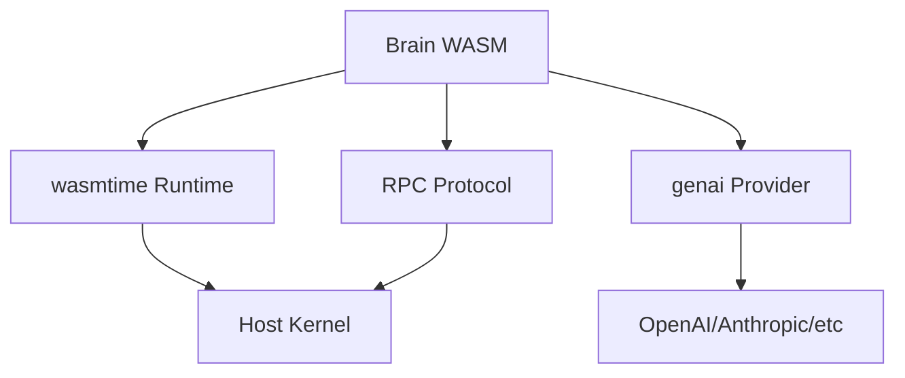
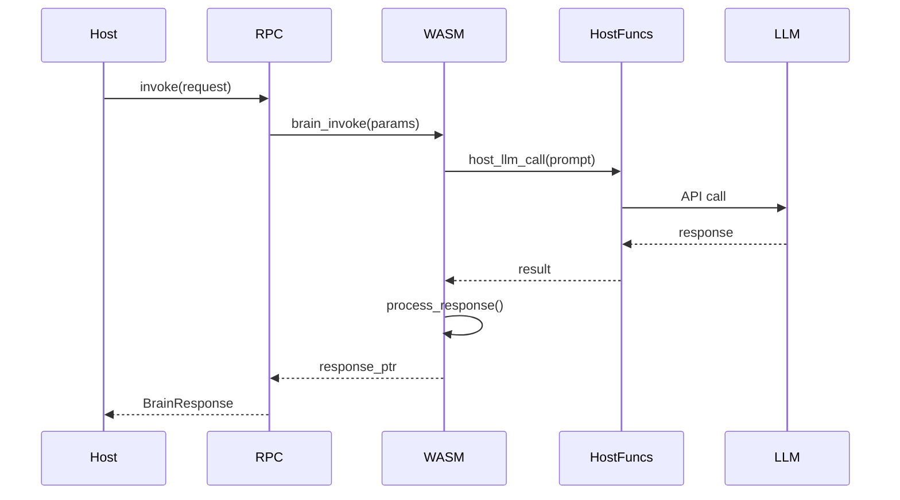
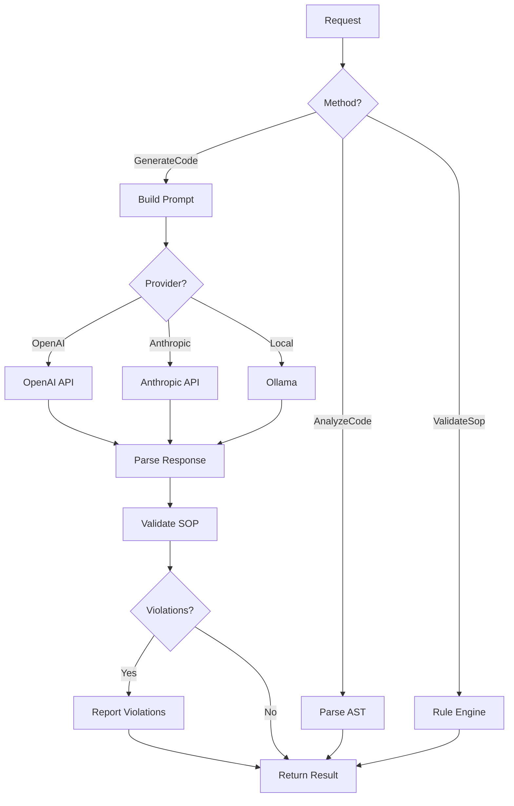
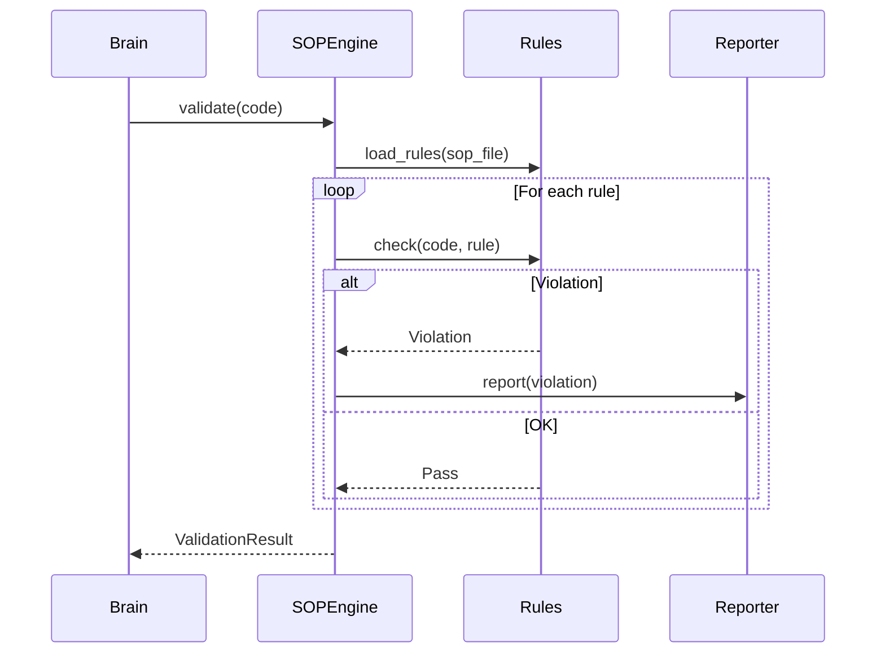

# Blue Paper BP-BRAIN-001: Brain WASM Component

## BP-1: Design Overview

### 1.1 Purpose

The Brain is the intelligence layer of Clawdius, responsible for LLM orchestration, SOP enforcement, and prompt construction. It runs inside a WebAssembly (WASM) sandbox via wasmtime to prevent "Brain-Leaking" attacks where compromised LLM responses attempt privilege escalation.

### 1.2 Scope

This Blue Paper specifies:
- wasmtime integration and configuration
- Brain-Host RPC protocol
- LLM provider orchestration
- SOP validation logic
- Prompt construction pipeline

### 1.3 Stakeholders

| Stakeholder | Role | Concerns |
|-------------|------|----------|
| AI Engineer | LLM integration | Provider compatibility |
| Security Engineer | Isolation | RPC boundary |
| Process Engineer | SOP enforcement | Validation rigor |

### 1.4 Viewpoints

- **Component Viewpoint:** WASM module structure
- **Interaction Viewpoint:** RPC protocol
- **Behavioral Viewpoint:** LLM orchestration

---

## BP-2: Design Decomposition

### 2.1 Component Hierarchy

```
Brain WASM (COMP-BRAIN-001)
├── WASM Runtime (wasmtime)
│   ├── Module Loader
│   ├── Instance Manager
│   └── Memory Controller
├── RPC Handler
│   ├── Request Parser
│   ├── Response Serializer
│   └── Version Negotiator
├── LLM Orchestrator
│   ├── Provider Router
│   ├── Prompt Builder
│   └── Response Parser
├── SOP Validator
│   ├── Rule Engine
│   └── Violation Reporter
└── Context Manager
    ├── Conversation State
    └── Artifact References
```

### 2.2 Dependencies



### 2.3 Coupling Analysis

| Component | Coupling | Strength | Justification |
|-----------|----------|----------|---------------|
| wasmtime | Control | Low | Trait-based backend |
| RPC | Data | Low | Versioned protocol |
| genai | Stamp | Low | Provider interface |

---

## BP-3: Design Rationale

### 3.1 Key Decisions

| Decision ID | Decision | Rationale |
|-------------|----------|-----------|
| ADR-BRAIN-001 | WASM isolation | Prevent Brain-Leaking |
| ADR-BRAIN-002 | Versioned RPC | API stability |
| ADR-BRAIN-003 | genai abstraction | Provider agnosticism |
| ADR-BRAIN-004 | SOP in WASM | Consistent validation |

### 3.2 Theory Mapping

| Yellow Paper Theory | Design Decision |
|---------------------|-----------------|
| Definition 4 (Brain-Host RPC) | Versioned protocol v1.0.0 |
| Theorem 2 (Brain-Leaking Prevention) | WASM sandbox isolation |
| Theorem 3 (Secret Isolation) | Host proxy for API keys |

### 3.3 Alternatives Considered

| Alternative | Rejected Because |
|-------------|------------------|
| Native execution | No isolation from LLM output |
| Docker container | High overhead, complex |
| Separate process | IPC complexity, latency |

---

## BP-4: Traceability

### 4.1 Requirements Mapping

| Requirement | Design Element | Verification |
|-------------|----------------|--------------|
| REQ-2.5 | Provider Router (genai) | Test |
| REQ-3.2 | WASM Runtime (wasmtime) | Test, Analysis |
| REQ-4.1 | SOP Validator | Test |
| REQ-4.4 | Context Manager | Test |

### 4.2 Yellow Paper Theory Mapping

| Theory Element | Implementation Location |
|----------------|------------------------|
| $\mathcal{R}$ (RPC interface) | `src/brain/rpc.rs` |
| $\rho$ (Privilege level) | `brain` (lowest) |
| Versioned protocol | `rpc/v1/schema.capnp` |

---

## BP-5: Interface Design

### 5.1 RPC Protocol

```rust
pub struct BrainRpc {
    version: ProtocolVersion,
    wasm_store: Store<HostState>,
    brain_instance: Instance,
}

impl BrainRpc {
    pub async fn invoke(&mut self, request: BrainRequest) -> Result<BrainResponse, RpcError>;
    pub fn version(&self) -> &ProtocolVersion;
    pub fn memory_usage(&self) -> usize;
}

#[derive(Debug, Clone, Serialize, Deserialize)]
pub struct BrainRequest {
    pub id: Uuid,
    pub method: BrainMethod,
    pub params: serde_json::Value,
    pub capability: Capability,
}

#[derive(Debug, Clone, Serialize, Deserialize)]
pub struct BrainResponse {
    pub id: Uuid,
    pub result: Result<serde_json::Value, BrainError>,
    pub usage: UsageStats,
}

#[derive(Debug, Clone, Copy, PartialEq, Eq)]
pub struct ProtocolVersion {
    pub major: u8,
    pub minor: u8,
    pub patch: u8,
}
```

### 5.2 Brain Methods

```rust
#[derive(Debug, Clone, Serialize, Deserialize)]
#[serde(rename_all = "snake_case")]
pub enum BrainMethod {
    GenerateCode,
    AnalyzeCode,
    ValidateSop,
    BuildPrompt,
    SynthesizeResearch,
    ExplainCode,
    RefactorCode,
}
```

### 5.3 Host Functions (WASM Imports)

```rust
#[wasmtime::witx::host_function]
pub fn host_log(level: LogLevel, message: Ptr<String>) -> Result<(), Error>;

#[wasmtime::witx::host_function]
pub fn host_read_file(path: Ptr<String>, capability: Ptr<Capability>) -> Result<Ptr<Vec<u8>>, Error>;

#[wasmtime::witx::host_function]
pub fn host_llm_call(provider: Ptr<String>, prompt: Ptr<String>) -> Result<Ptr<String>, Error>;

#[wasmtime::witx::host_function]
pub fn host_get_artifact(id: Ptr<ArtifactId>) -> Result<Ptr<Artifact>, Error>;
```

### 5.4 WASM Exports (Brain Functions)

```wasm
(module
  (func (export "brain_init") (param i32) (result i32))
  (func (export "brain_invoke") (param i32 i32) (result i32))
  (func (export "brain_get_version") (result i32))
  (func (export "brain_shutdown") (result i32))
  (memory (export "memory") 256))
```

### 5.5 Error Codes

| Code | Name | Description | Recovery |
|------|------|-------------|----------|
| 0x3001 | `WasmCompileFailed` | WASM module compilation failed | Rebuild module |
| 0x3002 | `WasmTrap` | Runtime trap in WASM | Log, restart |
| 0x3003 | `RpcVersionMismatch` | Protocol version incompatible | Update module |
| 0x3004 | `LlmCallFailed` | Provider API error | Retry with backoff |
| 0x3005 | `CapabilityInsufficient` | Required permission missing | Request capability |
| 0x3006 | `MemoryLimitExceeded` | WASM memory exhausted | Increase limit |
| 0x3007 | `SopViolation` | Code violates SOP | Report to user |
| 0x3008 | `PromptTooLong` | Context exceeds token limit | Truncate |

---

## BP-6: Data Design

### 6.1 Protocol Versioning

```
Protocol v1.0.0
├── Methods: generate_code, analyze_code, validate_sop, build_prompt
├── Host Functions: host_log, host_read_file, host_llm_call, host_get_artifact
└── Capabilities: FS_READ, LLM_CALL, ARTIFACT_READ
```

### 6.2 WASM Memory Layout

```
WASM Linear Memory (4GB max)
├── 0x0000-0x00FF: Reserved
├── 0x0100-0xFFFF: Stack
├── 0x10000-...: Heap
└── Request/Response buffers at dynamic offsets
```

### 6.3 LLM Provider Configuration

```toml
[llm.providers.openai]
enabled = true
model = "gpt-4"
max_tokens = 8192

[llm.providers.anthropic]
enabled = true
model = "claude-3-opus"
max_tokens = 100000

[llm.providers.deepseek]
enabled = true
model = "deepseek-coder"
max_tokens = 16384

[llm.providers.ollama]
enabled = true
model = "codellama"
base_url = "http://localhost:11434"
```

---

## BP-7: Component Design

### 7.1 RPC Sequence



### 7.2 LLM Orchestration



### 7.3 SOP Validation Flow



---

## BP-8: Deployment Design

### 8.1 WASM Module

```
brain.wasm (~2MB)
├── Code Section: ~1.5MB
├── Data Section: ~200KB
├── Memory: 256 pages (16MB) initial
└── Exports: brain_init, brain_invoke, brain_get_version, brain_shutdown
```

### 8.2 Runtime Configuration

```rust
pub fn create_wasm_runtime() -> Result<wasmtime::Engine, Error> {
    let mut config = Config::new();
    config.wasm_multi_memory(true);
    config.wasm_memory64(false);
    config.max_wasm_stack(1024 * 1024);
    config.consume_fuel(true);
    
    wasmtime::Engine::new(&config)
}
```

### 8.3 Resource Limits

| Resource | Limit | Notes |
|----------|-------|-------|
| Memory | 4GB | WASM max |
| Stack | 1MB | Configurable |
| Fuel | 1B units | Prevent infinite loops |
| Timeout | 30s | Per invoke |

---

## BP-9: Formal Verification

### 9.1 Properties to Prove

| Property | Type | Description |
|----------|------|-------------|
| P-BRAIN-001 | Safety | WASM cannot escape sandbox |
| P-BRAIN-002 | Safety | Host functions require capability |
| P-BRAIN-003 | Liveness | Invoke eventually returns |
| P-BRAIN-004 | Safety | API keys never in WASM memory |

### 9.2 Lean4 Proof Sketch

```lean
-- See proofs/proof_brain.lean for full implementation

inductive BrainMethod where
  | generateCode : BrainMethod
  | analyzeCode : BrainMethod
  | validateSop : BrainMethod

def BrainRequest := { method : BrainMethod, capability : Capability }

theorem wasm_isolation (request : BrainRequest) :
  request.capability.permissions ∩ {Permission.secretAccess} = ∅ →
  ∀ secret, secret ∈ Host.keychain →
  secret ∉ Brain.wasm_memory := by
  sorry -- Proof by wasmtime isolation guarantees

theorem host_function_capability (func : HostFunction) (cap : Capability) :
  requires_capability func ∉ cap.permissions →
  call func cap = Error CapabilityDenied := by
  sorry -- Proof by host function implementation
```

---

## BP-10: HAL Specification

Not applicable - Brain WASM is platform-independent.

---

## BP-11: Compliance Matrix

### 11.1 Standards Mapping

| Standard | Clause | Compliance | Evidence |
|----------|--------|------------|----------|
| WASM Spec | Core 2.0 | Full | wasmtime compliant |
| IEEE 1016 | 7.3 | Full | Interface spec |
| OWASP ASVS | V5.3 | Full | Sandbox isolation |

### 11.2 Theory Compliance

| YP-SECURITY-SANDBOX-001 Element | Implementation Status |
|--------------------------------|----------------------|
| Definition 4 (Brain-Host RPC) | Implemented |
| Theorem 2 (Brain-Leaking Prevention) | Implemented |
| Theorem 3 (Secret Isolation) | Implemented |

---

## BP-12: Quality Checklist

| Item | Status | Notes |
|------|--------|-------|
| IEEE 1016 Sections 1-12 | Complete | All sections |
| RPC Protocol v1.0.0 | Complete | Versioned |
| WASM Module Spec | Complete | Exports defined |
| Host Functions | Complete | Imports defined |
| LLM Provider Abstraction | Complete | genai interface |
| Lean4 Proof | Sketch | proof_brain.lean |

---

**Document Status:** APPROVED  
**Next Review:** After implementation (Phase 3)  
**Sign-off:** Construct Systems Architect
