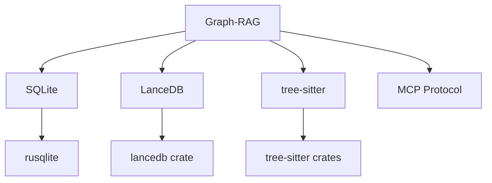
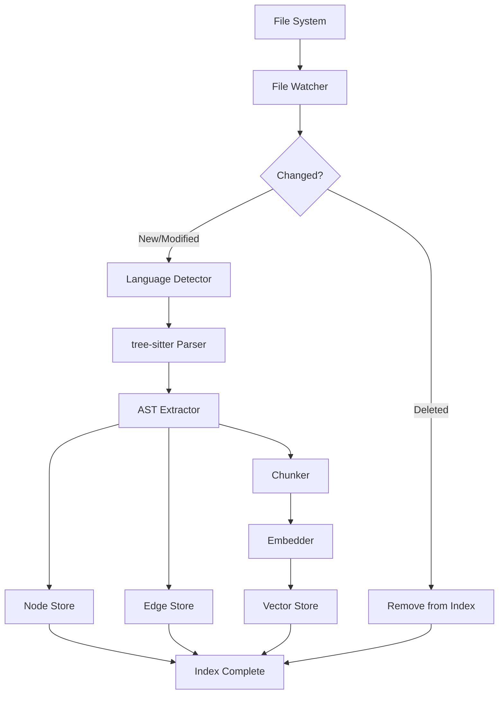
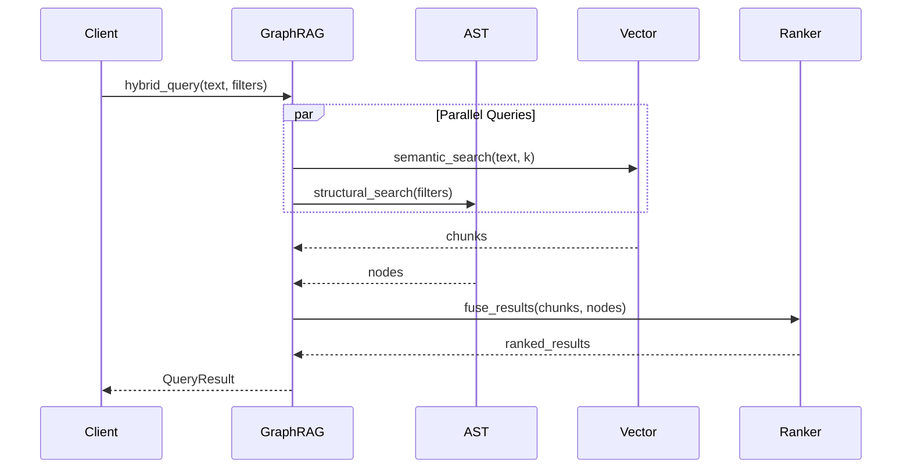
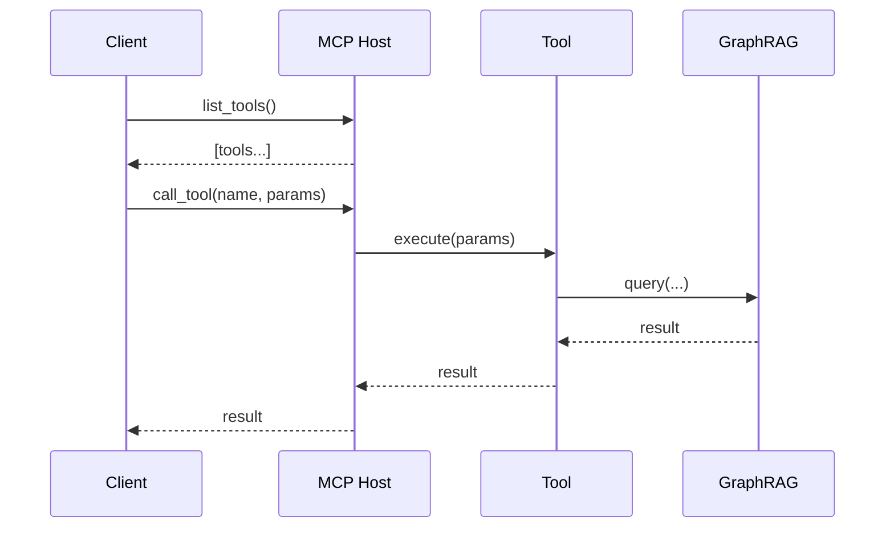

# Blue Paper BP-GRAPH-RAG-001: Graph-RAG Component

## BP-1: Design Overview

### 1.1 Purpose

The Graph-RAG (Retrieval-Augmented Generation) component provides the knowledge layer for Clawdius. It combines structural code understanding (AST-based graph) with semantic retrieval (vector embeddings) to enable intelligent code analysis, refactoring, and research synthesis.

### 1.2 Scope

This Blue Paper specifies:
- SQLite AST storage and query interface
- LanceDB vector storage and similarity search
- tree-sitter parsing integration
- MCP (Model Context Protocol) host support
- Multi-lingual knowledge integration

### 1.3 Stakeholders

| Stakeholder | Role | Concerns |
|-------------|------|----------|
| AI Engineer | RAG pipeline | Retrieval quality |
| Backend Engineer | Storage | Performance, scalability |
| DevOps Engineer | Deployment | Resource usage |

### 1.4 Viewpoints

- **Data Viewpoint:** Storage schemas
- **Component Viewpoint:** Index pipelines
- **Interface Viewpoint:** Query API

---

## BP-2: Design Decomposition

### 2.1 Component Hierarchy

```
Graph-RAG (COMP-GRAPH-001)
├── AST Index (SQLite)
│   ├── Node Store
│   ├── Edge Store
│   └── Query Engine
├── Vector Store (LanceDB)
│   ├── Embedding Index
│   ├── Chunk Store
│   └── Similarity Search
├── Parser Pipeline
│   ├── tree-sitter Workers
│   ├── Language Detectors
│   └── Delta Indexer
├── MCP Host
│   ├── Tool Registry
│   ├── Resource Handlers
│   └── Protocol Server
└── Knowledge Integrator
    ├── Multi-Lingual Mapper
    └── Concept Linker
```

### 2.2 Dependencies



### 2.3 Coupling Analysis

| Component | Coupling | Strength | Justification |
|-----------|----------|----------|---------------|
| SQLite | Data | Low | Query interface |
| LanceDB | Data | Low | Embedding interface |
| tree-sitter | Control | Medium | Grammar selection |
| MCP | Stamp | Low | Protocol interface |

---

## BP-3: Design Rationale

### 3.1 Key Decisions

| Decision ID | Decision | Rationale |
|-------------|----------|-----------|
| ADR-GRAPH-001 | SQLite for AST | Embedded, zero-config, ACID |
| ADR-GRAPH-002 | LanceDB for vectors | Rust-native, columnar, fast |
| ADR-GRAPH-003 | tree-sitter | Incremental, multi-language |
| ADR-GRAPH-004 | MCP Host | Extensibility without code changes |

### 3.2 Alternatives Considered

| Alternative | Rejected Because |
|-------------|------------------|
| Neo4j | External dependency, heavy |
| PostgreSQL + pgvector | Overkill for embedded use |
| ripgrep for search | No semantic understanding |

---

## BP-4: Traceability

### 4.1 Requirements Mapping

| Requirement | Design Element | Verification |
|-------------|----------------|--------------|
| REQ-2.1 | AST Index + tree-sitter | Test |
| REQ-2.2 | Vector Store + LanceDB | Test |
| REQ-2.3 | Knowledge Integrator | Test |
| REQ-2.4 | MCP Host | Test |

### 4.2 Design Decisions

| Decision | Trace To |
|----------|----------|
| SQLite AST | basic_spec.md §2.2 |
| LanceDB vectors | basic_spec.md §2.2 |
| tree-sitter parsing | basic_spec.md §2.2 |

---

## BP-5: Interface Design

### 5.1 Graph Query Interface

```rust
pub struct GraphRag {
    ast_db: AstDatabase,
    vector_store: VectorStore,
    parser_pipeline: ParserPipeline,
    mcp_host: McpHost,
}

impl GraphRag {
    pub async fn index_project(&mut self, root: &Path) -> Result<IndexStats, GraphError>;
    pub async fn query_structural(&self, query: AstQuery) -> Result<Vec<AstNode>, GraphError>;
    pub async fn query_semantic(&self, query: &str, k: usize) -> Result<Vec<Chunk>, GraphError>;
    pub async fn hybrid_query(&self, query: HybridQuery) -> Result<QueryResult, GraphError>;
    pub async fn get_call_graph(&self, function: &NodeId) -> Result<CallGraph, GraphError>;
    pub async fn find_impact(&self, node: &NodeId) -> Result<Vec<NodeId>, GraphError>;
}
```

### 5.2 AST Node Types

```rust
#[derive(Debug, Clone, Serialize, Deserialize)]
pub enum NodeType {
    Module,
    Function,
    Struct,
    Enum,
    Trait,
    Impl,
    TypeAlias,
    Constant,
    Static,
    Use,
    Mod,
    Macro,
    Field,
    Variant,
    Parameter,
    Local,
}

#[derive(Debug, Clone, Serialize, Deserialize)]
pub enum EdgeType {
    Calls,
    Defines,
    Implements,
    Imports,
    Contains,
    References,
    Extends,
    CompliesWith,
}
```

### 5.3 Vector Store Interface

```rust
pub struct VectorStore {
    db: lancedb::Connection,
    table_name: String,
}

impl VectorStore {
    pub async fn insert(&mut self, chunks: Vec<Chunk>) -> Result<(), VectorError>;
    pub async fn search(&self, embedding: &[f32], k: usize) -> Result<Vec<Chunk>, VectorError>;
    pub async fn delete(&mut self, ids: &[Uuid]) -> Result<(), VectorError>;
}

pub struct Chunk {
    pub id: Uuid,
    pub content: String,
    pub embedding: Vec<f32>,
    pub source_path: PathBuf,
    pub start_line: u32,
    pub end_line: u32,
    pub language: Language,
    pub metadata: HashMap<String, String>,
}
```

### 5.4 MCP Tool Interface

```rust
pub trait McpTool: Send + Sync {
    fn name(&self) -> &str;
    fn description(&self) -> &str;
    fn schema(&self) -> serde_json::Value;
    fn execute(&self, params: serde_json::Value) -> Result<serde_json::Value, McpError>;
}

pub struct McpHost {
    tools: HashMap<String, Box<dyn McpTool>>,
}

impl McpHost {
    pub fn register_tool(&mut self, tool: Box<dyn McpTool>);
    pub fn list_tools(&self) -> Vec<ToolInfo>;
    pub async fn call_tool(&self, name: &str, params: serde_json::Value) -> Result<serde_json::Value, McpError>;
}
```

### 5.5 Error Codes

| Code | Name | Description | Recovery |
|------|------|-------------|----------|
| 0x4001 | `DatabaseError` | SQLite/LanceDB error | Retry |
| 0x4002 | `ParseError` | tree-sitter parse failed | Skip file |
| 0x4003 | `EmbeddingError` | Embedding generation failed | Retry |
| 0x4004 | `QueryError` | Invalid query syntax | Report to user |
| 0x4005 | `McpToolNotFound` | Tool not registered | List available |
| 0x4006 | `IndexCorrupted` | Index integrity failed | Rebuild index |

---

## BP-6: Data Design

### 6.1 AST Schema (SQLite)

```sql
CREATE TABLE nodes (
    id BLOB PRIMARY KEY,
    type TEXT NOT NULL,
    name TEXT,
    file_path TEXT NOT NULL,
    start_byte INTEGER NOT NULL,
    end_byte INTEGER NOT NULL,
    start_line INTEGER NOT NULL,
    end_line INTEGER NOT NULL,
    language TEXT NOT NULL,
    documentation TEXT,
    metadata TEXT,
    hash BLOB NOT NULL
);

CREATE TABLE edges (
    id BLOB PRIMARY KEY,
    source_id BLOB NOT NULL REFERENCES nodes(id),
    target_id BLOB NOT NULL REFERENCES nodes(id),
    type TEXT NOT NULL,
    weight REAL DEFAULT 1.0,
    metadata TEXT
);

CREATE INDEX idx_nodes_type ON nodes(type);
CREATE INDEX idx_nodes_name ON nodes(name);
CREATE INDEX idx_nodes_file ON nodes(file_path);
CREATE INDEX idx_edges_source ON edges(source_id);
CREATE INDEX idx_edges_target ON edges(target_id);
CREATE INDEX idx_edges_type ON edges(type);
```

### 6.2 Vector Schema (LanceDB)

```python
# Schema definition for LanceDB
schema = pa.schema([
    pa.field("id", pa.string()),
    pa.field("content", pa.string()),
    pa.field("embedding", pa.list_(pa.float32(), list_size=1536)),
    pa.field("source_path", pa.string()),
    pa.field("start_line", pa.int32()),
    pa.field("end_line", pa.int32()),
    pa.field("language", pa.string()),
    pa.field("metadata", pa.string()),
])
```

### 6.3 Supported Languages

| Language | tree-sitter Grammar | AST Nodes | Embedding Model |
|----------|---------------------|-----------|-----------------|
| Rust | tree-sitter-rust | Full | codebert |
| TypeScript | tree-sitter-typescript | Full | codebert |
| Python | tree-sitter-python | Full | codebert |
| C++ | tree-sitter-cpp | Full | codebert |
| Go | tree-sitter-go | Full | codebert |
| Java | tree-sitter-java | Full | codebert |

---

## BP-7: Component Design

### 7.1 Indexing Pipeline



### 7.2 Query Pipeline



### 7.3 MCP Integration



---

## BP-8: Deployment Design

### 8.1 Storage Layout

```
.clawdius/graph/
├── ast.db              # SQLite AST index (~50MB per 100k LOC)
├── vectors/            # LanceDB vector store (~500MB per 100k LOC)
│   ├── data.lance/
│   └── index.lance/
├── cache/              # Embedding cache
└── mcp_tools/          # MCP tool configurations
```

### 8.2 Resource Estimates

| Project Size | AST Index | Vector Store | Memory (Index) |
|--------------|-----------|--------------|----------------|
| 10k LOC | 5MB | 50MB | 50MB |
| 100k LOC | 50MB | 500MB | 200MB |
| 1M LOC | 500MB | 5GB | 1GB |

### 8.3 Performance Targets

| Operation | Target | Notes |
|-----------|--------|-------|
| Index file | <100ms | Incremental |
| Structural query | <10ms | SQLite |
| Semantic search | <50ms | LanceDB |
| Hybrid query | <100ms | Combined |

---

## BP-9: Formal Verification

### 9.1 Properties to Prove

| Property | Type | Description |
|----------|------|-------------|
| P-GRAPH-001 | Safety | Index consistency after crash |
| P-GRAPH-002 | Liveness | Queries eventually return |
| P-GRAPH-003 | Safety | No duplicate nodes |

### 9.2 Verification Approach

Properties verified through:
- SQLite ACID guarantees
- LanceDB consistency checks
- Integration tests

---

## BP-10: HAL Specification

Not applicable - Graph-RAG uses portable Rust crates.

---

## BP-11: Compliance Matrix

### 11.1 Standards Mapping

| Standard | Clause | Compliance | Evidence |
|----------|--------|------------|----------|
| IEEE 1016 | 8.2 | Full | Data design |
| MCP Spec | 2024.11 | Full | Protocol compliance |

### 11.2 Requirements Compliance

| Requirement | Status | Notes |
|-------------|--------|-------|
| REQ-2.1 | Full | tree-sitter + SQLite |
| REQ-2.2 | Full | LanceDB |
| REQ-2.3 | Partial | TQA score pending |
| REQ-2.4 | Full | MCP Host |

---

## BP-12: Quality Checklist

| Item | Status | Notes |
|------|--------|-------|
| IEEE 1016 Sections 1-12 | Complete | All sections |
| AST Schema | Complete | SQLite tables |
| Vector Schema | Complete | LanceDB schema |
| Query Interface | Complete | Rust traits |
| MCP Integration | Complete | Tool interface |
| Interface Contract | Complete | interface_graph.toml |

---

**Document Status:** APPROVED  
**Next Review:** After implementation (Phase 3)  
**Sign-off:** Construct Systems Architect
