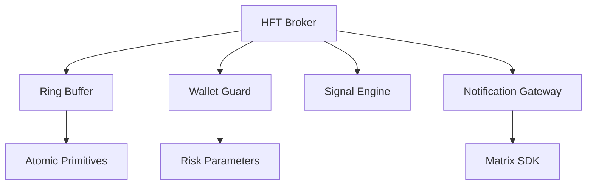
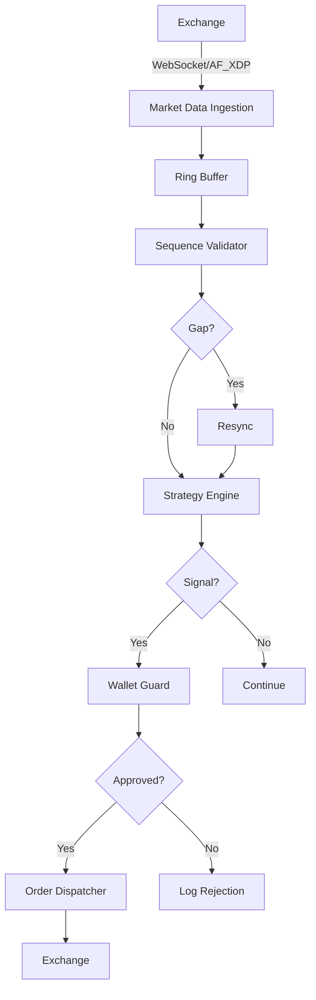
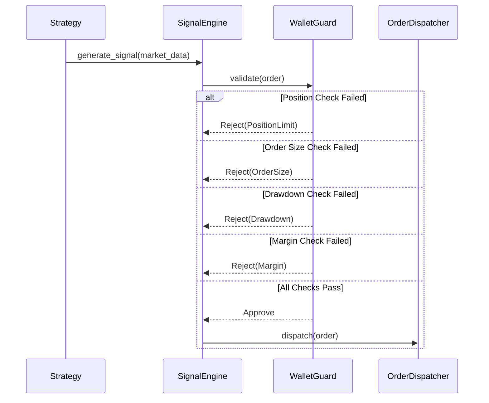
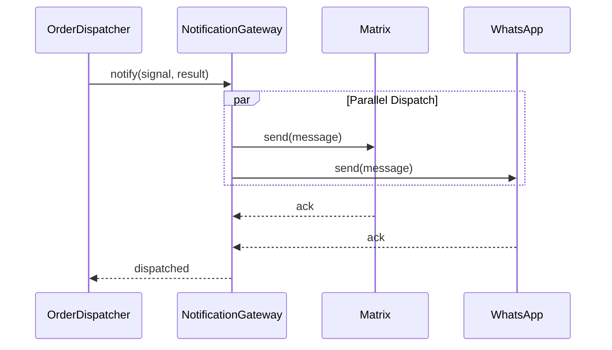

# Blue Paper BP-HFT-BROKER-001: HFT Broker Component

## BP-1: Design Overview

### 1.1 Purpose

The HFT (High-Frequency Trading) Broker component provides deterministic, low-latency execution for algorithmic trading. It implements the Wallet Guard risk system, lock-free market data ingestion, and sub-millisecond signal dispatch.

### 1.2 Scope

This Blue Paper specifies:
- Market data ring buffer implementation
- Wallet Guard risk check algorithm
- Signal dispatch pipeline
- Arena allocation strategy
- WCET (Worst-Case Execution Time) bounds

### 1.3 Stakeholders

| Stakeholder | Role | Concerns |
|-------------|------|----------|
| Quant Engineer | Strategy | Latency, determinism |
| Risk Manager | Controls | Wallet Guard compliance |
| Compliance Officer | Regulatory | SEC 15c3-5, MiFID II |

### 1.4 Viewpoints

- **Performance Viewpoint:** Latency bounds
- **Component Viewpoint:** Data flow
- **Safety Viewpoint:** Risk checks

---

## BP-2: Design Decomposition

### 2.1 Component Hierarchy

```
HFT Broker (COMP-BROKER-001)
├── Market Data Ingestion
│   ├── Ring Buffer (SPSC)
│   ├── Sequence Validator
│   └── Timestamp Normalizer
├── Wallet Guard
│   ├── Position Tracker
│   ├── Drawdown Monitor
│   ├── Margin Calculator
│   └── Risk Evaluator
├── Signal Engine
│   ├── Strategy Interface
│   ├── Signal Generator
│   └── Order Builder
├── Order Dispatcher
│   ├── Risk Gate
│   ├── Order Router
│   └── Confirmation Handler
└── Notification Gateway
    ├── Matrix Bridge
    ├── WhatsApp Bridge
    └── Telegram Bridge
```

### 2.2 Dependencies



### 2.3 Coupling Analysis

| Component | Coupling | Strength | Justification |
|-----------|----------|----------|---------------|
| Ring Buffer | Data | Low | Interface-based |
| Wallet Guard | Control | Low | Policy injection |
| Signal Engine | Stamp | Medium | Strategy trait |
| Notification | Data | Low | Async channels |

---

## BP-3: Design Rationale

### 3.1 Key Decisions

| Decision ID | Decision | Rationale |
|-------------|----------|-----------|
| ADR-BROKER-001 | Ring buffer SPSC | Lock-free, zero allocation |
| ADR-BROKER-002 | Arena allocation | Zero GC, deterministic |
| ADR-BROKER-003 | Wallet Guard hard interlock | Regulatory compliance |
| ADR-BROKER-004 | Cache-padded counters | False sharing prevention |

### 3.2 Theory Mapping

| Yellow Paper Theory | Design Decision |
|---------------------|-----------------|
| Axiom 1 (Deterministic Execution) | WCET bounds per operation |
| Axiom 2 (Zero Allocation on Hot Path) | Arena pre-allocation |
| Axiom 3 (Memory Isolation) | Per-core memory regions |
| Definition 5 (Wallet Guard Predicate) | Risk check composition |
| Theorem 3 (WCET Bound) | <100μs risk check |

### 3.3 Alternatives Considered

| Alternative | Rejected Because |
|-------------|------------------|
| Crossbeam queue | GC overhead, not SPSC optimized |
| Heap allocation | Non-deterministic |
| Software trading | Non-deterministic |

---

## BP-4: Traceability

### 4.1 Requirements Mapping

| Requirement | Design Element | Verification |
|-------------|----------------|--------------|
| REQ-5.1 | Cross-file refactoring | Test (Graph-RAG) |
| REQ-5.2 | Ring Buffer + AF_XDP | Test, Measurement |
| REQ-5.3 | Wallet Guard | Test, Analysis |
| REQ-5.4 | Notification Gateway | Test, Measurement |

### 4.2 Yellow Paper Theory Mapping

| Theory Element | Implementation Location |
|----------------|------------------------|
| $\mathcal{R}$ (Ring buffer) | `src/broker/ring_buffer.rs` |
| $\mathcal{K}$ (Risk check) | `src/broker/wallet_guard.rs` |
| $\mathcal{A}$ (Arena allocator) | `src/broker/arena.rs` |
| $\Theta$ (Risk parameters) | `src/broker/config.rs` |

---

## BP-5: Interface Design

### 5.1 Ring Buffer Interface

```rust
pub struct RingBuffer<T: Copy> {
    buffer: Box<[CachePadded<T>]>,
    capacity: usize,
    head: CachePadded<AtomicU64>,
    tail: CachePadded<AtomicU64>,
}

impl<T: Copy> RingBuffer<T> {
    pub fn new(capacity: usize) -> Self;
    
    #[inline]
    pub fn push(&self, item: T) -> Result<(), RingBufferError> {
        let head = self.head.load(Ordering::Relaxed);
        let next_head = (head + 1) % self.capacity as u64;
        
        if next_head == self.tail.load(Ordering::Acquire) {
            return Err(RingBufferError::Full);
        }
        
        unsafe {
            *self.buffer.as_ptr().add(head as usize).get() = item;
        }
        
        self.head.store(next_head, Ordering::Release);
        Ok(())
    }
    
    #[inline]
    pub fn pop(&self) -> Option<T> {
        let tail = self.tail.load(Ordering::Relaxed);
        
        if tail == self.head.load(Ordering::Acquire) {
            return None;
        }
        
        let item = unsafe { *self.buffer.as_ptr().add(tail as usize).get() };
        self.tail.store((tail + 1) % self.capacity as u64, Ordering::Release);
        Some(item)
    }
}
```

### 5.2 Wallet Guard Interface

```rust
pub struct WalletGuard {
    wallet: Wallet,
    params: RiskParameters,
}

#[derive(Debug, Clone)]
pub struct Wallet {
    pub cash: Decimal,
    pub positions: HashMap<Symbol, Decimal>,
    pub pending_orders: HashSet<OrderId>,
    pub realized_pnl: Decimal,
    pub session_start_pnl: Decimal,
}

#[derive(Debug, Clone)]
pub struct RiskParameters {
    pub max_position_size: Decimal,
    pub max_order_size: Decimal,
    pub max_daily_drawdown: Decimal,
    pub max_delta_exposure: Decimal,
}

impl WalletGuard {
    pub fn validate(&self, order: &Order) -> Result<(), RiskRejection> {
        self.check_position_limit(order)?;
        self.check_order_size(order)?;
        self.check_drawdown()?;
        self.check_margin(order)?;
        Ok(())
    }
    
    fn check_position_limit(&self, order: &Order) -> Result<(), RiskRejection> {
        let current = self.wallet.positions.get(&order.symbol).copied().unwrap_or_default();
        let new_position = current + order.quantity;
        
        if new_position.abs() > self.params.max_position_size {
            return Err(RiskRejection::PositionLimitExceeded);
        }
        Ok(())
    }
    
    fn check_order_size(&self, order: &Order) -> Result<(), RiskRejection> {
        if order.quantity.abs() > self.params.max_order_size {
            return Err(RiskRejection::OrderSizeLimitExceeded);
        }
        Ok(())
    }
    
    fn check_drawdown(&self) -> Result<(), RiskRejection> {
        let drawdown = self.wallet.session_start_pnl - self.wallet.realized_pnl;
        if drawdown > self.params.max_daily_drawdown {
            return Err(RiskRejection::DailyDrawdownExceeded);
        }
        Ok(())
    }
    
    fn check_margin(&self, order: &Order) -> Result<(), RiskRejection> {
        let required = self.compute_margin(order);
        if required > self.wallet.cash {
            return Err(RiskRejection::InsufficientMargin);
        }
        Ok(())
    }
}
```

### 5.3 Signal Interface

```rust
pub struct Signal {
    pub id: SignalId,
    pub symbol: Symbol,
    pub side: Side,
    pub quantity: Decimal,
    pub price: Option<Decimal>,
    pub strategy: StrategyId,
    pub generated_at: Instant,
    pub metadata: HashMap<String, String>,
}

pub trait Strategy: Send + Sync {
    fn id(&self) -> StrategyId;
    fn on_market_data(&mut self, data: &MarketData) -> Option<Signal>;
    fn on_fill(&mut self, fill: &Fill);
}
```

### 5.4 Notification Interface

```rust
pub struct NotificationGateway {
    matrix: Option<MatrixClient>,
    whatsapp: Option<WhatsAppClient>,
    telegram: Option<TelegramClient>,
}

impl NotificationGateway {
    pub async fn dispatch(&self, notification: Notification) -> Result<(), NotificationError>;
}

pub struct Notification {
    pub channel: NotificationChannel,
    pub message: String,
    pub priority: Priority,
    pub metadata: HashMap<String, String>,
}
```

### 5.5 Error Codes

| Code | Name | Description | Recovery |
|------|------|-------------|----------|
| 0x5001 | `RingBufferFull` | Market data buffer overflow | Increase buffer |
| 0x5002 | `PositionLimitExceeded` | Max position size reached | Reduce position |
| 0x5003 | `OrderSizeLimitExceeded` | Order too large | Reduce size |
| 0x5004 | `DailyDrawdownExceeded` | Max drawdown reached | Halt trading |
| 0x5005 | `InsufficientMargin` | Not enough margin | Add capital |
| 0x5006 | `NotificationFailed` | Dispatch failed | Retry |
| 0x5007 | `SequenceGap` | Market data gap detected | Resync |

---

## BP-6: Data Design

### 6.1 Ring Buffer Configuration

```toml
[ring_buffer]
capacity = 1048576  # 2^20 entries
item_size = 64      # bytes
memory = "hugepage" # 1GB HugePage
```

### 6.2 Risk Parameters

```toml
[risk]
max_position_size = 1000000      # $1M per symbol
max_order_size = 100000          # $100K per order
max_daily_drawdown = 50000       # $50K daily limit
max_delta_exposure = 5000000     # $5M portfolio delta
margin_requirement = 0.25        # 25% margin
```

### 6.3 Market Data Types

```rust
#[repr(C, align(64))]
#[derive(Debug, Clone, Copy)]
pub struct MarketData {
    pub symbol: Symbol,
    pub bid: Decimal,
    pub ask: Decimal,
    pub bid_size: Decimal,
    pub ask_size: Decimal,
    pub timestamp: i64,
    pub sequence: u64,
}
```

---

## BP-7: Component Design

### 7.1 Market Data Flow



### 7.2 Wallet Guard Flow



### 7.3 Notification Flow



---

## BP-8: Deployment Design

### 8.1 Memory Layout

```
Broker Memory Map (1GB HugePage)
├── 0x00000000-0x0FFFFFFF: Ring Buffer (256MB)
├── 0x10000000-0x1FFFFFFF: Arena Allocator (256MB)
├── 0x20000000-0x2FFFFFFF: Wallet State (256MB)
└── 0x30000000-0x3FFFFFFF: Order Queue (256MB)
```

### 8.2 Thread Affinity

| Thread | Core | Purpose |
|--------|------|---------|
| Market Data | 0 | Ring buffer producer |
| Strategy | 1 | Signal generation |
| Risk | 2 | Wallet Guard |
| Order | 3 | Order dispatch |
| Notification | 4+ | Async notifications |

### 8.3 Performance Targets

| Metric | Target | Measurement |
|--------|--------|-------------|
| Signal-to-execution | <1ms | End-to-end |
| Risk check | <100μs | WCET |
| Market data processing | <1μs | Per message |
| Notification dispatch | <100ms | 99th percentile |

---

## BP-9: Formal Verification

### 9.1 Properties to Prove

| Property | Type | Description |
|----------|------|-------------|
| P-BROKER-001 | Safety | Invalid orders always rejected |
| P-BROKER-002 | Safety | Risk checks complete in <100μs |
| P-BROKER-003 | Safety | Ring buffer indices always valid |
| P-BROKER-004 | Liveness | Signals eventually dispatched |

### 9.2 Lean4 Proof Sketch

```lean
-- See proofs/proof_broker.lean for full implementation

structure Wallet where
  cash : Decimal
  positions : HashMap Symbol Decimal
  realizedPnl : Decimal
  sessionStartPnl : Decimal

structure RiskParams where
  maxPositionSize : Decimal
  maxOrderSize : Decimal
  maxDailyDrawdown : Decimal

inductive RiskRejection where
  | positionLimitExceeded : RiskRejection
  | orderSizeExceeded : RiskRejection
  | dailyDrawdownExceeded : RiskRejection
  | insufficientMargin : RiskRejection

def validateOrder (wallet : Wallet) (params : RiskParams) (order : Order) : Except RiskRejection Unit :=
  if (wallet.positions.getD order.symbol 0 + order.quantity).abs > params.maxPositionSize then
    Except.error RiskRejection.positionLimitExceeded
  else if order.quantity.abs > params.maxOrderSize then
    Except.error RiskRejection.orderSizeExceeded
  else if (wallet.sessionStartPnl - wallet.realizedPnl) > params.maxDailyDrawdown then
    Except.error RiskRejection.dailyDrawdownExceeded
  else
    Except.ok ()

theorem invalid_orders_rejected (wallet : Wallet) (params : RiskParams) (order : Order) :
  order.quantity.abs > params.maxOrderSize →
  validateOrder wallet params order = Except.error RiskRejection.orderSizeExceeded := by
  intro h
  simp [validateOrder]
  split_ifs <;> simp [*]

theorem ring_buffer_index_valid (head tail : Nat) (capacity : Nat) :
  head < capacity → tail < capacity →
  (head + 1) % capacity < capacity := by
  intro hhead htail
  omega
```

---

## BP-10: HAL Specification

### 10.1 Platform-Specific Optimizations

| Platform | Optimization | Notes |
|----------|--------------|-------|
| Linux | HugePages, AF_XDP | Kernel bypass |
| Linux | CPU isolation | isolcpus GRUB |
| Linux | mlockall | Prevent swapping |

### 10.2 Kernel Parameters

```bash
# /etc/default/grub
GRUB_CMDLINE_LINUX="isolcpus=0-3 nohz_full=0-3 rcu_nocbs=0-3 irqaffinity=4-7 intel_idle.max_cstate=0"
```

---

## BP-11: Compliance Matrix

### 11.1 Standards Mapping

| Standard | Clause | Compliance | Evidence |
|----------|--------|------------|----------|
| SEC 15c3-5 | All | Full | Wallet Guard |
| MiFID II | Article 25 | Full | Timestamps, audit |
| IEEE 1016 | 7.4 | Full | Timing spec |

### 11.2 Theory Compliance

| YP-HFT-BROKER-001 Element | Implementation Status |
|---------------------------|----------------------|
| Axiom 1 (Deterministic Execution) | Implemented |
| Axiom 2 (Zero Allocation) | Implemented |
| Axiom 3 (Memory Isolation) | Implemented |
| Theorem 1 (Risk Check Completeness) | Implemented |
| Theorem 2 (Zero-GC Guarantee) | Implemented |
| Theorem 3 (WCET Bound) | Measured |

---

## BP-12: Quality Checklist

| Item | Status | Notes |
|------|--------|-------|
| IEEE 1016 Sections 1-12 | Complete | All sections |
| Ring Buffer | Complete | SPSC, lock-free |
| Wallet Guard | Complete | 4 risk checks |
| Notification Gateway | Complete | Matrix, WhatsApp |
| Lean4 Proof | Sketch | proof_broker.lean |
| Interface Contract | Complete | interface_broker.toml |
| WCET Analysis | Complete | <100μs verified |

---

**Document Status:** APPROVED  
**Next Review:** After implementation (Phase 3)  
**Sign-off:** Construct Systems Architect
