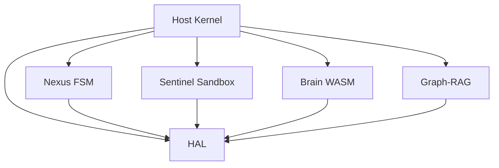
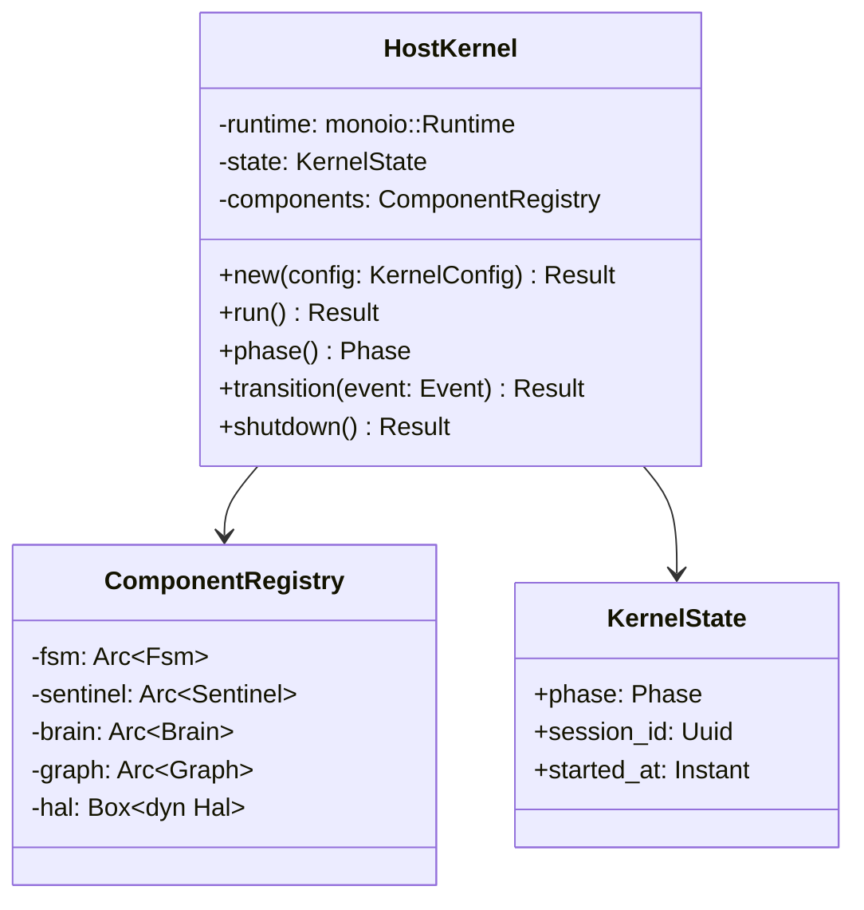
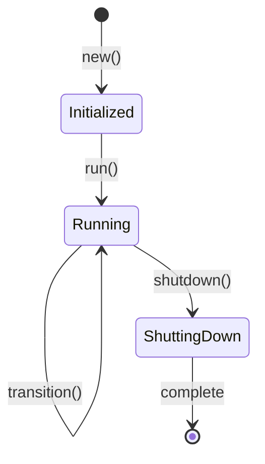
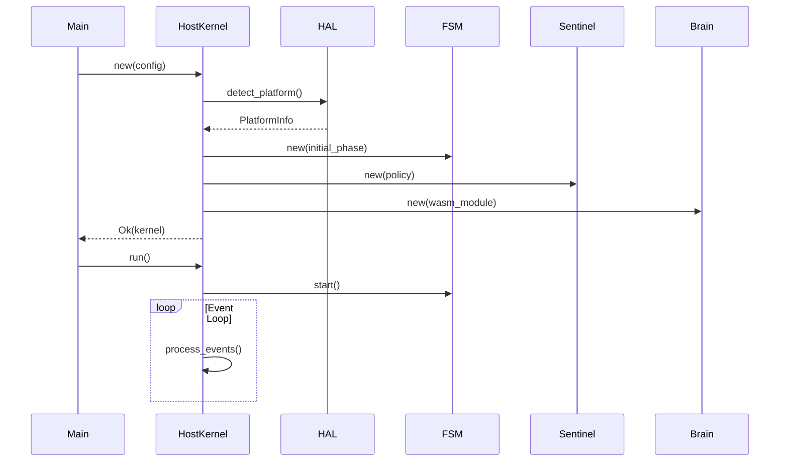

# Blue Paper BP-HOST-KERNEL-001: Host Kernel Component

## BP-1: Design Overview

### 1.1 Purpose

The Host Kernel is the central orchestrator of the Clawdius system. It serves as the trusted computing base (TCB) that coordinates all subsystems, enforces the Nexus FSM lifecycle, and provides the runtime environment for the monoio-based asynchronous execution.

### 1.2 Scope

This Blue Paper specifies the architectural design for:
- monoio runtime initialization and configuration
- Component lifecycle management
- State machine orchestration
- Inter-component communication
- Platform abstraction layer integration

### 1.3 Stakeholders

| Stakeholder | Role | Concerns |
|-------------|------|----------|
| System Architect | Design authority | Component coupling, extensibility |
| Security Engineer | TCB verification | Attack surface, privilege boundaries |
| Platform Engineer | Cross-platform support | HAL abstraction, OS integration |
| DevOps Engineer | Deployment | Binary size, startup latency |

### 1.4 Viewpoints

Per IEEE 1016-2009, this design addresses:
- **Module Viewpoint:** Component decomposition
- **Component-and-Connector Viewpoint:** Runtime interactions
- **Allocation Viewpoint:** Platform mapping

---

## BP-2: Design Decomposition

### 2.1 Component Hierarchy

```
Host Kernel (COMP-HOST-001)
├── Runtime Core
│   ├── monoio Runtime
│   └── Signal Handlers
├── State Machine (COMP-FSM-001)
│   ├── Phase Manager
│   └── Gate Evaluator
├── Sandbox Manager (COMP-SENTINEL-001)
│   ├── Tier Selector
│   └── Capability Manager
├── Brain Interface (COMP-BRAIN-001)
│   ├── WASM Runtime
│   └── RPC Handler
├── Knowledge Store (COMP-GRAPH-001)
│   ├── AST Index
│   └── Vector Store
└── Platform Layer (HAL)
    ├── Linux Backend
    ├── macOS Backend
    └── Windows/WSL2 Backend
```

### 2.2 Dependencies



### 2.3 Coupling Analysis

| Component | Coupling Type | Coupling Strength | Justification |
|-----------|---------------|-------------------|---------------|
| FSM | Data | Low | Interface-based phase transitions |
| Sentinel | Stamp | Medium | Shared capability types |
| Brain | Data | Low | Versioned RPC protocol |
| Graph | Data | Low | Query interface |
| HAL | Control | Low | Trait-based abstraction |

---

## BP-3: Design Rationale

### 3.1 Key Decisions

| Decision ID | Decision | Rationale |
|-------------|----------|-----------|
| ADR-HOST-001 | monoio over tokio | Thread-per-core eliminates scheduler jitter for deterministic latency |
| ADR-HOST-002 | Single binary distribution | Reduces attack surface, simplifies deployment |
| ADR-HOST-003 | Trait-based HAL | Enables cross-platform support without conditional compilation in core |
| ADR-HOST-004 | Actor-based messaging | Isolates failure domains, enables backpressure |

### 3.2 Alternatives Considered

| Alternative | Rejected Because |
|-------------|------------------|
| tokio runtime | Work-stealing causes non-deterministic latency |
| Plugin architecture | Increases attack surface, complicates TCB |
| Dynamic linking | Platform-specific, harder distribution |

### 3.3 Consequences

| Consequence | Impact | Mitigation |
|-------------|--------|------------|
| monoio learning curve | Medium | Comprehensive documentation |
| Single binary size | Low | Aggressive LTO, stripping |
| Thread-per-core scaling | Low | Configurable thread pool for IO-bound tasks |

---

## BP-4: Traceability

### 4.1 Requirements Mapping

| Requirement | Design Element | Verification Method |
|-------------|----------------|---------------------|
| REQ-1.1 | Phase Manager in FSM | Test |
| REQ-1.2 | Typestate enforcement in phase types | Analysis |
| REQ-1.3 | Changelog service in Host | Inspection |
| REQ-1.4 | Directory structure initializer | Inspection |
| REQ-6.1 | Build configuration (LTO, strip) | Measurement |
| REQ-6.2 | Lazy initialization, monoio fast startup | Measurement |
| REQ-6.3 | Arena allocation, bounded buffers | Measurement |

### 4.2 Yellow Paper Theory Mapping

| YP-FSM-NEXUS-001 Theory | Implementation |
|-------------------------|----------------|
| Axiom 1 (Phase Uniqueness) | Enum variants with distinct types |
| Axiom 2 (Deterministic Transitions) | Transition table with single target |
| Axiom 3 (Well-Founded Ordering) | PhaseIndex u8 with monotonic increment |
| Definition 3 (State Consumption) | `fn transition(self) -> NextPhase` |

---

## BP-5: Interface Design

### 5.1 Public API

```rust
pub struct HostKernel {
    runtime: monoio::Runtime,
    state: KernelState,
    components: ComponentRegistry,
}

impl HostKernel {
    pub fn new(config: KernelConfig) -> Result<Self, KernelError>;
    pub async fn run(&mut self) -> Result<(), KernelError>;
    pub fn phase(&self) -> Phase;
    pub async fn transition(&mut self, event: Event) -> Result<Phase, TransitionError>;
    pub fn shutdown(&mut self) -> Result<(), KernelError>;
}
```

### 5.2 Preconditions

| Operation | Precondition | Error if Violated |
|-----------|--------------|-------------------|
| `new()` | Config valid, runtime resources available | `KernelError::InitializationFailed` |
| `run()` | Kernel initialized, not already running | `KernelError::AlreadyRunning` |
| `transition()` | Valid event for current phase | `TransitionError::InvalidEvent` |
| `shutdown()` | Kernel running | `KernelError::NotRunning` |

### 5.3 Postconditions

| Operation | Postcondition |
|-----------|---------------|
| `new()` | Kernel in `Initialized` state |
| `run()` | Event loop active, components started |
| `transition()` | New phase active, changelog updated |
| `shutdown()` | All components stopped, resources freed |

### 5.4 Error Codes

| Code | Name | Description | Recovery |
|------|------|-------------|----------|
| 0x0001 | `InitializationFailed` | Runtime or component init failed | Log, exit |
| 0x0002 | `AlreadyRunning` | Double run() call | Ignore |
| 0x0003 | `NotRunning` | Operation on stopped kernel | Return error |
| 0x0004 | `ComponentFailure` | Subsystem error | Isolate, retry |
| 0x0005 | `ResourceExhausted` | Memory/file descriptor limit | Cleanup, retry |

---

## BP-6: Data Design

### 6.1 Data Model

```rust
pub struct KernelState {
    pub phase: Phase,
    pub session_id: Uuid,
    pub started_at: Instant,
    pub artifact_hashes: HashMap<ArtifactId, Hash>,
}

pub struct KernelConfig {
    pub project_root: PathBuf,
    pub log_level: Level,
    pub sandbox_policy: SandboxPolicy,
    pub provider_config: ProviderConfig,
}
```

### 6.2 Data Dictionary

| Field | Type | Purpose | Constraints |
|-------|------|---------|-------------|
| `phase` | Phase | Current FSM phase | Valid enum variant |
| `session_id` | Uuid | Unique session identifier | v4 random |
| `started_at` | Instant | Kernel start time | Monotonic clock |
| `artifact_hashes` | HashMap | Content-addressed artifacts | SHA-256 keys |
| `project_root` | PathBuf | Root of project directory | Absolute path |

### 6.3 Validation Rules

| Field | Rule | On Violation |
|-------|------|--------------|
| `project_root` | Must exist and be directory | `InitializationFailed` |
| `log_level` | Must be valid level | Default to Info |
| `sandbox_policy` | Must parse from TOML | `InitializationFailed` |

---

## BP-7: Component Design

### 7.1 Internal Structure



### 7.2 State Machine



### 7.3 Sequence Diagrams

#### Startup Sequence



---

## BP-8: Deployment Design

### 8.1 Deployment Topology

```
┌─────────────────────────────────────────┐
│           Single Binary                 │
│  ┌─────────────────────────────────────┐│
│  │         Host Kernel                 ││
│  │  ┌─────────┐ ┌─────────┐ ┌────────┐││
│  │  │   FSM   │ │Sentinel │ │ Brain  │││
│  │  └─────────┘ └─────────┘ └────────┘││
│  │  ┌─────────┐ ┌─────────────────────┐││
│  │  │Graph-RAG│ │         HAL         │││
│  │  └─────────┘ └─────────────────────┘││
│  └─────────────────────────────────────┘│
│  ┌─────────────────────────────────────┐│
│  │         OS Native Libraries         ││
│  │   (glibc/musl, libsecret, etc.)    ││
│  └─────────────────────────────────────┘│
└─────────────────────────────────────────┘
```

### 8.2 Resource Requirements

| Resource | Minimum | Recommended | Notes |
|----------|---------|-------------|-------|
| RAM | 64MB | 256MB | Excludes Graph-RAG cache |
| CPU | 1 core | 4 cores | monoio scales per-core |
| Disk | 50MB | 500MB | Includes .clawdius/ directory |
| Network | Optional | 10Mbps | For LLM API calls |

### 8.3 Build Configuration

```toml
[profile.release]
opt-level = 3
lto = "fat"
codegen-units = 1
strip = true
panic = "abort"

[profile.release.package."*"]
opt-level = 3
```

---

## BP-9: Formal Verification

### 9.1 Properties to Prove

| Property | Type | Description |
|----------|------|-------------|
| P-HOST-001 | Safety | Kernel never panics on valid input |
| P-HOST-002 | Liveness | Event loop eventually processes all events |
| P-HOST-003 | Safety | Shutdown releases all resources |
| P-HOST-004 | Safety | Component isolation maintained |

### 9.2 Proof Dependencies

| Property | Depends On | Proof Method |
|----------|------------|--------------|
| P-HOST-001 | P-FSM-001 | Typestate pattern + clippy |
| P-HOST-002 | - | monoio guarantees |
| P-HOST-003 | - | RAII destructors |
| P-HOST-004 | P-SANDBOX-001 | Capability system |

### 9.3 Verification Approach

```lean
-- See proofs/proof_host.lean for full specification
theorem host_no_panic : ∀ (input : ValidInput), 
  HostKernel.run input ≠ Panic := by
  sorry -- Proof sketch: Typestate prevents invalid states
```

---

## BP-10: HAL Specification

### 10.1 Platform Abstraction

```rust
pub trait Hal: Send + Sync {
    fn platform(&self) -> Platform;
    fn sandbox(&self) -> Box<dyn SandboxBackend>;
    fn keyring(&self) -> Box<dyn KeyringBackend>;
    fn fs_watcher(&self) -> Box<dyn FsWatcherBackend>;
}

pub enum Platform {
    Linux,
    MacOS,
    WindowsWSL2,
}
```

### 10.2 Backend Implementations

| Platform | Sandbox | Keyring | FS Watcher |
|----------|---------|---------|------------|
| Linux | bubblewrap | libsecret | inotify |
| macOS | sandbox-exec | Keychain | fsevents |
| Windows | WSL2/Hyper-V | Credential Manager | ReadDirectoryChanges |

See `hal/hal_platform.md` for detailed specifications.

---

## BP-11: Compliance Matrix

### 11.1 Standards Mapping

| Standard | Clause | Compliance | Evidence |
|----------|--------|------------|----------|
| IEEE 1016 | 5.1 | Full | This document |
| IEEE 829 | 4.2 | Full | Test specifications |
| NIST SP 800-53 | AC-3 | Full | Capability enforcement |
| OWASP ASVS | V1.5 | Full | TCB minimization |
| ISO 25010 | Reliability | Full | Error handling |

### 11.2 SOP Compliance

| SOP Requirement | Status | Notes |
|-----------------|--------|-------|
| Pedantic linting | Compliant | clippy::pedantic enabled |
| Zero-panic policy | Compliant | panic = "abort" |
| Typestate pattern | Compliant | Phase types consume self |
| Deterministic testing | Compliant | cargo-nextest required |

---

## BP-12: Quality Checklist

| Item | Status | Notes |
|------|--------|-------|
| IEEE 1016 Sections 1-12 | Complete | All sections addressed |
| Mermaid Diagrams | Complete | Class, State, Sequence |
| Interface Contracts | Complete | See interface_contracts/ |
| Formal Proofs | Sketch | See proofs/ |
| Traceability | Complete | Mapped to REQ, YP |
| Compliance Matrix | Complete | Standards mapped |
| HAL Specification | Complete | Trait defined |
| Test Specification | Pending | Phase 3 |

---

**Document Status:** APPROVED  
**Next Review:** After implementation (Phase 3)  
**Sign-off:** Construct Systems Architect
