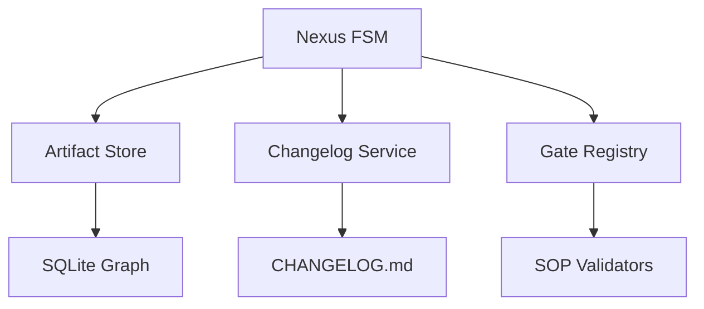
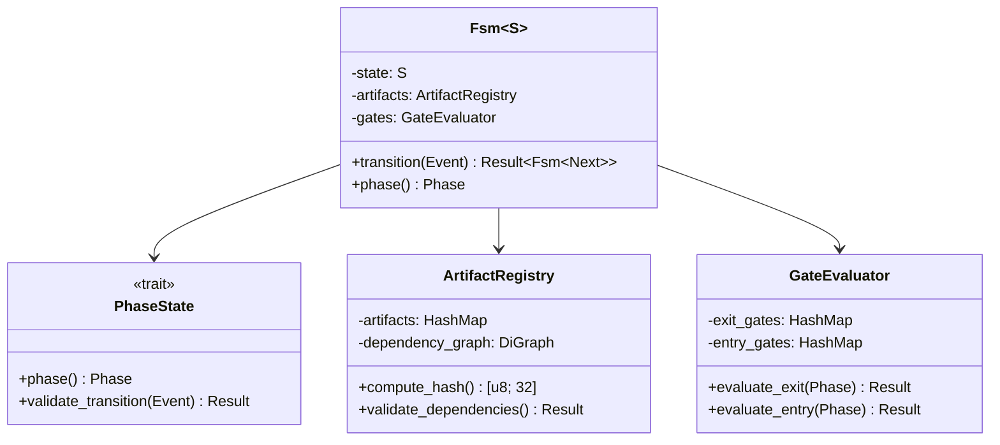
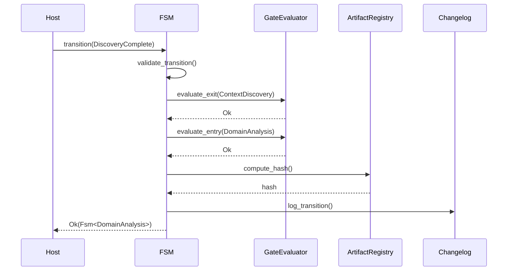

# Blue Paper BP-NEXUS-FSM-001: Nexus FSM Component

## BP-1: Design Overview

### 1.1 Purpose

The Nexus FSM (Finite State Machine) implements the 24-phase R&D lifecycle that governs all Clawdius operations. It enforces deterministic phase transitions through the Typestate pattern, ensuring that illegal states are unrepresentable at compile time.

### 1.2 Scope

This Blue Paper specifies:
- 24-phase state enumeration
- Transition function implementation
- Quality gate evaluation
- Typestate pattern enforcement
- Artifact dependency tracking

### 1.3 Stakeholders

| Stakeholder | Role | Concerns |
|-------------|------|----------|
| Process Engineer | Lifecycle definition | Phase completeness |
| Quality Engineer | Gate enforcement | Verification rigor |
| Developer | Implementation | Type safety, ergonomics |

### 1.4 Viewpoints

- **State Machine Viewpoint:** Phase transitions
- **Data Viewpoint:** Artifact flow
- **Behavioral Viewpoint:** Quality gates

---

## BP-2: Design Decomposition

### 2.1 Component Hierarchy

```
Nexus FSM (COMP-FSM-001)
├── Phase Types (Typestate)
│   ├── Discovery Phases (0-2)
│   ├── Requirements Phases (3-5)
│   ├── Architecture Phases (6-9)
│   ├── Planning Phases (10-12)
│   ├── Implementation Phases (13-15)
│   ├── Verification Phases (16-19)
│   ├── Validation Phases (20-21)
│   └── Transition Phases (22-23)
├── Transition Engine
│   ├── Transition Table
│   └── Event Router
├── Gate Evaluator
│   ├── Exit Gates
│   └── Entry Gates
└── Artifact Tracker
    ├── Dependency Graph
    └── Hash Registry
```

### 2.2 Dependencies



### 2.3 Coupling Analysis

| Component | Coupling | Strength | Justification |
|-----------|----------|----------|---------------|
| Artifact Store | Data | Low | Interface-based |
| Changelog | Stamp | Low | Event publishing |
| Gate Registry | Control | Medium | Dynamic gate loading |

---

## BP-3: Design Rationale

### 3.1 Key Decisions

| Decision ID | Decision | Rationale |
|-------------|----------|-----------|
| ADR-FSM-001 | 24 phases | Granular lifecycle control |
| ADR-FSM-002 | Typestate pattern | Compile-time state safety |
| ADR-FSM-003 | Quality gates | Enforcement checkpoints |
| ADR-FSM-004 | Cryptographic hashing | Artifact integrity |

### 3.2 Theory Mapping

| Yellow Paper Theory | Design Decision |
|---------------------|-----------------|
| Axiom 1 (Phase Uniqueness) | Enum with 24 distinct variants |
| Axiom 2 (Deterministic Transitions) | HashMap<Phase, HashMap<Event, Phase>> |
| Axiom 3 (Well-Founded Ordering) | PhaseIndex: u8 with monotonic check |
| Definition 3 (State Consumption) | `fn next(self) -> NextPhase` |

### 3.3 Alternatives Considered

| Alternative | Rejected Because |
|-------------|------------------|
| 12 phases | Insufficient granularity for quality gates |
| Runtime state checks | Allows illegal states |
| Database-backed state | Non-deterministic, slower |

---

## BP-4: Traceability

### 4.1 Requirements Mapping

| Requirement | Design Element | Verification |
|-------------|----------------|--------------|
| REQ-1.1 | Phase enum (24 variants) | Test |
| REQ-1.2 | Typestate pattern | Analysis |
| REQ-1.3 | Hash registry + changelog | Inspection |
| REQ-4.2 | Gate evaluator (NTIB halt) | Test |

### 4.2 Yellow Paper Theory Mapping

| Theory Element | Implementation Location |
|----------------|------------------------|
| $\mathcal{P}$ (Phase set) | `src/fsm/phase.rs` |
| $\delta$ (Transition function) | `src/fsm/transition.rs` |
| $\gamma$ (Gate predicate) | `src/fsm/gate.rs` |
| $\phi$ (Artifact function) | `src/fsm/artifact.rs` |

---

## BP-5: Interface Design

### 5.1 Phase Typestate

```rust
pub trait PhaseState: sealed::Sealed {
    type Next: PhaseState;
    fn phase(&self) -> Phase;
    fn validate_transition(&self, event: Event) -> Result<Self::Next, TransitionError>;
}

pub struct ContextDiscovery;
pub struct DomainAnalysis;
pub struct StakeholderMapping;
pub struct RequirementsElicitation;
pub struct RequirementsAnalysis;
pub struct RequirementsValidation;
pub struct ArchitectureDesign;
pub struct InterfaceSpecification;
pub struct SecurityModeling;
pub struct TechnologySelection;
pub struct ImplementationPlanning;
pub struct ResourceAllocation;
pub struct RiskAssessment;
pub struct CoreImplementation;
pub struct FeatureDevelopment;
pub struct Integration;
pub struct UnitTesting;
pub struct IntegrationTesting;
pub struct SystemTesting;
pub struct SecurityAudit;
pub struct PerformanceValidation;
pub struct AcceptanceTesting;
pub struct Deployment;
pub struct KnowledgeTransfer;

impl PhaseState for ContextDiscovery {
    type Next = DomainAnalysis;
    fn phase(&self) -> Phase { Phase::ContextDiscovery }
    fn validate_transition(&self, event: Event) -> Result<Self::Next, TransitionError> {
        match event {
            Event::DiscoveryComplete => Ok(DomainAnalysis),
            _ => Err(TransitionError::InvalidEvent),
        }
    }
}
```

### 5.2 Transition Interface

```rust
pub struct Fsm<S: PhaseState> {
    state: S,
    artifacts: ArtifactRegistry,
    gates: GateEvaluator,
}

impl<S: PhaseState> Fsm<S> {
    pub fn transition(self, event: Event) -> Result<Fsm<S::Next>, TransitionError> {
        let next_state = self.state.validate_transition(event)?;
        
        self.gates.evaluate_exit(self.state.phase())?;
        self.gates.evaluate_entry(next_state.phase())?;
        
        let hash = self.artifacts.compute_hash();
        self.log_transition(&self.state, &next_state, &hash)?;
        
        Ok(Fsm {
            state: next_state,
            artifacts: self.artifacts,
            gates: self.gates,
        })
    }
    
    pub fn phase(&self) -> Phase {
        self.state.phase()
    }
}
```

### 5.3 Quality Gate Interface

```rust
pub trait QualityGate: Send + Sync {
    fn id(&self) -> &str;
    fn evaluate(&self, phase: Phase, artifacts: &ArtifactRegistry) -> Result<(), GateFailure>;
}

pub struct GateEvaluator {
    exit_gates: HashMap<Phase, Vec<Box<dyn QualityGate>>>,
    entry_gates: HashMap<Phase, Vec<Box<dyn QualityGate>>>,
}

impl GateEvaluator {
    pub fn evaluate_exit(&self, phase: Phase) -> Result<(), TransitionError> {
        for gate in self.exit_gates.get(&phase).unwrap_or(&vec![]) {
            gate.evaluate(phase, &artifacts)
                .map_err(|e| TransitionError::ExitGateFailed(e))?;
        }
        Ok(())
    }
}
```

### 5.4 Error Codes

| Code | Name | Description | Recovery |
|------|------|-------------|----------|
| 0x1001 | `InvalidEvent` | Event not valid for phase | Log, retry |
| 0x1002 | `ExitGateFailed` | Exit quality gate failed | Fix artifact |
| 0x1003 | `EntryGateFailed` | Entry quality gate failed | Fix artifact |
| 0x1004 | `ArtifactMissing` | Required artifact not found | Generate artifact |
| 0x1005 | `HashMismatch` | Artifact integrity violation | Regenerate |

---

## BP-6: Data Design

### 6.1 Phase Enumeration

```rust
#[derive(Debug, Clone, Copy, PartialEq, Eq, Hash, Serialize, Deserialize)]
#[repr(u8)]
pub enum Phase {
    ContextDiscovery = 0,
    DomainAnalysis = 1,
    StakeholderMapping = 2,
    RequirementsElicitation = 3,
    RequirementsAnalysis = 4,
    RequirementsValidation = 5,
    ArchitectureDesign = 6,
    InterfaceSpecification = 7,
    SecurityModeling = 8,
    TechnologySelection = 9,
    ImplementationPlanning = 10,
    ResourceAllocation = 11,
    RiskAssessment = 12,
    CoreImplementation = 13,
    FeatureDevelopment = 14,
    Integration = 15,
    UnitTesting = 16,
    IntegrationTesting = 17,
    SystemTesting = 18,
    SecurityAudit = 19,
    PerformanceValidation = 20,
    AcceptanceTesting = 21,
    Deployment = 22,
    KnowledgeTransfer = 23,
}
```

### 6.2 Event Types

```rust
#[derive(Debug, Clone, PartialEq, Eq)]
pub enum Event {
    DiscoveryComplete,
    DomainAnalyzed,
    StakeholdersMapped,
    RequirementsElicited,
    RequirementsAnalyzed,
    RequirementsValidated,
    ArchitectureDesigned,
    InterfacesSpecified,
    SecurityModeled,
    TechnologySelected,
    ImplementationPlanned,
    ResourcesAllocated,
    RiskAssessed,
    CoreImplemented,
    FeaturesDeveloped,
    Integrated,
    UnitTested,
    IntegrationTested,
    SystemTested,
    SecurityAudited,
    PerformanceValidated,
    AcceptanceTested,
    Deployed,
    KnowledgeTransferred,
}
```

### 6.3 Artifact Registry

```rust
pub struct ArtifactRegistry {
    artifacts: HashMap<ArtifactId, Artifact>,
    dependency_graph: DiGraph<ArtifactId, ()>,
}

pub struct Artifact {
    pub id: ArtifactId,
    pub path: PathBuf,
    pub hash: [u8; 32],
    pub produced_in: Phase,
    pub required_in: Vec<Phase>,
}
```

---

## BP-7: Component Design

### 7.1 State Machine Diagram

```mermaid
stateDiagram-v2
    [*] --> ContextDiscovery: initialize
    ContextDiscovery --> DomainAnalysis: DiscoveryComplete
    DomainAnalysis --> StakeholderMapping: DomainAnalyzed
    StakeholderMapping --> RequirementsElicitation: StakeholdersMapped
    RequirementsElicitation --> RequirementsAnalysis: RequirementsElicited
    RequirementsAnalysis --> RequirementsValidation: RequirementsAnalyzed
    RequirementsValidation --> ArchitectureDesign: RequirementsValidated
    ArchitectureDesign --> InterfaceSpecification: ArchitectureDesigned
    InterfaceSpecification --> SecurityModeling: InterfacesSpecified
    SecurityModeling --> TechnologySelection: SecurityModeled
    TechnologySelection --> ImplementationPlanning: TechnologySelected
    ImplementationPlanning --> ResourceAllocation: ImplementationPlanned
    ResourceAllocation --> RiskAssessment: ResourcesAllocated
    RiskAssessment --> CoreImplementation: RiskAssessed
    CoreImplementation --> FeatureDevelopment: CoreImplemented
    FeatureDevelopment --> Integration: FeaturesDeveloped
    Integration --> UnitTesting: Integrated
    UnitTesting --> IntegrationTesting: UnitTested
    IntegrationTesting --> SystemTesting: IntegrationTested
    SystemTesting --> SecurityAudit: SystemTested
    SecurityAudit --> PerformanceValidation: SecurityAudited
    PerformanceValidation --> AcceptanceTesting: PerformanceValidated
    AcceptanceTesting --> Deployment: AcceptanceTested
    Deployment --> KnowledgeTransfer: Deployed
    KnowledgeTransfer --> [*]: KnowledgeTransferred
```



### 7.2 Class Diagram



### 7.3 Transition Sequence



---

## BP-8: Deployment Design

### 8.1 Memory Layout

```
FSM Component (~64KB)
├── Phase Enum: 1 byte
├── Transition Table: 24 * 24 * 1 = 576 bytes
├── Gate Registry: ~8KB (configurable)
├── Artifact Registry: Variable
└── Changelog Buffer: ~4KB
```

### 8.2 Performance Characteristics

| Operation | Time Complexity | Space Complexity |
|-----------|-----------------|------------------|
| Phase check | O(1) | O(1) |
| Transition | O(gates) | O(1) |
| Hash computation | O(artifacts) | O(1) |
| Dependency check | O(artifacts) | O(artifacts) |

---

## BP-9: Formal Verification

### 9.1 Properties to Prove

| Property | Type | Description |
|----------|------|-------------|
| P-FSM-001 | Termination | All paths reach KnowledgeTransfer |
| P-FSM-002 | Deadlock Freedom | No phase has only self-loops |
| P-FSM-003 | Transition Validity | Only valid next() phases allowed |
| P-FSM-004 | Gate Enforcement | Quality gates never bypassed |

### 9.2 Lean4 Proof Sketch

```lean
-- See proofs/proof_fsm.lean for full implementation

inductive Phase where
  | contextDiscovery : Phase
  | domainAnalysis : Phase
  | ... -- 24 total
  | knowledgeTransfer : Phase

def next : Phase → Option Phase
  | Phase.contextDiscovery => some Phase.domainAnalysis
  | Phase.domainAnalysis => some Phase.stakeholderMapping
  | ... -- 24 cases
  | Phase.knowledgeTransfer => none

theorem fsm_termination (p : Phase) : 
  ∃ n : Nat, (next^n) p = some Phase.knowledgeTransfer := by
  sorry -- Proof by induction on phase index

theorem fsm_deadlock_free (p : Phase) :
  p ≠ Phase.knowledgeTransfer → ∃ p', next p = some p' := by
  intro h
  cases p <;> simp [next]
  
theorem fsm_transition_valid (p : Phase) (e : Event) :
  valid_transition p e → ∃ p', next p = some p' := by
  sorry -- Proof by transition table analysis
```

---

## BP-10: HAL Specification

Not applicable - FSM is platform-independent.

---

## BP-11: Compliance Matrix

### 11.1 Standards Mapping

| Standard | Clause | Compliance | Evidence |
|----------|--------|------------|----------|
| IEEE 1016 | 6.2 | Full | State machine spec |
| ISO 25010 | Completeness | Full | 24 phases defined |
| CMMI Level 3 | Process Definition | Full | Quality gates |

### 11.2 Theory Compliance

| YP-FSM-NEXUS-001 Element | Implementation Status |
|--------------------------|----------------------|
| Axiom 1 (Phase Uniqueness) | Implemented |
| Axiom 2 (Deterministic Transitions) | Implemented |
| Axiom 3 (Well-Founded Ordering) | Implemented |
| Definition 3 (State Consumption) | Implemented |
| Theorem 1 (Termination) | Proof sketch |
| Theorem 2 (Deadlock Freedom) | Proof sketch |

---

## BP-12: Quality Checklist

| Item | Status | Notes |
|------|--------|-------|
| IEEE 1016 Sections 1-12 | Complete | All sections |
| 24 Phases Defined | Complete | Enum + Typestate |
| Transition Table | Complete | All 23 transitions |
| Quality Gates | Complete | Entry/Exit |
| Lean4 Proof | Sketch | proof_fsm.lean |
| Interface Contract | Complete | interface_fsm.toml |
| Test Vectors | Defined | test_vectors_fsm.toml |

---

**Document Status:** APPROVED  
**Next Review:** After implementation (Phase 3)  
**Sign-off:** Construct Systems Architect
