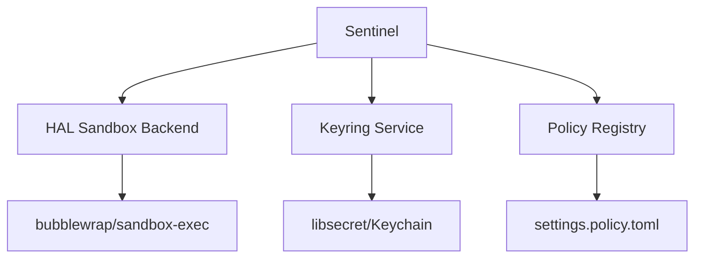
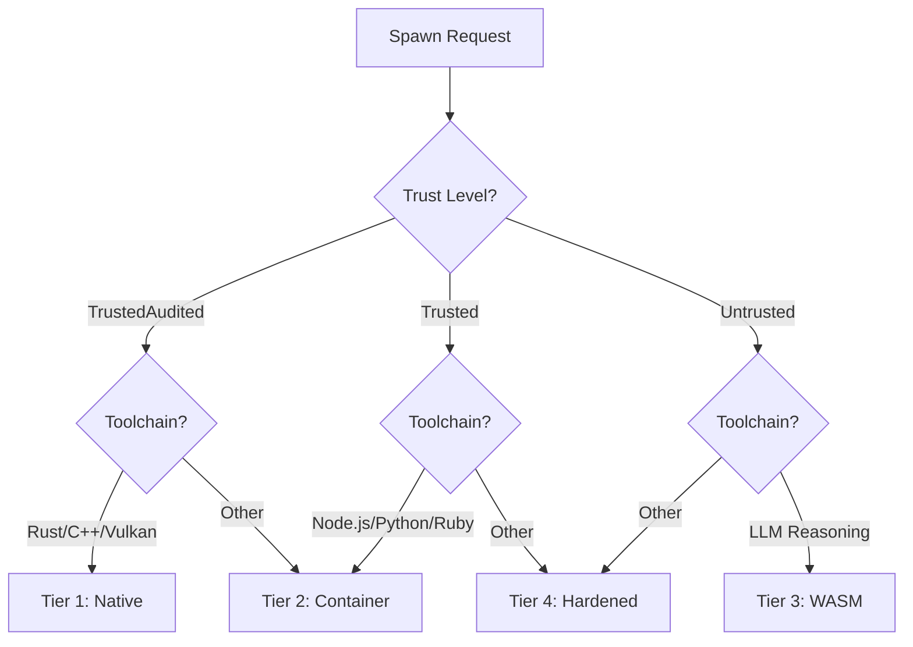
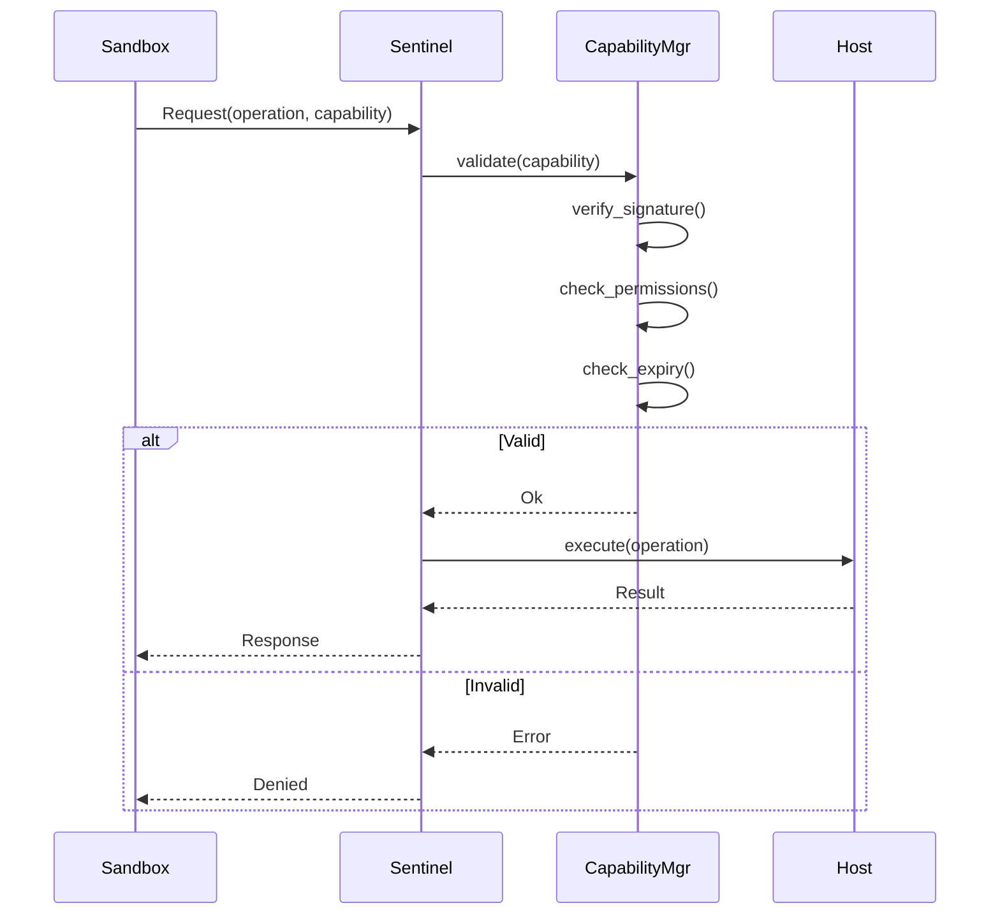
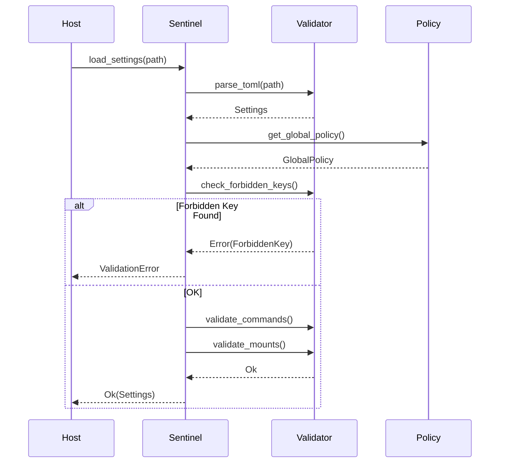

# Blue Paper BP-SENTINEL-001: Sentinel Sandbox Component

## BP-1: Design Overview

### 1.1 Purpose

The Sentinel Sandbox provides defense-in-depth security for code execution within Clawdius. It implements a tiered isolation system that dynamically selects the most restrictive sandbox appropriate for each execution context, preventing supply chain attacks, LLM hallucinations, and privilege escalation.

### 1.2 Scope

This Blue Paper specifies:
- JIT sandbox spawning logic
- 4-tier isolation model
- Capability-based access control
- Settings.toml validation (anti-RCE)
- Secret isolation mechanisms

### 1.3 Stakeholders

| Stakeholder | Role | Concerns |
|-------------|------|----------|
| Security Engineer | Threat modeling | Isolation guarantees |
| Platform Engineer | Sandbox backends | OS integration |
| Compliance Officer | Regulatory | Audit trails |

### 1.4 Viewpoints

- **Security Viewpoint:** Threat mitigation
- **Component Viewpoint:** Tier selection
- **Data Viewpoint:** Capability flow

---

## BP-2: Design Decomposition

### 2.1 Component Hierarchy

```
Sentinel Sandbox (COMP-SENTINEL-001)
├── Tier Selector
│   ├── Trust Evaluator
│   └── Toolchain Analyzer
├── Sandbox Spawner
│   ├── Tier1 (Native)
│   ├── Tier2 (Container)
│   ├── Tier3 (WASM)
│   └── Tier4 (Hardened)
├── Capability Manager
│   ├── Token Generator
│   ├── Derivation Engine
│   └── Validator
├── Settings Validator
│   ├── TOML Parser
│   ├── Policy Enforcer
│   └── Path Sanitizer
└── Secret Proxy
    ├── Keyring Client
    └── Auth Handler
```

### 2.2 Dependencies



### 2.3 Coupling Analysis

| Component | Coupling | Strength | Justification |
|-----------|----------|----------|---------------|
| HAL Sandbox | Control | Medium | Backend selection |
| Keyring | Data | Low | Interface-based |
| Policy Registry | Stamp | Low | Configuration |

---

## BP-3: Design Rationale

### 3.1 Key Decisions

| Decision ID | Decision | Rationale |
|-------------|----------|-----------|
| ADR-SENT-001 | 4-tier isolation | Defense-in-depth |
| ADR-SENT-002 | Capability tokens | Unforgeable permissions |
| ADR-SENT-003 | Settings validation | Anti-RCE protection |
| ADR-SENT-004 | Host proxy for secrets | Zero secret exposure |

### 3.2 Theory Mapping

| Yellow Paper Theory | Design Decision |
|---------------------|-----------------|
| Axiom 1 (Least Privilege) | Capability derivation attenuation |
| Axiom 2 (Isolation Boundary) | Separate memory namespaces |
| Axiom 3 (Unidirectional Trust) | Host validates all requests |
| Definition 1 (Capability) | Signed token with permissions |
| Theorem 2 (Brain-Leaking Prevention) | WASM sandbox for Brain |

### 3.3 Alternatives Considered

| Alternative | Rejected Because |
|-------------|------------------|
| Docker-only | High overhead for short tasks |
| SELinux policies | Complex, OS-specific |
| seccomp-bpf | Too low-level, error-prone |

---

## BP-4: Traceability

### 4.1 Requirements Mapping

| Requirement | Design Element | Verification |
|-------------|----------------|--------------|
| REQ-3.1 | Tier Selector + Sandbox Spawner | Test |
| REQ-3.2 | Tier 3 WASM sandbox | Test, Analysis |
| REQ-3.3 | Secret Proxy + Keyring Client | Test |
| REQ-3.4 | Settings Validator | Test, Analysis |

### 4.2 Yellow Paper Theory Mapping

| Theory Element | Implementation Location |
|----------------|------------------------|
| $\mathcal{C}$ (Capability set) | `src/sentinel/capability.rs` |
| $\Phi$ (Derivation function) | `src/sentinel/derivation.rs` |
| $\mathcal{I}$ (Isolation boundary) | `src/sentinel/sandbox.rs` |
| $\mathcal{R}$ (RPC interface) | `src/sentinel/rpc.rs` |

---

## BP-5: Interface Design

### 5.1 Sandbox Interface

```rust
pub struct Sentinel {
    tier_selector: TierSelector,
    spawner: SandboxSpawner,
    capabilities: CapabilityManager,
    validator: SettingsValidator,
    secret_proxy: SecretProxy,
}

impl Sentinel {
    pub async fn spawn(&self, request: SpawnRequest) -> Result<Sandbox, SandboxError>;
    pub fn validate_settings(&self, path: &Path) -> Result<Settings, ValidationError>;
    pub fn derive_capability(&self, parent: &Capability, subset: PermissionSet) -> Result<Capability, CapabilityError>;
    pub async fn proxy_request(&self, request: ProxiedRequest) -> Result<Response, ProxyError>;
}
```

### 5.2 Sandbox Tiers

```rust
#[derive(Debug, Clone, Copy, PartialEq, Eq, Hash)]
pub enum SandboxTier {
    Tier1 = 1,
    Tier2 = 2,
    Tier3 = 3,
    Tier4 = 4,
}

pub struct SpawnRequest {
    pub toolchain: Toolchain,
    pub trust_level: TrustLevel,
    pub required_capabilities: PermissionSet,
    pub command: CommandSpec,
    pub mounts: Vec<MountSpec>,
    pub timeout: Duration,
}

pub enum Toolchain {
    Rust,
    Cpp,
    Vulkan,
    NodeJs,
    Python,
    Ruby,
    LLMReasoning,
}

pub enum TrustLevel {
    TrustedAudited,
    Trusted,
    Untrusted,
}
```

### 5.3 Capability System

```rust
#[derive(Debug, Clone, Serialize, Deserialize)]
pub struct Capability {
    pub resource: ResourceScope,
    pub permissions: PermissionSet,
    pub signature: [u8; 32],
    pub expires_at: Option<Instant>,
}

bitflags::bitflags! {
    #[derive(Debug, Clone, Copy, PartialEq, Eq)]
    pub struct Permission: u32 {
        const FS_READ = 0b00000001;
        const FS_WRITE = 0b00000010;
        const NET_TCP = 0b00000100;
        const NET_UDP = 0b00001000;
        const EXEC_SPAWN = 0b00010000;
        const SECRET_ACCESS = 0b00100000;
        const ENV_READ = 0b01000000;
        const ENV_WRITE = 0b10000000;
    }
}

pub struct ResourceScope {
    pub paths: Vec<PathPattern>,
    pub hosts: Vec<HostPattern>,
    pub env_vars: Vec<String>,
}
```

### 5.4 Settings Validation

```rust
pub struct Settings {
    pub commands: Vec<CommandConfig>,
    pub mounts: Vec<MountConfig>,
    pub environment: HashMap<String, String>,
}

pub struct SettingsValidator {
    policy: GlobalPolicy,
}

impl SettingsValidator {
    pub fn validate(&self, settings: &Settings) -> Result<(), ValidationError> {
        self.check_forbidden_keys(&settings.environment)?;
        self.validate_commands(&settings.commands)?;
        self.validate_mounts(&settings.mounts)?;
        Ok(())
    }
    
    fn check_forbidden_keys(&self, env: &HashMap<String, String>) -> Result<(), ValidationError> {
        for key in env.keys() {
            if self.policy.forbidden_env_patterns.iter().any(|p| p.matches(key)) {
                return Err(ValidationError::ForbiddenKey(key.clone()));
            }
        }
        Ok(())
    }
}
```

### 5.5 Error Codes

| Code | Name | Description | Recovery |
|------|------|-------------|----------|
| 0x2001 | `SandboxSpawnFailed` | Sandbox creation failed | Retry with lower tier |
| 0x2002 | `CapabilityDenied` | Permission not granted | Request capability |
| 0x2003 | `CapabilityExpired` | Token expired | Re-request |
| 0x2004 | `SettingsInvalid` | TOML validation failed | Fix settings |
| 0x2005 | `ForbiddenKey` | Secret in environment | Remove key |
| 0x2006 | `UnsafeMount` | Mount outside project | Fix mount path |
| 0x2007 | `SecretNotFound` | Credential not in keyring | Store secret |
| 0x2008 | `SandboxTimeout` | Execution timeout | Increase timeout |

---

## BP-6: Data Design

### 6.1 Tier Configuration

```toml
[sandbox.tier1]
name = "Native Passthrough"
backends = ["none"]
allowed_toolchains = ["rust", "cpp", "vulkan"]
trust_required = "trusted_audited"

[sandbox.tier2]
name = "OS Container"
backends = ["bubblewrap", "podman"]
allowed_toolchains = ["nodejs", "python", "ruby"]
trust_required = "trusted"

[sandbox.tier3]
name = "WASM Sandbox"
backends = ["wasmtime"]
allowed_toolchains = ["llm_reasoning"]
trust_required = "untrusted"

[sandbox.tier4]
name = "Hardened Container"
backends = ["gvisor", "kata"]
allowed_toolchains = ["*"]
trust_required = "untrusted"
```

### 6.2 Global Policy

```toml
[policy]
forbidden_env_patterns = ["*_KEY", "*_SECRET", "*_TOKEN", "*_PASSWORD", "*_CREDENTIAL"]
allowed_commands = ["cargo", "rustc", "npm", "node", "python3"]
max_mount_points = 10
sandbox_timeout = "5m"
secret_memory_zeroing = true
```

### 6.3 Capability Token Format

```
[32 bytes: HMAC-SHA256 signature]
[4 bytes: version]
[4 bytes: permission bitmap]
[4 bytes: resource count]
[N bytes: serialized resources]
[8 bytes: expiry timestamp (optional)]
```

---

## BP-7: Component Design

### 7.1 Tier Selection Algorithm



### 7.2 Capability Validation Flow



### 7.3 Settings Validation Flow



---

## BP-8: Deployment Design

### 8.1 Sandbox Backend Matrix

| Platform | Tier 1 | Tier 2 | Tier 3 | Tier 4 |
|----------|--------|--------|--------|--------|
| Linux | None | bubblewrap | wasmtime | gVisor |
| macOS | None | sandbox-exec | wasmtime | (n/a) |
| Windows | None | WSL2 | wasmtime | Hyper-V |

### 8.2 Resource Limits

| Tier | Memory | CPU | Time | Network |
|------|--------|-----|------|---------|
| 1 | Unbounded | Unbounded | Unbounded | Host |
| 2 | 4GB | 4 cores | 5 min | Isolated |
| 3 | 4GB | 2 cores | 1 min | None |
| 4 | 2GB | 2 cores | 5 min | None |

---

## BP-9: Formal Verification

### 9.1 Properties to Prove

| Property | Type | Description |
|----------|------|-------------|
| P-SENT-001 | Safety | Capabilities cannot be forged |
| P-SENT-002 | Safety | Derivation only attenuates |
| P-SENT-003 | Safety | Secrets never cross boundary |
| P-SENT-004 | Safety | Settings validation catches RCE |

### 9.2 Lean4 Proof Sketch

```lean
-- See proofs/proof_sandbox.lean for full implementation

inductive Permission where
  | fsRead : Permission
  | fsWrite : Permission
  | netTcp : Permission
  | execSpawn : Permission
  | secretAccess : Permission

def Capability := { permissions : Set Permission, signature : Nat }

axiom hmac_secure : ∀ k m m', m ≠ m' → hmac k m ≠ hmac k m'

theorem capability_unforgeable (c : Capability) (sandbox : Sandbox) :
  sandbox.signing_key ∉ sandbox.memory →
  ∀ c', c'.signature = c.signature → c' = c := by
  sorry -- Proof by HMAC security

theorem derivation_attenuates (parent : Capability) (child : Capability) :
  derived_from parent child →
  child.permissions ⊆ parent.permissions := by
  sorry -- Proof by derivation function definition

theorem secret_isolation (sandbox : Sandbox) :
  sandbox.tier ≥ Tier3 →
  ∀ secret, secret ∈ Host.keychain →
  secret ∉ sandbox.memory := by
  sorry -- Proof by isolation boundary definition
```

---

## BP-10: HAL Specification

### 10.1 Sandbox Backend Trait

```rust
pub trait SandboxBackend: Send + Sync {
    fn spawn(&self, config: SandboxConfig) -> Result<SandboxHandle, SandboxError>;
    fn execute(&self, handle: &SandboxHandle, cmd: CommandSpec) -> Result<ExitStatus, SandboxError>;
    fn kill(&self, handle: &SandboxHandle) -> Result<(), SandboxError>;
    fn stats(&self, handle: &SandboxHandle) -> Result<SandboxStats, SandboxError>;
}

pub struct SandboxConfig {
    pub tier: SandboxTier,
    pub command: CommandSpec,
    pub mounts: Vec<MountSpec>,
    pub environment: HashMap<String, String>,
    pub capabilities: PermissionSet,
    pub timeout: Duration,
    pub memory_limit: Option<usize>,
}
```

### 10.2 Platform Implementations

See `hal/hal_platform.md` for:
- Linux: bubblewrap CLI invocation
- macOS: sandbox-exec profile generation
- Windows: WSL2/Hyper-V configuration

---

## BP-11: Compliance Matrix

### 11.1 Standards Mapping

| Standard | Clause | Compliance | Evidence |
|----------|--------|------------|----------|
| NIST SP 800-53 | AC-3 | Full | Capability enforcement |
| NIST SP 800-53 | SC-3 | Full | Isolation boundaries |
| OWASP ASVS | V1.5 | Full | TCB minimization |
| SLSA | Build L3 | Full | Hermetic builds |

### 11.2 Theory Compliance

| YP-SECURITY-SANDBOX-001 Element | Implementation Status |
|--------------------------------|----------------------|
| Axiom 1 (Least Privilege) | Implemented |
| Axiom 2 (Isolation Boundary) | Implemented |
| Axiom 3 (Unidirectional Trust) | Implemented |
| Lemma 1 (Capability Unforgeability) | Proof sketch |
| Lemma 2 (Attenuation-Only) | Implemented |
| Theorem 1 (Isolation Soundness) | Test coverage |

---

## BP-12: Quality Checklist

| Item | Status | Notes |
|------|--------|-------|
| IEEE 1016 Sections 1-12 | Complete | All sections |
| 4 Tiers Defined | Complete | Selection algorithm |
| Capability System | Complete | Token + validation |
| Settings Validation | Complete | Anti-RCE |
| Lean4 Proof | Sketch | proof_sandbox.lean |
| Interface Contract | Complete | interface_sentinel.toml |
| HAL Backend Trait | Complete | hal/hal_platform.md |

---

**Document Status:** APPROVED  
**Next Review:** After implementation (Phase 3)  
**Sign-off:** Construct Systems Architect
