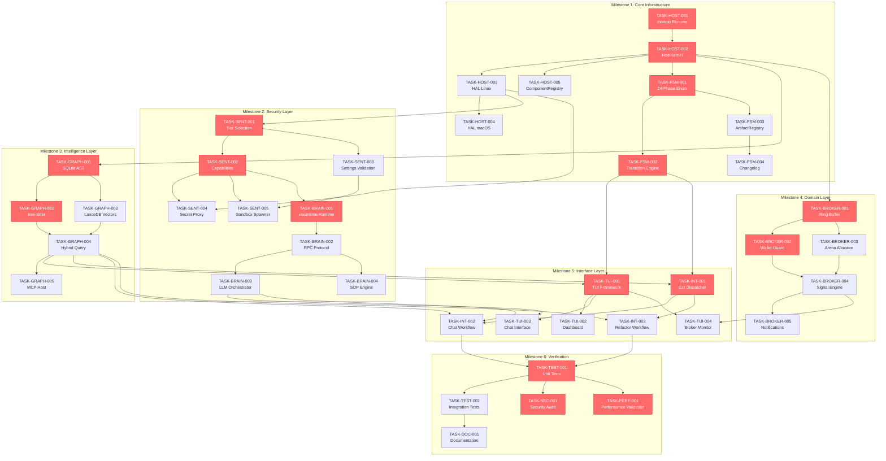

# Task Dependency Graph

This document visualizes the task dependencies for the Clawdius implementation plan using topological sort.

## Overview

- **Total Tasks:** 47
- **Critical Path Length:** 16 tasks
- **Estimated Total Effort:** 228 hours

## Dependency Graph



## Critical Path

The critical path (highlighted in red) represents the longest sequence of dependent tasks:

```
TASK-HOST-001 (4h)
    └─→ TASK-HOST-002 (6h)
        └─→ TASK-FSM-001 (6h)
            └─→ TASK-FSM-002 (8h)
                └─→ TASK-SENT-001 (6h)
                    └─→ TASK-SENT-002 (8h)
                        └─→ TASK-BRAIN-001 (6h)
                            └─→ TASK-GRAPH-001 (8h)
                                └─→ TASK-GRAPH-002 (8h)
                                    └─→ TASK-BROKER-001 (8h)
                                        └─→ TASK-BROKER-002 (8h)
                                            └─→ TASK-TUI-001 (8h)
                                                └─→ TASK-INT-001 (6h)
                                                    └─→ TASK-TEST-001 (12h)
                                                        └─→ TASK-SEC-001 (8h)
                                                        └─→ TASK-PERF-001 (6h)
```

**Critical Path Total:** 128 hours

## Parallel Execution Opportunities

Tasks that can run in parallel after their dependencies are satisfied:

### After TASK-HOST-002
- TASK-HOST-003 (HAL Linux)
- TASK-HOST-005 (ComponentRegistry)
- TASK-FSM-001 (Phase Enum)
- TASK-GRAPH-001 (SQLite AST)
- TASK-BROKER-001 (Ring Buffer)

### After TASK-SENT-002
- TASK-SENT-004 (Secret Proxy)
- TASK-SENT-005 (Sandbox Spawner)
- TASK-BRAIN-001 (wasmtime Runtime)

### After TASK-GRAPH-004
- TASK-GRAPH-005 (MCP Host)
- TASK-TUI-001 (TUI Framework)
- TASK-INT-001 (CLI Dispatcher)

## Component Dependency Summary

| Component | Depends On | Provides To |
|-----------|------------|-------------|
| COMP-HOST-001 | None | FSM, SENTINEL, BRAIN, GRAPH, BROKER |
| COMP-FSM-001 | HOST | TUI, CLI |
| COMP-SENTINEL-001 | HOST | BRAIN |
| COMP-BRAIN-001 | HOST, SENTINEL | TUI, Workflows |
| COMP-GRAPH-001 | HOST | TUI, BROKER, Workflows |
| COMP-BROKER-001 | HOST, GRAPH | TUI, Notifications |
| COMP-TUI-001 | HOST, FSM, GRAPH | User Interface |

## Milestone Gates

Each milestone has entry and exit gates:

### M1: Core Infrastructure
- **Entry:** None (foundation)
- **Exit:** All HOST and FSM tasks complete, tests passing

### M2: Security Layer
- **Entry:** M1 complete
- **Exit:** Sentinel and Brain tasks complete, capability tests passing

### M3: Intelligence Layer
- **Entry:** M1 complete
- **Exit:** Graph-RAG tasks complete, indexing validated

### M4: Domain Layer
- **Entry:** M1, M3 complete
- **Exit:** Broker tasks complete, WCET verified <100µs

### M5: Interface Layer
- **Entry:** M1, M2, M3, M4 complete
- **Exit:** TUI and CLI tasks complete, E2E workflows passing

### M6: Verification
- **Entry:** All previous milestones complete
- **Exit:** 85%+ coverage, security audit passed, docs complete

## Risk Areas

High-risk dependencies that could delay the critical path:

1. **TASK-HOST-003** (HAL Linux) - Platform-specific, may require iteration
2. **TASK-SENT-005** (Sandbox Spawner) - Security-critical, needs thorough testing
3. **TASK-BRAIN-001** (wasmtime) - Complex integration, potential version conflicts
4. **TASK-GRAPH-002** (tree-sitter) - Multi-language support, grammar issues
5. **TASK-BROKER-001** (Ring Buffer) - Lock-free complexity, memory ordering
