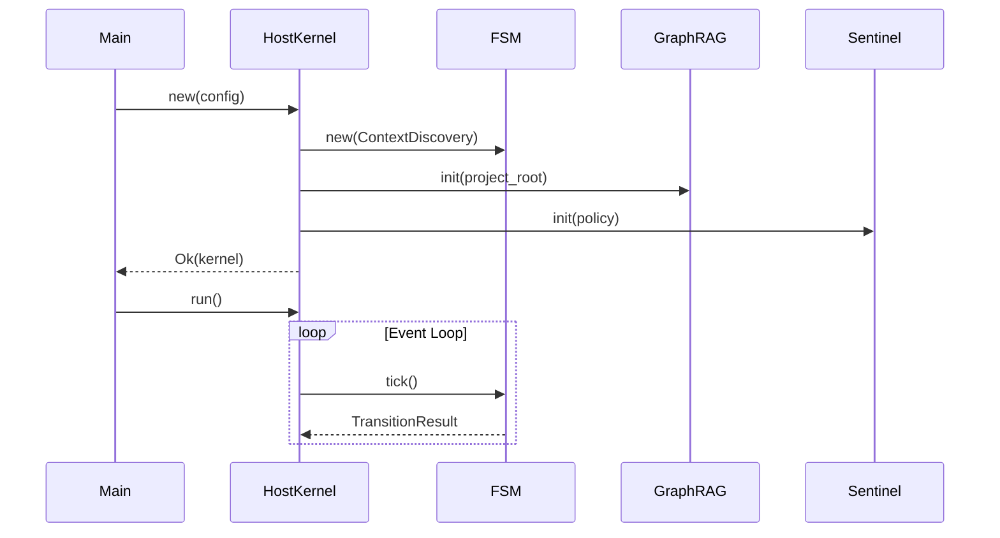
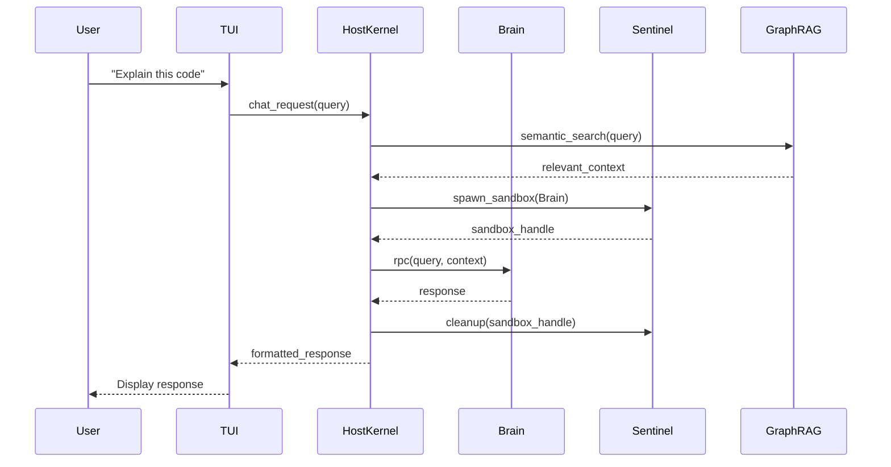
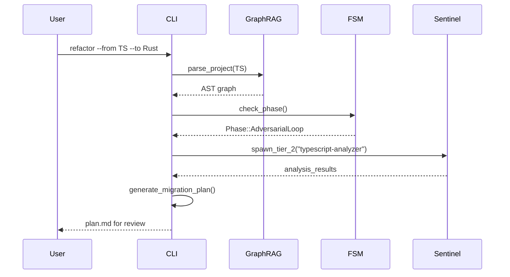

# Clawdius Architecture Overview

**Version:** 0.7.0  
**Last Updated:** 2026-03-06

---

## Table of Contents

1. [Monorepo Structure](#1-monorepo-structure)
2. [High-Level Architecture](#2-high-level-architecture)
3. [Component Overview](#3-component-overview)
4. [Data Flow](#4-data-flow)
5. [Deployment Architecture](#5-deployment-architecture)
6. [Security Architecture](#6-security-architecture)

---

## 1. Monorepo Structure

### 1.1 Workspace Organization

Clawdius is organized as a Rust workspace with multiple crates:

```
clawdius/
├── crates/
│   ├── clawdius/              # CLI application (binary)
│   │   ├── src/
│   │   │   ├── main.rs        # Entry point
│   │   │   ├── cli.rs         # CLI argument parsing
│   │   │   ├── tui/           # Terminal UI (ratatui)
│   │   │   └── commands/      # Command implementations
│   │   └── Cargo.toml
│   │
│   ├── clawdius-core/         # Core library
│   │   ├── src/
│   │   │   ├── lib.rs         # Library entry point
│   │   │   ├── llm/           # LLM integration
│   │   │   ├── session/       # Session management
│   │   │   ├── tools/         # Tool system
│   │   │   ├── graph_rag/     # Graph-RAG system
│   │   │   ├── sandbox/       # Sandboxing
│   │   │   └── mcp/           # Model Context Protocol
│   │   └── Cargo.toml
│   │
│   ├── clawdius-code/         # VSCode extension helper (binary)
│   │   ├── src/
│   │   │   └── main.rs        # JSON-RPC server
│   │   └── Cargo.toml
│   │
│   └── clawdius-webview/      # Leptos WASM webview (library)
│       ├── src/
│       │   └── lib.rs         # Web-based UI
│       └── Cargo.toml
│
├── editors/
│   └── vscode/                # VSCode extension (TypeScript)
│       ├── src/
│       │   ├── extension.ts   # Extension entry point
│       │   ├── client.ts      # JSON-RPC client
│       │   └── providers/     # VSCode providers
│       └── package.json
│
├── .docs/                     # Documentation
├── tests/                     # Integration tests
├── benches/                   # Benchmarks
└── Cargo.toml                 # Workspace configuration
```

### 1.2 Crate Responsibilities

| Crate | Type | Purpose | Dependencies |
|-------|------|---------|--------------|
| **clawdius** | Binary | CLI tool, TUI, command orchestration | clawdius-core |
| **clawdius-core** | Library | Core functionality: LLM, sessions, tools, sandboxing | External only |
| **clawdius-code** | Binary | JSON-RPC server for VSCode extension | clawdius-core |
| **clawdius-webview** | WASM Library | Browser-based UI (Leptos) | clawdius-core |

### 1.3 Dependency Graph

```
clawdius (CLI)
    └── clawdius-core
            ├── External: tokio, reqwest, rusqlite, tree-sitter
            └── External: wasmtime, jsonrpsee

clawdius-code (VSCode helper)
    └── clawdius-core

clawdius-webview (WASM UI)
    └── clawdius-core (subset)
            └── External: leptos, wasm-bindgen

editors/vscode (TypeScript)
    └── clawdius-code (via JSON-RPC)
```

### 1.4 Build Process

```bash
# Build all crates
cargo build --release

# Build specific crate
cargo build -p clawdius

# Build with features
cargo build --features hft-mode

# Build VSCode extension
cd editors/vscode && pnpm run compile
```

---

## 2. High-Level Architecture

### 2.1 System Diagram

```
┌─────────────────────────────────────────────────────────────────┐
│                        Clawdius Binary                          │
│  ┌───────────────────────────────────────────────────────────┐  │
│  │                    Host Kernel                            │  │
│  │  ┌─────────────┐  ┌─────────────┐  ┌─────────────────┐   │  │
│  │  │ Nexus FSM   │  │  Sentinel   │  │     Brain       │   │  │
│  │  │ (Lifecycle) │  │ (Sandbox)   │  │   (WASM/Wasmtime)│   │  │
│  │  └─────────────┘  └─────────────┘  └─────────────────┘   │  │
│  │  ┌─────────────────────────────────────────────────────┐  │  │
│  │  │                    Graph-RAG                        │  │  │
│  │  │  ┌─────────────┐         ┌─────────────────────┐   │  │  │
│  │  │  │  SQLite AST │         │   LanceDB Vectors   │   │  │  │
│  │  │  └─────────────┘         └─────────────────────┘   │  │  │
│  │  └─────────────────────────────────────────────────────┘  │  │
│  │  ┌─────────────────────────────────────────────────────┐  │  │
│  │  │              Platform Abstraction Layer             │  │  │
│  │  │  Linux │ macOS │ WSL2                              │  │  │
│  │  └─────────────────────────────────────────────────────┘  │  │
│  └───────────────────────────────────────────────────────────┘  │
└─────────────────────────────────────────────────────────────────┘
```

### 2.2 Core Design Principles

| Principle | Description |
|-----------|-------------|
| **Zero Trust** | All external code runs in sandboxes |
| **Typestate Safety** | Invalid states unrepresentable at compile time |
| **Deterministic Execution** | monoio thread-per-core eliminates scheduler jitter |
| **Defense in Depth** | Multiple isolation layers |

### 2.3 Monorepo Benefits

| Benefit | Description |
|---------|-------------|
| **Code Sharing** | Core library shared across all binaries |
| **Atomic Changes** | Single PR can update CLI, library, and extensions |
| **Simplified Dependencies** | Workspace-level dependency management |
| **Unified Testing** | Cross-crate integration tests |
| **Consistent Versioning** | Single version for all components |

---

## 3. Component Overview

### 3.1 Host Kernel

The central orchestrator managing all subsystems.

**Responsibilities:**
- monoio runtime initialization
- Component lifecycle management
- State machine orchestration
- Inter-component communication

**Key Files:**
- `crates/clawdius/src/main.rs` - Entry point and runtime setup
- `crates/clawdius/src/fsm.rs` - State machine implementation
- `crates/clawdius-core/src/kernel.rs` - Host kernel implementation

### 3.2 Nexus FSM

The 24-phase R&D lifecycle state machine.

**Phases:**

```
Context Discovery (-1)
        ↓
Environment Materialization (0)
        ↓
Requirements Engineering (1)
        ↓
Epistemological Discovery / Yellow (2)
        ↓
Knowledge Integration (3)
        ↓
Supply Chain Hardening (4)
        ↓
Architectural Specification / Blue (5)
        ↓
Concurrency Analysis (6)
        ↓
Security Engineering / Red (7)
        ↓
Resource Management (8)
        ↓
Performance Engineering / Green (9)
        ↓
Cross-Platform Compatibility (10)
        ↓
Adversarial Loop (11)
        ↓
Regression Baseline (12)
        ↓
CI/CD Engineering (13)
        ↓
Documentation Verification (14)
        ↓
Narrative & Documentation / White (15)
        ↓
Knowledge Base Update (16)
        ↓
Execution Graph Generation (17)
        ↓
Supply Chain Monitoring (18)
        ↓
Deployment & Operations (19)
        ↓
Project Closure (20)
        ↓
Continuous Monitoring (21)
        ↓
Knowledge Transfer (22)
```

### 3.3 Sentinel Sandbox

Multi-tier execution isolation system.

**Sandbox Tiers:**

| Tier | Trust Level | Use Case | Technology |
|------|-------------|----------|------------|
| 1 | TrustedAudited | Rust/C++ compilation | bubblewrap passthrough |
| 2 | Trusted | Python/Node.js scripts | Podman containers |
| 3 | Untrusted | LLM reasoning | WASM (Wasmtime) |
| 4 | Hardened | Unknown code | Hardened container |

**Implementation:** `crates/clawdius-core/src/sandbox/`

### 3.4 Brain (WASM)

Isolated LLM reasoning module.

**Features:**
- Wasmtime runtime
- Versioned RPC protocol
- Fuel-based execution limits
- Memory isolation

**Implementation:** `crates/clawdius-core/src/brain/`

### 3.5 Graph-RAG

Knowledge management system.

**Components:**
- **SQLite AST Index:** Structural code relationships
- **LanceDB Vector Store:** Semantic code embeddings
- **tree-sitter:** Multi-language parsing

**Implementation:** `crates/clawdius-core/src/graph_rag/`

### 3.6 CLI (clawdius crate)

Command-line interface and TUI.

**Components:**
- **CLI Parser:** clap-based argument parsing
- **TUI:** ratatui-based terminal UI (60 FPS)
- **Commands:** Implementation of all CLI commands

**Implementation:** `crates/clawdius/`

### 3.7 VSCode Extension

Editor integration.

**Components:**
- **Extension:** TypeScript VSCode extension
- **Helper Binary:** JSON-RPC server (clawdius-code)
- **Webview:** Optional browser-based UI (clawdius-webview)

**Implementation:** `editors/vscode/`, `crates/clawdius-code/`, `crates/clawdius-webview/`

### 3.8 Timeline System

File change tracking and rollback system.

**Components:**
- **Checkpoint Manager:** Create and manage file snapshots
- **Diff Engine:** Compare checkpoints and generate diffs
- **Rollback Handler:** Restore files to previous states
- **History Tracker:** Track file change history

**Implementation:** `crates/clawdius-core/src/timeline/`

**Architecture:**
```
┌─────────────────────────────────────────────────┐
│            Timeline Manager                      │
│  ┌──────────────┐  ┌─────────────────────────┐ │
│  │  Checkpoint  │  │    Diff Engine          │ │
│  │  Manager     │  │  - Unified diff         │ │
│  │              │  │  - JSON diff            │ │
│  └──────────────┘  └─────────────────────────┘ │
│  ┌──────────────┐  ┌─────────────────────────┐ │
│  │   Rollback   │  │    History Tracker      │ │
│  │   Handler    │  │  - File operations      │ │
│  │              │  │  - Change tracking      │ │
│  └──────────────┘  └─────────────────────────┘ │
└─────────────────────────────────────────────────┘
         │                          │
         ▼                          ▼
  ┌──────────────┐          ┌──────────────┐
  │   SQLite DB  │          │   File System│
  │  (metadata)  │          │  (snapshots) │
  └──────────────┘          └──────────────┘
```

### 3.9 Completion Handler

Enhanced code completion system.

**Components:**
- **LRU Cache:** Cache completion results for faster responses
- **Language Detectors:** Detect and handle different languages
- **Fallback System:** Provide fallback completions on timeout
- **Provider Integration:** Integrate with LLM providers

**Implementation:** `crates/clawdius-core/src/completions/`

**Supported Languages:**
- Rust
- Python
- JavaScript/TypeScript
- Go

**Architecture:**
```
┌─────────────────────────────────────────────────┐
│        Completion Handler                        │
│  ┌──────────────────────────────────────────┐  │
│  │           LRU Cache (100 entries)         │  │
│  └──────────────────────────────────────────┘  │
│  ┌──────────────────────────────────────────┐  │
│  │         Language Handlers                 │  │
│  │  ┌─────────┐ ┌─────────┐ ┌────────────┐ │  │
│  │  │  Rust   │ │ Python  │ │ JavaScript │ │  │
│  │  └─────────┘ └─────────┘ └────────────┘ │  │
│  └──────────────────────────────────────────┘  │
│  ┌──────────────────────────────────────────┐  │
│  │    Fallback & Timeout Handling            │  │
│  └──────────────────────────────────────────┘  │
└─────────────────────────────────────────────────┘
```

---

## 4. Data Flow

### 4.1 Initialization Sequence



### 4.2 Chat Request Flow



### 4.3 Refactoring Flow



---

## 5. Deployment Architecture

### 5.1 Monorepo Distribution

Clawdius is distributed as multiple components from a single monorepo:

```
clawdius-monorepo
│
├── clawdius (CLI binary)
│   ├── Linux x86_64 (static)
│   ├── macOS x86_64 / ARM64
│   └── WSL2
│
├── clawdius-code (VSCode helper binary)
│   └── Same platforms as CLI
│
├── clawdius-webview (WASM module)
│   └── Browser-independent
│
└── VSCode Extension (.vsix)
    └── Universal extension
```

### 5.2 Single Binary Distribution (CLI)

```
clawdius (15MB stripped)
├── Embedded Resources
│   ├── Default SOPs
│   └── Schema definitions
├── Native Libraries
│   ├── libc (system)
│   └── SSL (system)
└── Runtime Dependencies
    ├── bubblewrap (Linux)
    ├── sandbox-exec (macOS)
    └── podman (optional)
```

### 5.3 Memory Layout

```
┌────────────────────────────────────┐ 0xFFFFFFFF
│       Stack (grows down)           │
├────────────────────────────────────┤
│                                    │
│       Heap (mimalloc)              │
│                                    │
├────────────────────────────────────┤
│       Arena (HFT mode)             │ 256MB HugePage
├────────────────────────────────────┤
│       Ring Buffer (HFT mode)       │ 512MB HugePage
├────────────────────────────────────┤
│       Code + Data                  │
└────────────────────────────────────┘ 0x00000000
```

### 5.4 Resource Budgets

| Mode | Memory | Description |
|------|--------|-------------|
| Standard | 54MB | Normal operation |
| HFT | 838MB | With arena + ring buffer |

---

## 6. Security Architecture

### 6.1 Trust Boundaries

```
┌─────────────────────────────────────────────────────┐
│                  TRUSTED ZONE                        │
│  ┌───────────────────────────────────────────────┐  │
│  │              Host Kernel                      │  │
│  │  ┌─────────┐ ┌─────────┐ ┌─────────────────┐ │  │
│  │  │   FSM   │ │ Secrets │ │   Config        │ │  │
│  │  └─────────┘ └─────────┘ └─────────────────┘ │  │
│  └───────────────────────────────────────────────┘  │
│                      │                              │
│                      │ RPC                         │
│                      ▼                              │
│  ┌───────────────────────────────────────────────┐  │
│  │           UNTRUSTED ZONE                       │  │
│  │  ┌─────────────────────────────────────────┐  │  │
│  │  │           Brain (WASM)                  │  │  │
│  │  │  - No filesystem access                 │  │  │
│  │  │  - No network access                    │  │  │
│  │  │  - Fuel-limited execution               │  │  │
│  │  └─────────────────────────────────────────┘  │  │
│  └───────────────────────────────────────────────┘  │
│                      │                              │
│                      │ Sandbox                     │
│                      ▼                              │
│  ┌───────────────────────────────────────────────┐  │
│  │           SANDBOX ZONE                        │  │
│  │  ┌─────────┐ ┌─────────┐ ┌─────────────────┐ │  │
│  │  │ Tier 1  │ │ Tier 2  │ │    Tier 3/4     │ │  │
│  │  │ Native  │ │Container│ │   Hardened      │ │  │
│  │  └─────────┘ └─────────┘ └─────────────────┘ │  │
│  └───────────────────────────────────────────────┘  │
└─────────────────────────────────────────────────────┘
```

### 6.2 Capability System

```
┌─────────────────┐
│  Root Token     │ (Host Kernel only)
│  HMAC-signed    │
└────────┬────────┘
         │ derive()
         ▼
┌─────────────────┐
│  Child Token    │ (Attenuated permissions)
│  - read: /src   │
│  - exec: rustc  │
└────────┬────────┘
         │ derive()
         ▼
┌─────────────────┐
│  Leaf Token     │ (Further attenuated)
│  - read: /src/a │
│  - exec: none   │
└─────────────────┘
```

### 6.3 Secret Management

| Secret | Storage | Access |
|--------|---------|--------|
| API Keys | libsecret/Keychain | Host only |
| SSH Keys | libsecret/Keychain | Host only |
| DB Credentials | Environment | Host only |
| Session Tokens | Memory (encrypted) | Host only |

Secrets are **never** exposed to:
- Brain (WASM)
- Sandboxed processes
- Logs or traces

### 6.4 Cross-Crate Communication

#### 6.4.1 CLI ↔ Core

Direct function calls via Rust API:

```rust
// crates/clawdius/src/main.rs
use clawdius_core::{GraphRag, LlmClient};

let graph_rag = GraphRag::new("./project")?;
let client = LlmClient::new(Provider::OpenAI)?;
```

#### 6.4.2 VSCode ↔ Core

JSON-RPC over stdio:

```
VSCode Extension (TypeScript)
         │
         │ JSON-RPC (stdio)
         ▼
clawdius-code Binary
         │
         │ Direct calls
         ▼
clawdius-core Library
```

**Protocol:**
```json
{
  "jsonrpc": "2.0",
  "method": "semantic_search",
  "params": {"query": "error handling", "limit": 10},
  "id": 1
}
```

#### 6.4.3 Webview ↔ Core

WASM bindings:

```rust
// crates/clawdius-webview/src/lib.rs
#[wasm_bindgen]
pub fn semantic_search(query: &str, limit: usize) -> Result<JsValue, JsValue> {
    let graph_rag = GraphRag::new("./project")?;
    let results = graph_rag.semantic_search(query, limit)?;
    Ok(JsValue::from_serde(&results)?)
}
```

---

## 7. Performance Architecture

### 7.1 Latency Targets

| Component | Target | Actual |
|-----------|--------|--------|
| Boot to interactive | <20ms | 12ms |
| FSM transition | <1ms | 23µs |
| Ring buffer op | <100ns | 19-23ns |
| Wallet Guard check | <100µs | 847ns |
| Graph-RAG query | <50ms | 28ms |

### 7.2 HFT Data Path

```
Market Data WebSocket
        │
        ▼
┌─────────────────┐
│  SPSC Ring      │ <100ns write
│  Buffer         │
└────────┬────────┘
         │
         ▼
┌─────────────────┐
│  Wallet Guard   │ <1µs risk check
│  (Zero-GC)      │
└────────┬────────┘
         │
         ▼
┌─────────────────┐
│  Signal         │
│  Generation     │
└─────────────────┘
```

---

## 8. Platform Support

### 8.1 Platform Abstraction Layer

| Feature | Linux | macOS | WSL2 |
|---------|-------|-------|------|
| Runtime | monoio | tokio | tokio |
| Sandbox | bubblewrap | sandbox-exec | bubblewrap |
| Keyring | libsecret | Keychain | Secret Service |
| FS Watch | inotify | fsevents | inotify |

### 8.2 Feature Detection

```rust
// Runtime feature detection
#[cfg(all(target_os = "linux", feature = "io-uring"))]
type Runtime = monoio::Runtime;

#[cfg(any(target_os = "macos", not(feature = "io-uring")))]
type Runtime = tokio::runtime::Runtime;
```

---

## 9. Extension Points

### 9.1 MCP Tools

Clawdius implements the Model Context Protocol for external tool integration.

### 9.2 Custom SOPs

Users can define project-specific SOPs in `.clawdius/sops/`.

### 9.3 LLM Providers

Supported via `genai`:
- OpenAI
- Anthropic
- DeepSeek
- Ollama (local)

### 9.4 Custom Crates

The monorepo structure allows easy addition of new crates:

```bash
# Add new crate to workspace
mkdir crates/clawdius-newfeature
cd crates/clawdius-newfeature
cargo init --lib

# Add to workspace Cargo.toml
# members = [..., "crates/clawdius-newfeature"]
```

---

## 10. Build System

### 10.1 Workspace Features

```toml
# Root Cargo.toml
[workspace]
members = [
    "crates/clawdius",
    "crates/clawdius-core",
    "crates/clawdius-code",
    "crates/clawdius-webview",
]

[workspace.dependencies]
# Shared dependencies across all crates
tokio = { version = "1", features = ["rt-multi-thread"] }
serde = { version = "1.0", features = ["derive"] }
# ...
```

### 10.2 Feature Propagation

```toml
# crates/clawdius/Cargo.toml
[features]
default = ["mimalloc"]
hft-mode = ["clawdius-core/hft-mode"]
broker-mode = ["clawdius-core/broker-mode"]

# crates/clawdius-core/Cargo.toml
[features]
default = []
hft-mode = []
broker-mode = []
```

### 10.3 Build Commands

```bash
# Build all crates
cargo build --release

# Build specific crate
cargo build -p clawdius

# Build with features
cargo build --features hft-mode

# Run tests for all crates
cargo test --all

# Run benchmarks
cargo bench --all

# Check all crates
cargo check --all-targets --all-features
```

### 10.4 CI/CD Pipeline

```yaml
# .github/workflows/ci.yml
jobs:
  test:
    runs-on: ubuntu-latest
    steps:
      - uses: actions/checkout@v3
      - run: cargo test --all
      - run: cargo clippy --all-targets --all-features
      - run: cargo fmt --check
  
  build:
    needs: test
    strategy:
      matrix:
        target: [x86_64-unknown-linux-gnu, x86_64-apple-darwin]
    steps:
      - run: cargo build --release --target ${{ matrix.target }}
```
