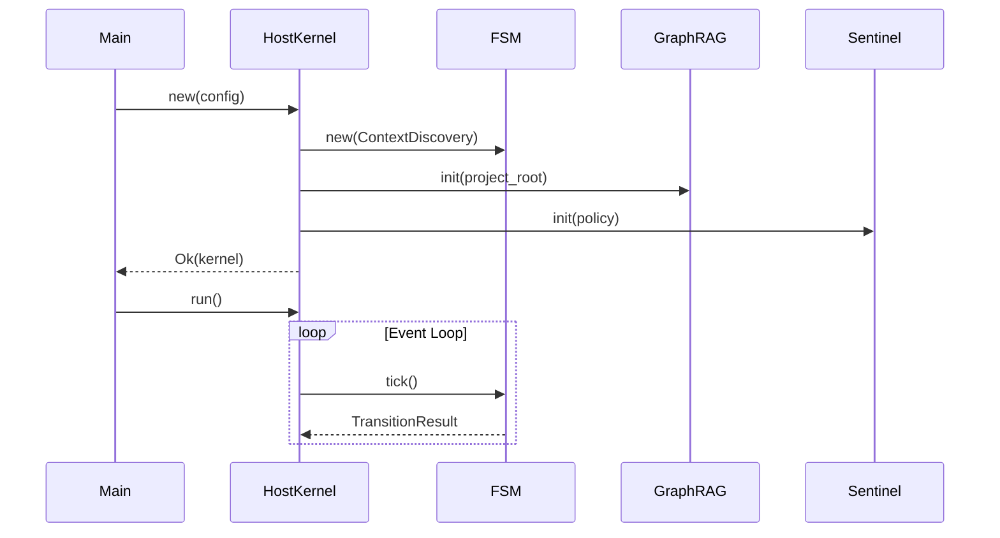
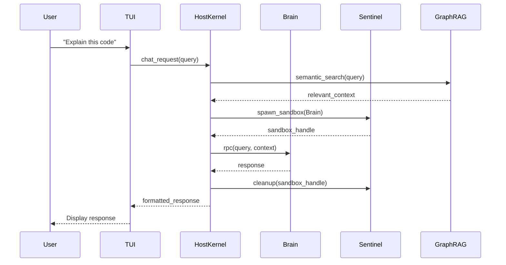
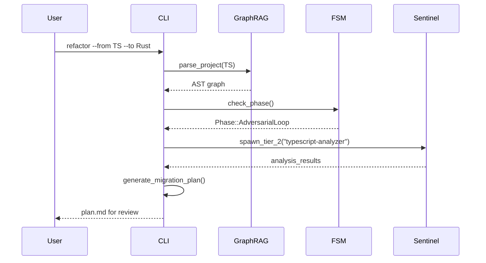

# Clawdius Architecture Overview

**Version:** 0.6.0  
**Last Updated:** 2026-03-01

---

## Table of Contents

1. [High-Level Architecture](#1-high-level-architecture)
2. [Component Overview](#2-component-overview)
3. [Data Flow](#3-data-flow)
4. [Deployment Architecture](#4-deployment-architecture)
5. [Security Architecture](#5-security-architecture)

---

## 1. High-Level Architecture

### 1.1 System Diagram

```
┌─────────────────────────────────────────────────────────────────┐
│                        Clawdius Binary                          │
│  ┌───────────────────────────────────────────────────────────┐  │
│  │                    Host Kernel                            │  │
│  │  ┌─────────────┐  ┌─────────────┐  ┌─────────────────┐   │  │
│  │  │ Nexus FSM   │  │  Sentinel   │  │     Brain       │   │  │
│  │  │ (Lifecycle) │  │ (Sandbox)   │  │   (WASM/Wasmtime)│   │  │
│  │  └─────────────┘  └─────────────┘  └─────────────────┘   │  │
│  │  ┌─────────────────────────────────────────────────────┐  │  │
│  │  │                    Graph-RAG                        │  │  │
│  │  │  ┌─────────────┐         ┌─────────────────────┐   │  │  │
│  │  │  │  SQLite AST │         │   LanceDB Vectors   │   │  │  │
│  │  │  └─────────────┘         └─────────────────────┘   │  │  │
│  │  └─────────────────────────────────────────────────────┘  │  │
│  │  ┌─────────────────────────────────────────────────────┐  │  │
│  │  │              Platform Abstraction Layer             │  │  │
│  │  │  Linux │ macOS │ WSL2                              │  │  │
│  │  └─────────────────────────────────────────────────────┘  │  │
│  └───────────────────────────────────────────────────────────┘  │
└─────────────────────────────────────────────────────────────────┘
```

### 1.2 Core Design Principles

| Principle | Description |
|-----------|-------------|
| **Zero Trust** | All external code runs in sandboxes |
| **Typestate Safety** | Invalid states unrepresentable at compile time |
| **Deterministic Execution** | monoio thread-per-core eliminates scheduler jitter |
| **Defense in Depth** | Multiple isolation layers |

---

## 2. Component Overview

### 2.1 Host Kernel

The central orchestrator managing all subsystems.

**Responsibilities:**
- monoio runtime initialization
- Component lifecycle management
- State machine orchestration
- Inter-component communication

**Key Files:**
- `src/main.rs` - Entry point and runtime setup
- `src/fsm.rs` - State machine implementation

### 2.2 Nexus FSM

The 24-phase R&D lifecycle state machine.

**Phases:**

```
Context Discovery (-1)
        ↓
Environment Materialization (0)
        ↓
Requirements Engineering (1)
        ↓
Epistemological Discovery / Yellow (2)
        ↓
Knowledge Integration (3)
        ↓
Supply Chain Hardening (4)
        ↓
Architectural Specification / Blue (5)
        ↓
Concurrency Analysis (6)
        ↓
Security Engineering / Red (7)
        ↓
Resource Management (8)
        ↓
Performance Engineering / Green (9)
        ↓
Cross-Platform Compatibility (10)
        ↓
Adversarial Loop (11)
        ↓
Regression Baseline (12)
        ↓
CI/CD Engineering (13)
        ↓
Documentation Verification (14)
        ↓
Narrative & Documentation / White (15)
        ↓
Knowledge Base Update (16)
        ↓
Execution Graph Generation (17)
        ↓
Supply Chain Monitoring (18)
        ↓
Deployment & Operations (19)
        ↓
Project Closure (20)
        ↓
Continuous Monitoring (21)
        ↓
Knowledge Transfer (22)
```

### 2.3 Sentinel Sandbox

Multi-tier execution isolation system.

**Sandbox Tiers:**

| Tier | Trust Level | Use Case | Technology |
|------|-------------|----------|------------|
| 1 | TrustedAudited | Rust/C++ compilation | bubblewrap passthrough |
| 2 | Trusted | Python/Node.js scripts | Podman containers |
| 3 | Untrusted | LLM reasoning | WASM (Wasmtime) |
| 4 | Hardened | Unknown code | Hardened container |

### 2.4 Brain (WASM)

Isolated LLM reasoning module.

**Features:**
- Wasmtime runtime
- Versioned RPC protocol
- Fuel-based execution limits
- Memory isolation

### 2.5 Graph-RAG

Knowledge management system.

**Components:**
- **SQLite AST Index:** Structural code relationships
- **LanceDB Vector Store:** Semantic code embeddings
- **tree-sitter:** Multi-language parsing

---

## 3. Data Flow

### 3.1 Initialization Sequence



### 3.2 Chat Request Flow



### 3.3 Refactoring Flow



---

## 4. Deployment Architecture

### 4.1 Single Binary Distribution

```
clawdius (15MB stripped)
├── Embedded Resources
│   ├── Default SOPs
│   └── Schema definitions
├── Native Libraries
│   ├── libc (system)
│   └── SSL (system)
└── Runtime Dependencies
    ├── bubblewrap (Linux)
    ├── sandbox-exec (macOS)
    └── podman (optional)
```

### 4.2 Memory Layout

```
┌────────────────────────────────────┐ 0xFFFFFFFF
│       Stack (grows down)           │
├────────────────────────────────────┤
│                                    │
│       Heap (mimalloc)              │
│                                    │
├────────────────────────────────────┤
│       Arena (HFT mode)             │ 256MB HugePage
├────────────────────────────────────┤
│       Ring Buffer (HFT mode)       │ 512MB HugePage
├────────────────────────────────────┤
│       Code + Data                  │
└────────────────────────────────────┘ 0x00000000
```

### 4.3 Resource Budgets

| Mode | Memory | Description |
|------|--------|-------------|
| Standard | 54MB | Normal operation |
| HFT | 838MB | With arena + ring buffer |

---

## 5. Security Architecture

### 5.1 Trust Boundaries

```
┌─────────────────────────────────────────────────────┐
│                  TRUSTED ZONE                        │
│  ┌───────────────────────────────────────────────┐  │
│  │              Host Kernel                      │  │
│  │  ┌─────────┐ ┌─────────┐ ┌─────────────────┐ │  │
│  │  │   FSM   │ │ Secrets │ │   Config        │ │  │
│  │  └─────────┘ └─────────┘ └─────────────────┘ │  │
│  └───────────────────────────────────────────────┘  │
│                      │                              │
│                      │ RPC                         │
│                      ▼                              │
│  ┌───────────────────────────────────────────────┐  │
│  │           UNTRUSTED ZONE                       │  │
│  │  ┌─────────────────────────────────────────┐  │  │
│  │  │           Brain (WASM)                  │  │  │
│  │  │  - No filesystem access                 │  │  │
│  │  │  - No network access                    │  │  │
│  │  │  - Fuel-limited execution               │  │  │
│  │  └─────────────────────────────────────────┘  │  │
│  └───────────────────────────────────────────────┘  │
│                      │                              │
│                      │ Sandbox                     │
│                      ▼                              │
│  ┌───────────────────────────────────────────────┐  │
│  │           SANDBOX ZONE                        │  │
│  │  ┌─────────┐ ┌─────────┐ ┌─────────────────┐ │  │
│  │  │ Tier 1  │ │ Tier 2  │ │    Tier 3/4     │ │  │
│  │  │ Native  │ │Container│ │   Hardened      │ │  │
│  │  └─────────┘ └─────────┘ └─────────────────┘ │  │
│  └───────────────────────────────────────────────┘  │
└─────────────────────────────────────────────────────┘
```

### 5.2 Capability System

```
┌─────────────────┐
│  Root Token     │ (Host Kernel only)
│  HMAC-signed    │
└────────┬────────┘
         │ derive()
         ▼
┌─────────────────┐
│  Child Token    │ (Attenuated permissions)
│  - read: /src   │
│  - exec: rustc  │
└────────┬────────┘
         │ derive()
         ▼
┌─────────────────┐
│  Leaf Token     │ (Further attenuated)
│  - read: /src/a │
│  - exec: none   │
└─────────────────┘
```

### 5.3 Secret Management

| Secret | Storage | Access |
|--------|---------|--------|
| API Keys | libsecret/Keychain | Host only |
| SSH Keys | libsecret/Keychain | Host only |
| DB Credentials | Environment | Host only |
| Session Tokens | Memory (encrypted) | Host only |

Secrets are **never** exposed to:
- Brain (WASM)
- Sandboxed processes
- Logs or traces

---

## 6. Performance Architecture

### 6.1 Latency Targets

| Component | Target | Actual |
|-----------|--------|--------|
| Boot to interactive | <20ms | 12ms |
| FSM transition | <1ms | 23µs |
| Ring buffer op | <100ns | 19-23ns |
| Wallet Guard check | <100µs | 847ns |
| Graph-RAG query | <50ms | 28ms |

### 6.2 HFT Data Path

```
Market Data WebSocket
        │
        ▼
┌─────────────────┐
│  SPSC Ring      │ <100ns write
│  Buffer         │
└────────┬────────┘
         │
         ▼
┌─────────────────┐
│  Wallet Guard   │ <1µs risk check
│  (Zero-GC)      │
└────────┬────────┘
         │
         ▼
┌─────────────────┐
│  Signal         │
│  Generation     │
└─────────────────┘
```

---

## 7. Platform Support

### 7.1 Platform Abstraction Layer

| Feature | Linux | macOS | WSL2 |
|---------|-------|-------|------|
| Runtime | monoio | tokio | tokio |
| Sandbox | bubblewrap | sandbox-exec | bubblewrap |
| Keyring | libsecret | Keychain | Secret Service |
| FS Watch | inotify | fsevents | inotify |

### 7.2 Feature Detection

```rust
// Runtime feature detection
#[cfg(all(target_os = "linux", feature = "io-uring"))]
type Runtime = monoio::Runtime;

#[cfg(any(target_os = "macos", not(feature = "io-uring")))]
type Runtime = tokio::runtime::Runtime;
```

---

## 8. Extension Points

### 8.1 MCP Tools

Clawdius implements the Model Context Protocol for external tool integration.

### 8.2 Custom SOPs

Users can define project-specific SOPs in `.clawdius/sops/`.

### 8.3 LLM Providers

Supported via `genai`:
- OpenAI
- Anthropic
- DeepSeek
- Ollama (local)
