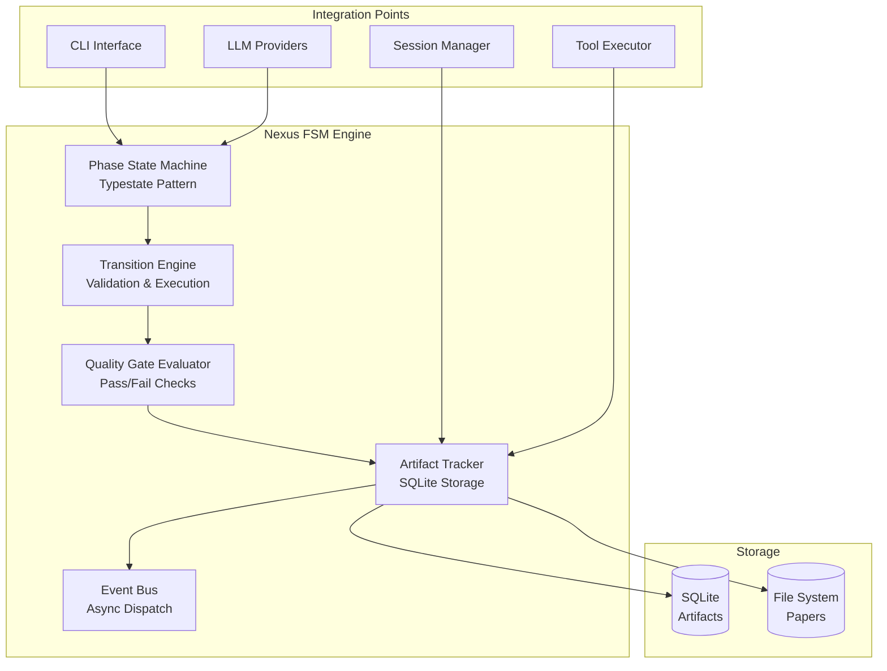
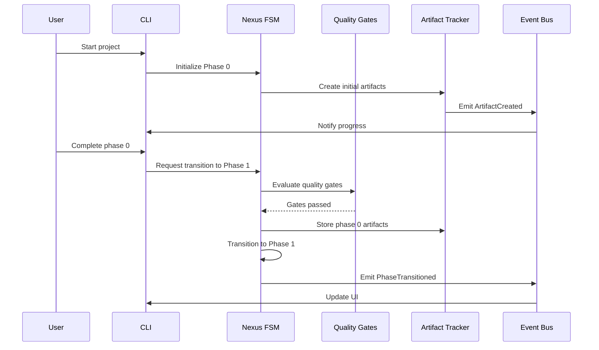

# Nexus FSM Technical Design Document

**Version:** 1.0.0  
**Date:** 2026-03-06  
**Status:** Design Complete  
**Author:** Nexus (Principal Systems Architect)

---

## Executive Summary

The Nexus FSM (Finite State Machine) is the **core differentiating feature** of Clawdius, implementing a 24-phase R&D lifecycle engine that enforces formal development practices through compile-time safety using the **Typestate pattern**.

**Purpose:** Ensure deterministic, traceable, and verifiable software development by enforcing phase transitions through quality gates and artifact tracking.

**Business Value:**
- Eliminates "shoot from the hip" development
- Provides complete audit trail of all decisions
- Enables formal verification at each phase
- Ensures compliance with ISO/IEEE/IEC standards

**Key Innovation:** The Typestate pattern makes illegal states unrepresentable at compile time, preventing developers from skipping phases or executing operations out of order.

**Architecture:** A state machine with 24 discrete phases, quality gate evaluator, artifact tracker, and event bus - all integrated through type-safe Rust APIs.

---

## 1. Architecture Overview

### 1.1 Component Architecture



### 1.2 State Machine Diagram

```mermaid
stateDiagram-v2
    [*] --> Phase0: Initialize
    
    Phase0: Phase 0: Context Discovery
    Phase1: Phase 1: Environment Materialization
    Phase2: Phase 2: Requirements Engineering
    Phase3: Phase 3: Epistemological Discovery
    Phase4: Phase 4: Cross-Lingual Integration
    Phase5: Phase 5: Supply Chain Hardening
    Phase6: Phase 6: Architecture (Blue Papers)
    Phase7: Phase 7: Concurrency Analysis
    Phase8: Phase 8: Security Engineering
    Phase9: Phase 9: Resource Management
    Phase10: Phase 10: Performance Engineering
    Phase11: Phase 11: Cross-Platform Compatibility
    Phase12: Phase 12: Adversarial Loop
    Phase13: Phase 13: CI/CD Engineering
    Phase14: Phase 14: Documentation
    Phase15: Phase 15: Knowledge Base
    Phase16: Phase 16: Execution Graph
    Phase17: Phase 17: Supply Monitoring
    Phase18: Phase 18: Deployment
    Phase19: Phase 19: Operations
    Phase20: Phase 20: Closure
    Phase21: Phase 21: Continuous Monitoring
    Phase22: Phase 22: Knowledge Transfer
    Phase23: Phase 23: Archive
    
    Phase0 --> Phase1: Domain Identified
    Phase1 --> Phase2: Environment Ready
    Phase2 --> Phase3: Requirements Complete
    Phase3 --> Phase4: Research Complete
    Phase4 --> Phase5: Integration Complete
    Phase5 --> Phase6: Supply Chain Secured
    Phase6 --> Phase7: Architecture Approved
    Phase7 --> Phase8: Concurrency Safe
    Phase8 --> Phase9: Security Verified
    Phase9 --> Phase10: Resources Managed
    Phase10 --> Phase11: Performance Met
    Phase11 --> Phase12: Platform Compatible
    Phase12 --> Phase13: Tests Pass
    Phase13 --> Phase14: CI/CD Ready
    Phase14 --> Phase15: Docs Complete
    Phase15 --> Phase16: Knowledge Captured
    Phase16 --> Phase17: Plan Ready
    Phase17 --> Phase18: Monitoring Active
    Phase18 --> Phase19: Deployed
    Phase19 --> Phase20: Operational
    Phase20 --> Phase21: Closed
    Phase21 --> Phase22: Monitoring Active
    Phase22 --> Phase23: Knowledge Transferred
    Phase23 --> [*]: Archived
    
    note right of Phase0
        Discovery Phases
        (0-2)
    end note
    
    note right of Phase6
        Architecture Phases
        (6-9)
    end note
    
    note right of Phase13
        Implementation Phases
        (13-15)
    end note
```



### 1.3 Data Flow



---

## 2. Phase Definitions

| Phase | Name | Purpose | Duration | Quality Gates |
|-------|------|---------|----------|---------------|
| 0 | Context Discovery | Analyze domain and determine applicable standards | 1-2 days | Domain identified, standards mapped |
| 1 | Environment Materialization | Set up build environment (Nix/Docker) | 2-4 hours | Environment reproducible |
| 2 | Requirements Engineering | Define testable requirements | 2-3 days | Requirements documented, stakeholders aligned |
| 3 | Epistemological Discovery | Research and create Yellow Papers | 3-5 days | Yellow Papers complete, test vectors verified |
| 4 | Cross-Lingual Integration | Synthesize multi-language research | 1-2 days | Knowledge graph updated, conflicts resolved |
| 5 | Supply Chain Hardening | Secure dependencies, create SBOM | 1-2 days | Dependencies materialized, vulnerabilities scanned |
| 6 | Architecture (Blue Papers) | Create IEEE 1016 specifications | 3-5 days | Blue Papers approved, interfaces defined |
| 7 | Concurrency Analysis | Design thread-safe systems | 2-3 days | Deadlock analysis complete, lock strategy defined |
| 8 | Security Engineering | Threat modeling, compliance | 2-3 days | STRIDE complete, compliance matrix filled |
| 9 | Resource Management | Memory/handle/thread pool design | 1-2 days | Resource limits defined, leak detection designed |
| 10 | Performance Engineering | Establish baselines, benchmarks | 2-3 days | Benchmarks passing, SLAs defined |
| 11 | Cross-Platform Compatibility | OS/compiler/architecture support | 1-2 days | Testing matrix defined |
| 12 | Adversarial Loop | Feasibility spike, fuzzing | 2-4 days | All tests pass, coverage >95% |
| 13 | CI/CD Engineering | Automated pipelines | 1-2 days | Pipeline configured, quality gates automated |
| 14 | Documentation | User guides, API docs | 2-3 days | Docs complete, examples working |
| 15 | Knowledge Base | Capture patterns, lessons learned | 1-2 days | Knowledge transferred to base |
| 16 | Execution Graph | Serialize build plan (TOML) | 1 day | Master plan generated |
| 17 | Supply Monitoring | Continuous dependency scanning | 1 day | Monitoring active |
| 18 | Deployment | Execute deployment strategy | 1-2 days | Deployed successfully |
| 19 | Operations | Monitoring, incident response | Ongoing | Runbooks ready |
| 20 | Closure | Lessons learned, acceptance | 1-2 days | Stakeholder sign-off |
| 21 | Continuous Monitoring | Ongoing compliance/performance | Ongoing | Alerts configured |
| 22 | Knowledge Transfer | Final documentation, training | 1-2 days | Team trained |
| 23 | Archive | Final archive, version freeze | 1 day | Archived |

---

## 3. Typestate Pattern Implementation

### 3.1 Core Traits

```rust
use std::sync::Arc;
use serde::{Serialize, Deserialize};

/// Phase state trait - implemented by all phases
pub trait PhaseState: Send + Sync + std::fmt::Debug {
    /// Phase number (0-23)
    fn phase_number(&self) -> u8;
    
    /// Human-readable phase name
    fn phase_name(&self) -> &'static str;
    
    /// Required input artifacts
    fn required_artifacts(&self) -> Vec<ArtifactType>;
    
    /// Produced output artifacts
    fn produced_artifacts(&self) -> Vec<ArtifactType>;
    
    /// Quality gates for this phase
    fn quality_gates(&self) -> Vec<Box<dyn QualityGate>>;
}

/// Artifact identifier
#[derive(Debug, Clone, Serialize, Deserialize, PartialEq, Eq, Hash)]
pub struct ArtifactId(String);

/// Artifact types
#[derive(Debug, Clone, Serialize, Deserialize)]
pub enum ArtifactType {
    YellowPaper,
    BluePaper,
    TestVector,
    Proof,
    SourceCode,
    Documentation,
    Configuration,
    Compliance,
}

/// Phase identifier
#[derive(Debug, Clone, Copy, Serialize, Deserialize)]
pub struct PhaseId(pub u8);
```

### 3.2 Phase Structs (Pattern)

```rust
/// Phase 0: Context Discovery
#[derive(Debug)]
pub struct Phase0ContextDiscovery;

impl PhaseState for Phase0ContextDiscovery {
    fn phase_number(&self) -> u8 { 0 }
    fn phase_name(&self) -> &'static str { "Context Discovery" }
    
    fn required_artifacts(&self) -> Vec<ArtifactType> {
        vec![] // No inputs for first phase
    }
    
    fn produced_artifacts(&self) -> Vec<ArtifactType> {
        vec![
            ArtifactType::Documentation, // Domain analysis
            ArtifactType::Configuration,  // Standards mapping
        ]
    }
    
    fn quality_gates(&self) -> Vec<Box<dyn QualityGate>> {
        vec![
            Box::new(DomainIdentifiedGate),
            Box::new(StandardsMappedGate),
        ]
    }
}

/// Phase 1: Environment Materialization
#[derive(Debug)]
pub struct Phase1EnvironmentSetup;

impl PhaseState for Phase1EnvironmentSetup {
    fn phase_number(&self) -> u8 { 1 }
    fn phase_name(&self) -> &'static str { "Environment Materialization" }
    
    fn required_artifacts(&self) -> Vec<ArtifactType> {
        vec![ArtifactType::Configuration]
    }
    
    fn produced_artifacts(&self) -> Vec<ArtifactType> {
        vec![ArtifactType::Configuration] // flake.nix, Dockerfile
    }
    
    fn quality_gates(&self) -> Vec<Box<dyn QualityGate>> {
        vec![
            Box::new(EnvironmentReproducibleGate),
            Box::new(DependenciesResolvedGate),
        ]
    }
}

// Continue pattern for all 24 phases...
// Phase2RequirementsEngineering, Phase3EpistemologicalDiscovery, etc.
```

### 3.3 Main Engine

```rust
/// Nexus FSM Engine with typestate pattern
pub struct NexusEngine<S: PhaseState> {
    /// Current phase state
    state: S,
    
    /// Artifact tracker
    artifacts: Arc<ArtifactTracker>,
    
    /// Quality gate evaluator
    gates: Arc<GateEvaluator>,
    
    /// Event bus for notifications
    events: Arc<EventBus>,
    
    /// Project root path
    project_root: std::path::PathBuf,
}

impl<S: PhaseState> NexusEngine<S> {
    /// Get current phase information
    pub fn current_phase(&self) -> PhaseId {
        PhaseId(self.state.phase_number())
    }
    
    /// Get phase name
    pub fn phase_name(&self) -> &'static str {
        self.state.phase_name()
    }
    
    /// Access artifact tracker
    pub fn artifacts(&self) -> &Arc<ArtifactTracker> {
        &self.artifacts
    }
    
    /// Evaluate quality gates for current phase
    pub fn evaluate_gates(&self) -> Result<Vec<GateResult>, NexusError> {
        self.gates.evaluate_all(&self.state)
    }
    
    /// Store an artifact
    pub fn store_artifact(&self, artifact: Artifact) -> Result<ArtifactId, NexusError> {
        let id = self.artifacts.store(artifact)?;
        self.events.publish(NexusEvent::ArtifactCreated { id: id.clone() })?;
        Ok(id)
    }
    
    /// Retrieve an artifact
    pub fn retrieve_artifact(&self, id: &ArtifactId) -> Result<Option<Artifact>, NexusError> {
        self.artifacts.retrieve(id)
    }
    
    /// Subscribe to events
    pub fn subscribe(&self, handler: Box<dyn EventHandler>) -> Result<(), NexusError> {
        self.events.subscribe(handler);
        Ok(())
    }
}
```

### 3.4 Type-Safe Transitions

```rust
impl NexusEngine<Phase0ContextDiscovery> {
    /// Create new Nexus engine in Phase 0
    pub fn new(project_root: std::path::PathBuf) -> Result<Self, NexusError> {
        Ok(Self {
            state: Phase0ContextDiscovery,
            artifacts: Arc::new(ArtifactTracker::new(&project_root)?),
            gates: Arc::new(GateEvaluator::new()),
            events: Arc::new(EventBus::new()),
            project_root,
        })
    }
    
    /// Transition to Phase 1: Environment Materialization
    pub fn transition_to_environment(
        self,
        domain_analysis: DomainAnalysis,
    ) -> Result<NexusEngine<Phase1EnvironmentSetup>, TransitionError> {
        // Validate required artifacts
        self.validate_required_artifacts(&self.state)?;
        
        // Evaluate quality gates
        let gate_results = self.gates.evaluate_all(&self.state)?;
        let blocking_failures: Vec<_> = gate_results
            .iter()
            .filter(|r| !r.passed && r.severity == GateSeverity::Blocking)
            .collect();
        
        if !blocking_failures.is_empty() {
            return Err(TransitionError::GatesFailed(blocking_failures));
        }
        
        // Store domain analysis artifact
        let artifact = Artifact::new(
            ArtifactType::Documentation,
            serde_json::to_value(&domain_analysis)?,
        );
        self.artifacts.store(artifact)?;
        
        // Emit transition event
        self.events.publish(NexusEvent::PhaseTransitioned {
            from: PhaseId(0),
            to: PhaseId(1),
        })?;
        
        // Create new engine in Phase 1
        Ok(NexusEngine {
            state: Phase1EnvironmentSetup,
            artifacts: self.artifacts,
            gates: self.gates,
            events: self.events,
            project_root: self.project_root,
        })
    }
}

impl NexusEngine<Phase1EnvironmentSetup> {
    /// Transition to Phase 2: Requirements Engineering
    pub fn transition_to_requirements(
        self,
        environment_config: EnvironmentConfig,
    ) -> Result<NexusEngine<Phase2RequirementsEngineering>, TransitionError> {
        // Similar validation and transition logic
        // ...
        
        Ok(NexusEngine {
            state: Phase2RequirementsEngineering,
            artifacts: self.artifacts,
            gates: self.gates,
            events: self.events,
            project_root: self.project_root,
        })
    }
}

// Continue pattern for all phase transitions...
```

---

## 4. Core Components

### 4.1 Artifact Tracker

```rust
use rusqlite::{Connection, params};
use std::sync::Mutex;

/// Artifact tracker with SQLite backend
pub struct ArtifactTracker {
    conn: Mutex<Connection>,
    cache: lru::LruCache<ArtifactId, Artifact>,
}

/// Artifact representation
#[derive(Debug, Clone, Serialize, Deserialize)]
pub struct Artifact {
    pub id: ArtifactId,
    pub artifact_type: ArtifactType,
    pub content: serde_json::Value,
    pub hash: String,
    pub dependencies: Vec<ArtifactId>,
    pub metadata: ArtifactMetadata,
    pub created_at: chrono::DateTime<chrono::Utc>,
}

#[derive(Debug, Clone, Serialize, Deserialize)]
pub struct ArtifactMetadata {
    pub phase: PhaseId,
    pub author: String,
    pub description: String,
}

impl ArtifactTracker {
    pub fn new(project_root: &std::path::Path) -> Result<Self, NexusError> {
        let db_path = project_root.join(".clawdius/nexus.db");
        let conn = Connection::open(&db_path)?;
        
        // Create schema
        conn.execute_batch(include_str!("schema.sql"))?;
        
        Ok(Self {
            conn: Mutex::new(conn),
            cache: lru::LruCache::new(std::num::NonZeroUsize::new(1000).unwrap()),
        })
    }
    
    pub fn store(&self, artifact: Artifact) -> Result<ArtifactId, NexusError> {
        let conn = self.conn.lock().unwrap();
        
        let id = artifact.id.clone();
        let type_str = serde_json::to_string(&artifact.artifact_type)?;
        let content = serde_json::to_vec(&artifact.content)?;
        let metadata = serde_json::to_vec(&artifact.metadata)?;
        
        conn.execute(
            "INSERT INTO artifacts (id, type, content, hash, metadata, created_at)
             VALUES (?1, ?2, ?3, ?4, ?5, ?6)",
            params![
                id.0,
                type_str,
                content,
                artifact.hash,
                metadata,
                artifact.created_at.to_rfc3339(),
            ],
        )?;
        
        // Cache it
        self.cache.put(id.clone(), artifact);
        
        Ok(id)
    }
    
    pub fn retrieve(&self, id: &ArtifactId) -> Result<Option<Artifact>, NexusError> {
        // Check cache first
        if let Some(artifact) = self.cache.get(id) {
            return Ok(Some(artifact.clone()));
        }
        
        let conn = self.conn.lock().unwrap();
        
        let mut stmt = conn.prepare(
            "SELECT id, type, content, hash, metadata, created_at
             FROM artifacts WHERE id = ?1"
        )?;
        
        let result = stmt.query_row(params![id.0], |row| {
            Ok(Artifact {
                id: ArtifactId(row.get(0)?),
                artifact_type: serde_json::from_str(&row.get::<_, String>(1)?)?,
                content: serde_json::from_slice(&row.get::<_, Vec<u8>>(2)?)?,
                hash: row.get(3)?,
                metadata: serde_json::from_slice(&row.get::<_, Vec<u8>>(4)?)?,
                created_at: chrono::DateTime::parse_from_rfc3339(&row.get::<_, String>(5)?)?
                    .with_timezone(&chrono::Utc),
            })
        });
        
        match result {
            Ok(artifact) => {
                self.cache.put(id.clone(), artifact.clone());
                Ok(Some(artifact))
            }
            Err(rusqlite::Error::QueryReturnedNoRows) => Ok(None),
            Err(e) => Err(e.into()),
        }
    }
    
    pub fn validate_dependencies(&self, id: &ArtifactId) -> Result<bool, NexusError> {
        let artifact = self.retrieve(id)?
            .ok_or(NexusError::ArtifactNotFound(id.clone()))?;
        
        for dep_id in &artifact.dependencies {
            if self.retrieve(dep_id)?.is_none() {
                return Ok(false);
            }
        }
        
        Ok(true)
    }
}
```

### 4.2 Quality Gate Evaluator

```rust
/// Quality gate trait
pub trait QualityGate: Send + Sync + std::fmt::Debug {
    /// Unique gate identifier
    fn id(&self) -> &str;
    
    /// Human-readable description
    fn description(&self) -> &str;
    
    /// Evaluate the gate
    fn evaluate(&self, context: &GateContext) -> Result<GateResult, GateError>;
    
    /// Gate severity
    fn severity(&self) -> GateSeverity {
        GateSeverity::Blocking
    }
}

#[derive(Debug, Clone, Copy, PartialEq)]
pub enum GateSeverity {
    Blocking,
    Warning,
    Information,
}

#[derive(Debug)]
pub struct GateContext {
    pub phase: PhaseId,
    pub artifacts: Arc<ArtifactTracker>,
    pub project_root: std::path::PathBuf,
}

#[derive(Debug)]
pub struct GateResult {
    pub gate_id: String,
    pub passed: bool,
    pub severity: GateSeverity,
    pub message: String,
    pub details: Option<serde_json::Value>,
}

/// Gate evaluator
pub struct GateEvaluator {
    gates: Vec<Box<dyn QualityGate>>,
}

impl GateEvaluator {
    pub fn new() -> Self {
        Self {
            gates: Vec::new(),
        }
    }
    
    pub fn register(&mut self, gate: Box<dyn QualityGate>) {
        self.gates.push(gate);
    }
    
    pub fn evaluate_all(&self, phase: &dyn PhaseState) -> Result<Vec<GateResult>, NexusError> {
        let context = GateContext {
            phase: PhaseId(phase.phase_number()),
            artifacts: Arc::new(ArtifactTracker::new(&std::path::PathBuf::from("."))?),
            project_root: std::path::PathBuf::from("."),
        };
        
        let results: Result<Vec<_>, _> = self.gates
            .iter()
            .map(|gate| gate.evaluate(&context))
            .collect();
        
        Ok(results?)
    }
}

// Example gates

#[derive(Debug)]
pub struct CompilationGate;

impl QualityGate for CompilationGate {
    fn id(&self) -> &str { "compilation" }
    fn description(&self) -> &str { "Code must compile without errors" }
    
    fn evaluate(&self, _context: &GateContext) -> Result<GateResult, GateError> {
        // Run cargo check
        let output = std::process::Command::new("cargo")
            .args(&["check", "--all-targets", "--all-features"])
            .output()?;
        
        let passed = output.status.success();
        let message = if passed {
            "Compilation successful".to_string()
        } else {
            String::from_utf8_lossy(&output.stderr).to_string()
        };
        
        Ok(GateResult {
            gate_id: self.id().to_string(),
            passed,
            severity: GateSeverity::Blocking,
            message,
            details: None,
        })
    }
}

#[derive(Debug)]
pub struct TestCoverageGate {
    minimum_coverage: f64,
}

impl QualityGate for TestCoverageGate {
    fn id(&self) -> &str { "test_coverage" }
    fn description(&self) -> &str { "Test coverage must meet minimum threshold" }
    
    fn evaluate(&self, _context: &GateContext) -> Result<GateResult, GateError> {
        // Run cargo tarpaulin or similar
        // This is a simplified example
        let coverage = 0.85; // Would be calculated
        
        let passed = coverage >= self.minimum_coverage;
        let message = format!(
            "Coverage: {:.1}% (minimum: {:.1}%)",
            coverage * 100.0,
            self.minimum_coverage * 100.0
        );
        
        Ok(GateResult {
            gate_id: self.id().to_string(),
            passed,
            severity: GateSeverity::Blocking,
            message,
            details: Some(serde_json::json!({ "coverage": coverage })),
        })
    }
    
    fn severity(&self) -> GateSeverity {
        GateSeverity::Blocking
    }
}
```

### 4.3 Event Bus

```rust
use tokio::sync::RwLock;

/// Nexus event types
#[derive(Debug, Clone, Serialize, Deserialize)]
pub enum NexusEvent {
    PhaseStarted { phase: PhaseId },
    PhaseCompleted { phase: PhaseId, duration: std::time::Duration },
    PhaseTransitioned { from: PhaseId, to: PhaseId },
    
    GateEvaluated { gate: String, result: bool },
    GatesCompleted { phase: PhaseId, all_passed: bool },
    
    ArtifactCreated { id: ArtifactId },
    ArtifactModified { id: ArtifactId },
    ArtifactDeleted { id: ArtifactId },
    
    ErrorOccurred { error: String, phase: Option<PhaseId> },
}

/// Event handler trait
pub trait EventHandler: Send + Sync {
    fn handle(&self, event: &NexusEvent) -> Result<(), EventHandlerError>;
}

/// Event bus with async dispatch
pub struct EventBus {
    subscribers: Arc<RwLock<Vec<Box<dyn EventHandler>>>>,
    history: Arc<RwLock<Vec<NexusEvent>>>,
}

impl EventBus {
    pub fn new() -> Self {
        Self {
            subscribers: Arc::new(RwLock::new(Vec::new())),
            history: Arc::new(RwLock::new(Vec::new())),
        }
    }
    
    pub fn subscribe(&self, handler: Box<dyn EventHandler>) {
        let rt = tokio::runtime::Handle::current();
        rt.block_on(async {
            self.subscribers.write().await.push(handler);
        });
    }
    
    pub fn publish(&self, event: NexusEvent) -> Result<(), NexusError> {
        let rt = tokio::runtime::Handle::current();
        rt.block_on(async {
            // Store in history
            self.history.write().await.push(event.clone());
            
            // Notify all subscribers
            let subscribers = self.subscribers.read().await;
            for handler in subscribers.iter() {
                if let Err(e) = handler.handle(&event) {
                    eprintln!("Event handler error: {:?}", e);
                }
            }
        });
        
        Ok(())
    }
    
    pub fn history(&self) -> Vec<NexusEvent> {
        let rt = tokio::runtime::Handle::current();
        rt.block_on(async {
            self.history.read().await.clone()
        })
    }
}

// Example handler for logging
#[derive(Debug)]
pub struct LoggingHandler;

impl EventHandler for LoggingHandler {
    fn handle(&self, event: &NexusEvent) -> Result<(), EventHandlerError> {
        match event {
            NexusEvent::PhaseTransitioned { from, to } => {
                println!("Phase transition: {} -> {}", from.0, to.0);
            }
            NexusEvent::ArtifactCreated { id } => {
                println!("Artifact created: {}", id.0);
            }
            _ => {}
        }
        Ok(())
    }
}
```

---

## 5. Implementation Phases

### Phase 1: Core Types and State Machine (20 hours)

**Week 1, Days 1-3**

**Tasks:**
1. Create module structure
   - `crates/clawdius-core/src/nexus/mod.rs`
   - `crates/clawdius-core/src/nexus/phase.rs`
   - `crates/clawdius-core/src/nexus/engine.rs`
   - `crates/clawdius-core/src/nexus/artifact.rs`

2. Implement PhaseState trait
3. Create all 24 phase structs
4. Implement NexusEngine struct
5. Write unit tests for state machine

**Deliverables:**
- [ ] PhaseState trait defined
- [ ] All 24 phase structs implemented
- [ ] NexusEngine struct created
- [ ] Basic artifact types defined
- [ ] 20+ unit tests passing

**Success Criteria:**
- Code compiles without errors
- All phases have unique IDs and names
- Typestate pattern enforced at compile time

### Phase 2: Transition Engine (20 hours)

**Week 1-2, Days 4-7**

**Tasks:**
1. Implement transition validation
2. Add artifact dependency checking
3. Create transition execution logic
4. Implement rollback mechanisms
5. Write integration tests

**Deliverables:**
- [ ] Transition validation complete
- [ ] Dependency checking working
- [ ] Rollback functional
- [ ] 15+ integration tests passing

### Phase 3: Quality Gates (20 hours)

**Week 2-3, Days 8-11**

**Tasks:**
1. Define QualityGate trait
2. Implement GateEvaluator
3. Create example gates (compilation, tests, docs)
4. Add gate result handling
5. Write tests for gates

**Deliverables:**
- [ ] QualityGate trait defined
- [ ] GateEvaluator working
- [ ] 3+ example gates implemented
- [ ] 20+ tests passing

### Phase 4: Artifact Tracking (20 hours)

**Week 3-4, Days 12-15**

**Tasks:**
1. Design SQLite schema
2. Implement ArtifactTracker
3. Add hash verification
4. Implement dependency tracking
5. Create migration system
6. Write tests

**Deliverables:**
- [ ] SQLite schema created
- [ ] ArtifactTracker fully functional
- [ ] Hash verification working
- [ ] Dependency tracking operational
- [ ] 25+ tests passing

### Phase 5: Event Bus (20 hours)

**Week 4, Days 16-18**

**Tasks:**
1. Implement EventBus
2. Define event types
3. Add async dispatch
4. Implement event persistence
5. Write tests

**Deliverables:**
- [ ] EventBus operational
- [ ] All event types defined
- [ ] Async dispatch working
- [ ] Event persistence complete
- [ ] 15+ tests passing

### Phase 6: Integration (20 hours)

**Week 4-5, Days 19-22**

**Tasks:**
1. Integrate with CLI
2. Integrate with session manager
3. Integrate with tool executor
4. Write end-to-end tests
5. Create documentation

**Deliverables:**
- [ ] CLI integration complete
- [ ] Session manager integration working
- [ ] Tool executor integration functional
- [ ] 10+ E2E tests passing
- [ ] Complete API documentation

---

## 6. Database Schema

```sql
-- Phases table
CREATE TABLE phases (
    id INTEGER PRIMARY KEY,
    name TEXT NOT NULL,
    status TEXT NOT NULL CHECK (status IN ('pending', 'in_progress', 'completed', 'failed')),
    started_at TIMESTAMP,
    completed_at TIMESTAMP,
    metadata JSON,
    created_at TIMESTAMP DEFAULT CURRENT_TIMESTAMP,
    updated_at TIMESTAMP DEFAULT CURRENT_TIMESTAMP
);

-- Artifacts table
CREATE TABLE artifacts (
    id TEXT PRIMARY KEY,
    type TEXT NOT NULL,
    phase_id INTEGER REFERENCES phases(id),
    content BLOB NOT NULL,
    hash TEXT NOT NULL,
    metadata JSON,
    created_at TIMESTAMP DEFAULT CURRENT_TIMESTAMP,
    updated_at TIMESTAMP DEFAULT CURRENT_TIMESTAMP
);

-- Artifact dependencies
CREATE TABLE artifact_dependencies (
    artifact_id TEXT REFERENCES artifacts(id) ON DELETE CASCADE,
    depends_on_id TEXT REFERENCES artifacts(id) ON DELETE CASCADE,
    created_at TIMESTAMP DEFAULT CURRENT_TIMESTAMP,
    PRIMARY KEY (artifact_id, depends_on_id)
);

-- Quality gates
CREATE TABLE quality_gates (
    id TEXT PRIMARY KEY,
    phase_id INTEGER REFERENCES phases(id),
    gate_type TEXT NOT NULL,
    status TEXT NOT NULL CHECK (status IN ('pending', 'passed', 'failed', 'warning')),
    severity TEXT NOT NULL CHECK (severity IN ('blocking', 'warning', 'information')),
    result JSON,
    message TEXT,
    evaluated_at TIMESTAMP,
    created_at TIMESTAMP DEFAULT CURRENT_TIMESTAMP
);

-- Events
CREATE TABLE events (
    id INTEGER PRIMARY KEY AUTOINCREMENT,
    event_type TEXT NOT NULL,
    phase_id INTEGER REFERENCES phases(id),
    payload JSON NOT NULL,
    timestamp TIMESTAMP DEFAULT CURRENT_TIMESTAMP
);

-- Create indexes
CREATE INDEX idx_artifacts_phase ON artifacts(phase_id);
CREATE INDEX idx_artifacts_type ON artifacts(type);
CREATE INDEX idx_artifacts_hash ON artifacts(hash);
CREATE INDEX idx_gates_phase ON quality_gates(phase_id);
CREATE INDEX idx_gates_status ON quality_gates(status);
CREATE INDEX idx_events_phase ON events(phase_id);
CREATE INDEX idx_events_timestamp ON events(timestamp);
CREATE INDEX idx_events_type ON events(event_type);

-- Triggers for updated_at
CREATE TRIGGER update_phases_timestamp 
    AFTER UPDATE ON phases
    FOR EACH ROW
BEGIN
    UPDATE phases SET updated_at = CURRENT_TIMESTAMP WHERE id = NEW.id;
END;

CREATE TRIGGER update_artifacts_timestamp 
    AFTER UPDATE ON artifacts
    FOR EACH ROW
BEGIN
    UPDATE artifacts SET updated_at = CURRENT_TIMESTAMP WHERE id = NEW.id;
END;
```

---

## 7. Testing Strategy

### 7.1 Unit Tests

```rust
#[cfg(test)]
mod tests {
    use super::*;
    
    #[test]
    fn test_phase_numbers() {
        assert_eq!(Phase0ContextDiscovery.phase_number(), 0);
        assert_eq!(Phase1EnvironmentSetup.phase_number(), 1);
        // Test all phases...
    }
    
    #[test]
    fn test_phase_names() {
        assert_eq!(Phase0ContextDiscovery.phase_name(), "Context Discovery");
        // Test all phases...
    }
    
    #[test]
    fn test_engine_creation() {
        let engine = NexusEngine::new(PathBuf::from(".")).unwrap();
        assert_eq!(engine.current_phase(), PhaseId(0));
    }
    
    #[test]
    fn test_artifact_storage() {
        let tracker = ArtifactTracker::new(&PathBuf::from(".")).unwrap();
        let artifact = Artifact::new(
            ArtifactType::Documentation,
            serde_json::json!({"test": "data"}),
        );
        
        let id = tracker.store(artifact).unwrap();
        let retrieved = tracker.retrieve(&id).unwrap();
        
        assert!(retrieved.is_some());
    }
    
    // Add 50+ more unit tests...
}
```

### 7.2 Integration Tests

```rust
#[cfg(test)]
mod integration_tests {
    use super::*;
    use tempfile::TempDir;
    
    #[test]
    fn test_phase_transition() {
        let temp_dir = TempDir::new().unwrap();
        let engine = NexusEngine::new(temp_dir.path().to_path_buf()).unwrap();
        
        let domain_analysis = DomainAnalysis {
            domain: "test".to_string(),
            standards: vec![],
        };
        
        let engine = engine.transition_to_environment(domain_analysis).unwrap();
        assert_eq!(engine.current_phase(), PhaseId(1));
    }
    
    #[test]
    fn test_quality_gates_blocking() {
        let temp_dir = TempDir::new().unwrap();
        let mut engine = NexusEngine::new(temp_dir.path().to_path_buf()).unwrap();
        
        // Register failing gate
        engine.gates.register(Box::new(FailingTestGate));
        
        let domain_analysis = DomainAnalysis::default();
        let result = engine.transition_to_environment(domain_analysis);
        
        assert!(result.is_err());
    }
    
    // Add 20+ more integration tests...
}
```

### 7.3 Property-Based Tests

```rust
use proptest::prelude::*;

proptest! {
    #[test]
    fn test_artifact_hash_consistency(content in ".*") {
        let artifact1 = Artifact::new(
            ArtifactType::Documentation,
            serde_json::Value::String(content.clone()),
        );
        
        let artifact2 = Artifact::new(
            ArtifactType::Documentation,
            serde_json::Value::String(content),
        );
        
        prop_assert_eq!(artifact1.hash, artifact2.hash);
    }
    
    #[test]
    fn test_phase_transition_validity(from in 0u8..23, to in 0u8..24) {
        // Can only transition forward by 1
        prop_assert!(to == from + 1 || to <= from);
    }
}
```

---

## 8. Performance Considerations

### 8.1 Optimization Strategies

1. **Artifact Caching**
   - LRU cache for frequently accessed artifacts
   - Cache size: 1000 items (configurable)
   - Cache invalidation on modification

2. **Event Batching**
   - Batch events for async dispatch
   - Reduce database writes
   - Buffer size: 100 events (configurable)

3. **Database Connection Pooling**
   - Use r2d2 for connection pooling
   - Pool size: 10 connections
   - Connection timeout: 30 seconds

4. **Async Operations**
   - All I/O operations are async
   - Non-blocking event dispatch
   - Concurrent gate evaluation

### 8.2 Performance Targets

| Operation | Target | Measurement |
|-----------|--------|-------------|
| Phase transition | < 100ms | P95 |
| Artifact store | < 50ms | P95 |
| Artifact retrieve (cached) | < 5ms | P95 |
| Artifact retrieve (uncached) | < 50ms | P95 |
| Gate evaluation (single) | < 1s | P95 |
| Gate evaluation (all) | < 10s | P95 |
| Event dispatch | < 10ms | P95 |

---

## 9. Security Considerations

### 9.1 Artifact Integrity

```rust
impl Artifact {
    pub fn compute_hash(&self) -> String {
        use sha3::{Sha3_256, Digest};
        
        let mut hasher = Sha3_256::new();
        hasher.update(&self.artifact_type.to_string());
        hasher.update(&serde_json::to_vec(&self.content).unwrap());
        
        format!("{:x}", hasher.finalize())
    }
    
    pub fn verify_integrity(&self) -> bool {
        self.hash == self.compute_hash()
    }
}
```

### 9.2 Access Control

- All artifact modifications are logged
- Events provide complete audit trail
- Database transactions ensure consistency

---

## 10. Success Criteria

### Technical Metrics
- [ ] All 24 phases implemented
- [ ] Typestate pattern enforced at compile time
- [ ] 100+ unit tests passing
- [ ] 20+ integration tests passing
- [ ] 5+ property-based tests passing
- [ ] Zero clippy warnings
- [ ] Test coverage > 90%
- [ ] All performance targets met

### Documentation
- [ ] Complete API documentation (rustdoc)
- [ ] User guide created
- [ ] Architecture diagrams complete
- [ ] Example code working

### Integration
- [ ] CLI integration functional
- [ ] Session manager integration working
- [ ] Tool executor integration complete
- [ ] End-to-end workflow tested

---

## 11. Risks and Mitigations

| Risk | Probability | Impact | Mitigation |
|------|-------------|--------|------------|
| Typestate complexity | High | High | Clear examples, comprehensive documentation, pair programming |
| Performance issues | Medium | Medium | Profiling, caching, async operations |
| SQLite limitations | Low | Medium | Migration path to PostgreSQL, connection pooling |
| Learning curve | Medium | Medium | Training materials, office hours, code reviews |
| Integration challenges | Medium | Medium | Early integration testing, mock interfaces |

---

## 12. Next Steps

1. **Immediate** (This Week)
   - Review this design document
   - Set up project structure
   - Begin Phase 1 implementation

2. **Week 1-2**
   - Complete core types and state machine
   - Implement transition engine

3. **Week 3-4**
   - Add quality gates
   - Implement artifact tracking

4. **Week 5-6**
   - Add event bus
   - Complete integration

---

**Document Status:** ✅ COMPLETE  
**Ready for Implementation:** YES  
**Next Review:** After Phase 1 completion

---

*Created by: Nexus (Principal Systems Architect)*  
*Date: 2026-03-06*
