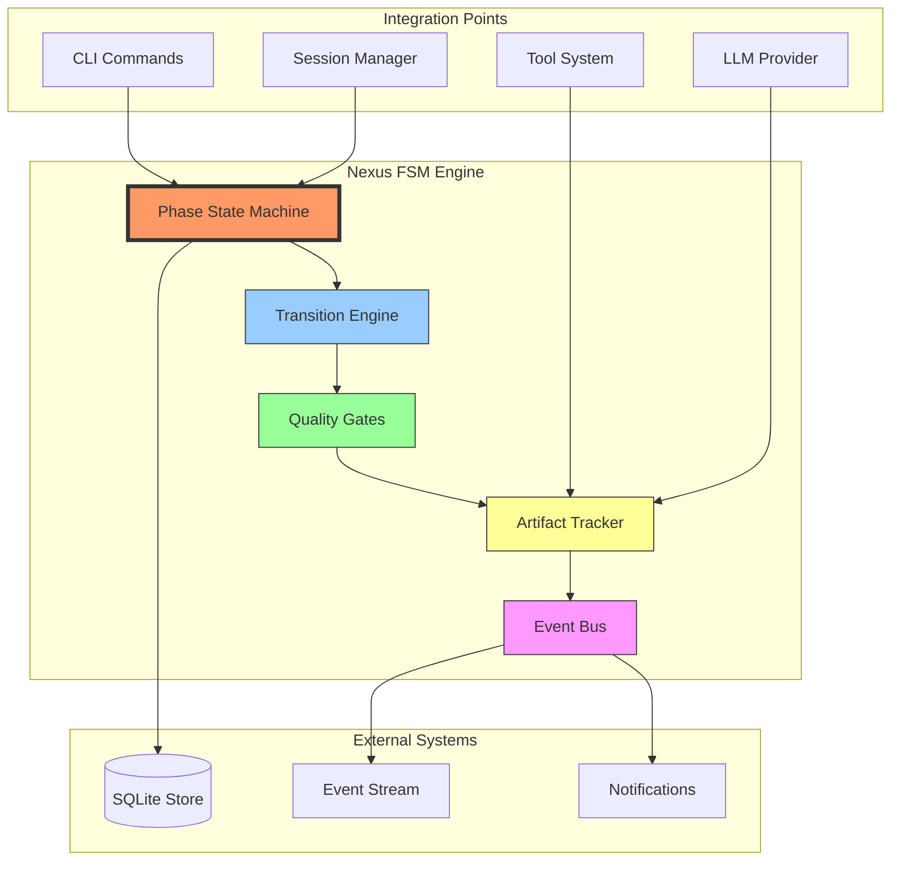
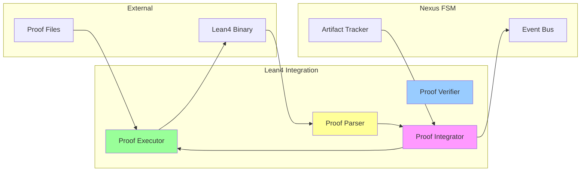
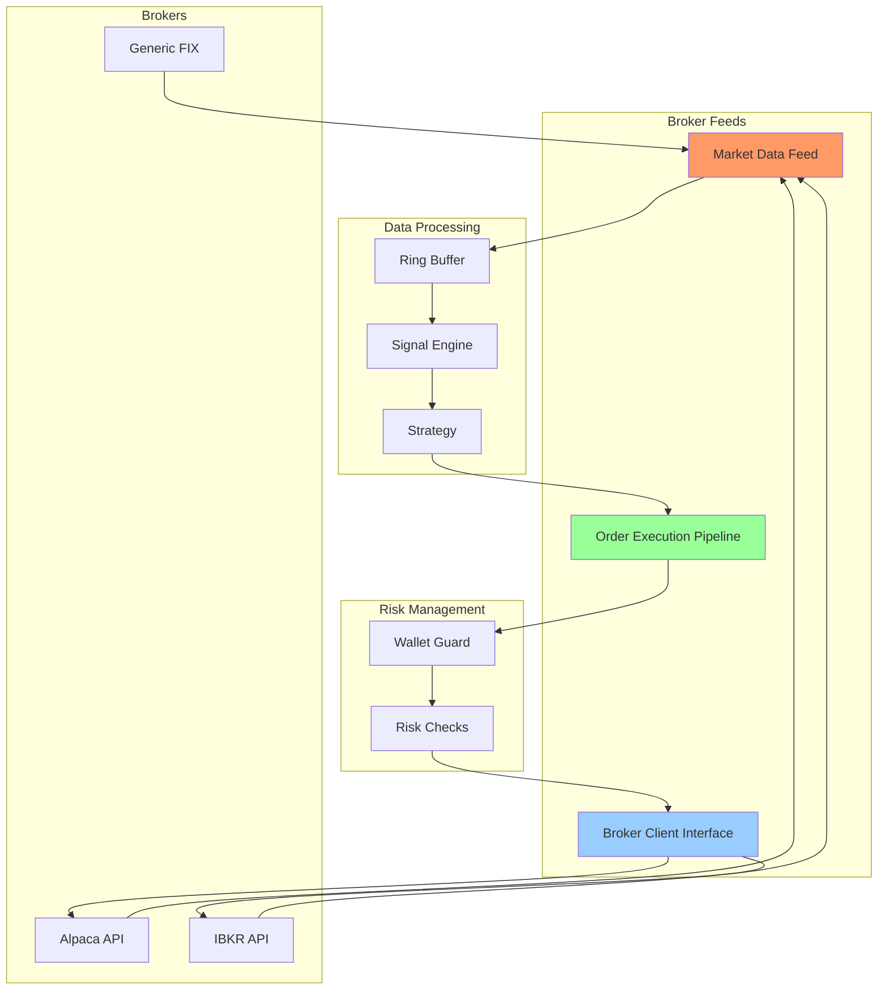
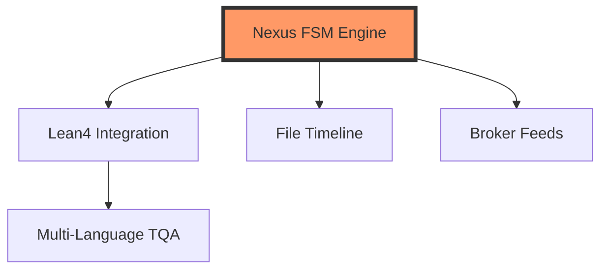

# Phase 3 Implementation Roadmap
## Missing Core Features - Comprehensive Implementation Plan

**Version:** v0.7.2 → v0.8.0  
**Date:** 2026-03-07  
**Status:** READY TO START  
**Estimated Duration:** 16-20 weeks (200+ hours)

---

## Executive Summary

Phase 3 focuses on implementing 5 critical missing features that differentiate Clawdius from competitors. These features were documented in specifications but never implemented:

| Feature | Priority | Effort | Current State | Impact |
|---------|----------|--------|---------------|--------|
| Nexus FSM Engine | P0 - CRITICAL | 80-120h | 0% | Core differentiator |
| Lean4 Proof Integration | P1 - HIGH | 40-60h | 30% | Formal verification |
| File Timeline Polish | P1 - MEDIUM | 40-60h | 60% | Developer experience |
| HFT Broker Feeds | P1 - HIGH | 120-160h | 40% | Real-time market data |
| Multi-Language TQA | P1 - MEDIUM | 80-100h | 20% | Research synthesis |

**Total Effort:** 360-500 hours (45-63 developer days)

---

## 1. Feature Implementation Plans

### A. Nexus FSM Engine (P0 - CRITICAL)

**Effort:** 80-120 hours  
**Priority:** P0 - CRITICAL  
**Current State:** 0% (not implemented)  
**Assignee:** Principal Architect

#### Overview

The Nexus Finite State Machine Engine is the core differentiating feature of Clawdius. It implements a formal R&D lifecycle enforcement system using Rust's typestate pattern to guarantee compile-time correctness of phase transitions.

**Why Critical:**
- Primary feature that differentiates Clawdius from other AI coding assistants
- Enables formal R&D lifecycle enforcement with compile-time guarantees
- Required for v1.0.0 release
- Documented in specifications but never implemented
- Foundation for Lean4 proof integration and artifact tracking

**Business Value:**
- Provides auditable development process
- Ensures quality gates are enforced before phase transitions
- Enables formal verification of development artifacts
- Supports compliance requirements (SOC2, GDPR)

#### Architecture



**Component Overview:**

1. **Phase State Machine** (`fsm.rs`)
   - Typestate pattern implementation
   - Compile-time phase transition validation
   - Phase-specific contexts and behaviors

2. **Transition Engine** (`transitions.rs`)
   - State transition logic
   - Validation rules
   - Rollback capabilities

3. **Quality Gates** (`gates.rs`)
   - Configurable quality checks
   - Test coverage validation
   - Documentation requirements
   - Code review status

4. **Artifact Tracker** (`artifacts.rs`)
   - File tracking and versioning
   - Dependency management
   - Artifact validation

5. **Event Bus** (`events.rs`)
   - Event publishing
   - Subscriber management
   - Event persistence

#### Implementation Phases

##### Phase 1: Core Types and State Machine (20 hours)

**Deliverables:**
- `crates/clawdius-core/src/nexus/mod.rs`
- `crates/clawdius-core/src/nexus/fsm.rs`
- `crates/clawdius-core/src/nexus/phases.rs`
- `crates/clawdius-core/src/nexus/types.rs`

**Key Structures:**

```rust
// crates/clawdius-core/src/nexus/phases.rs

/// R&D lifecycle phases using typestate pattern
pub struct PhaseDiscovery(DiscoveryContext);
pub struct PhaseDesign(DesignContext);
pub struct PhaseImplement(ImplementContext);
pub struct PhaseVerify(VerifyContext);
pub struct PhaseDeploy(DeployContext);

/// Phase context containing artifacts and state
pub struct DiscoveryContext {
    requirements: Vec<Requirement>,
    constraints: Vec<Constraint>,
    research_notes: Vec<ResearchNote>,
}

/// Phase transition trait - only valid transitions are implementable
pub trait PhaseTransition<From, To> {
    fn transition(self, artifacts: PhaseArtifacts) -> Result<To>;
}

// Valid transitions
impl PhaseTransition<PhaseDiscovery, PhaseDesign> for PhaseDiscovery {
    fn transition(self, artifacts: PhaseArtifacts) -> Result<PhaseDesign> {
        // Validate artifacts
        // Create new phase context
        // Return new phase
    }
}
```

**Tasks:**
- [ ] Define phase types and contexts (4h)
- [ ] Implement typestate pattern (6h)
- [ ] Create phase-specific data structures (4h)
- [ ] Add serialization/deserialization (2h)
- [ ] Write unit tests (4h)

**Success Criteria:**
- [ ] All 5 phases defined with typestate pattern
- [ ] Only valid transitions compile
- [ ] Unit test coverage > 90%
- [ ] No clippy warnings

##### Phase 2: Transition Engine (20 hours)

**Deliverables:**
- `crates/clawdius-core/src/nexus/transitions.rs`
- `crates/clawdius-core/src/nexus/validation.rs`

**Key Functions:**

```rust
// crates/clawdius-core/src/nexus/transitions.rs

pub struct TransitionEngine {
    store: TransitionStore,
    validators: Vec<Box<dyn Validator>>,
}

impl TransitionEngine {
    /// Execute a phase transition with validation
    pub async fn execute_transition<From, To>(
        &self,
        from: From,
        artifacts: PhaseArtifacts,
    ) -> Result<To>
    where
        From: PhaseTransition<To>,
    {
        // Validate transition prerequisites
        self.validate_prerequisites(&artifacts)?;
        
        // Execute transition
        let to = from.transition(artifacts)?;
        
        // Persist transition
        self.store.record_transition(&to)?;
        
        Ok(to)
    }
    
    /// Rollback to previous phase
    pub async fn rollback(&self, phase_id: &PhaseId) -> Result<PreviousPhase> {
        // Load previous state
        // Restore artifacts
        // Return previous phase
    }
}
```

**Tasks:**
- [ ] Implement transition execution logic (6h)
- [ ] Add validation framework (4h)
- [ ] Create rollback mechanism (4h)
- [ ] Implement transition persistence (3h)
- [ ] Write integration tests (3h)

**Success Criteria:**
- [ ] Transitions execute atomically
- [ ] Rollback works correctly
- [ ] Invalid transitions rejected
- [ ] Integration tests pass

##### Phase 3: Quality Gates (20 hours)

**Deliverables:**
- `crates/clawdius-core/src/nexus/gates.rs`
- `crates/clawdius-core/src/nexus/checks.rs`

**Key Structures:**

```rust
// crates/clawdius-core/src/nexus/gates.rs

pub struct QualityGate {
    checks: Vec<QualityCheck>,
    required_score: f64,
}

pub enum QualityCheck {
    TestCoverage { minimum: f64 },
    Documentation { required: bool },
    CodeReview { approved_by: Vec<String> },
    SecurityScan { pass: bool },
    PerformanceBenchmark { max_duration_ms: u64 },
}

impl QualityGate {
    /// Evaluate all quality checks
    pub async fn evaluate(&self, context: &PhaseContext) -> Result<GateResult> {
        let mut results = Vec::new();
        
        for check in &self.checks {
            let result = check.evaluate(context).await?;
            results.push(result);
        }
        
        let score = self.calculate_score(&results);
        
        Ok(GateResult {
            passed: score >= self.required_score,
            score,
            results,
        })
    }
}
```

**Tasks:**
- [ ] Define quality check types (3h)
- [ ] Implement check evaluation (6h)
- [ ] Create scoring system (3h)
- [ ] Add configurable gates (4h)
- [ ] Write property-based tests (4h)

**Success Criteria:**
- [ ] All check types implemented
- [ ] Scoring system works correctly
- [ ] Gates configurable per phase
- [ ] Property tests pass

##### Phase 4: Artifact Tracking (20 hours)

**Deliverables:**
- `crates/clawdius-core/src/nexus/artifacts.rs`
- `crates/clawdius-core/src/nexus/dependencies.rs`

**Key Structures:**

```rust
// crates/clawdius-core/src/nexus/artifacts.rs

pub struct ArtifactTracker {
    store: ArtifactStore,
    dependency_graph: DependencyGraph,
}

pub struct Artifact {
    id: ArtifactId,
    artifact_type: ArtifactType,
    path: PathBuf,
    checksum: Sha256Hash,
    phase: Phase,
    created_at: DateTime<Utc>,
    dependencies: Vec<ArtifactId>,
}

pub enum ArtifactType {
    Requirement,
    Design,
    SourceCode,
    TestCode,
    Documentation,
    BuildOutput,
}

impl ArtifactTracker {
    /// Track a new artifact
    pub async fn track(&mut self, artifact: Artifact) -> Result<()> {
        // Validate artifact
        // Calculate checksum
        // Store metadata
        // Update dependency graph
    }
    
    /// Validate artifact dependencies
    pub fn validate_dependencies(&self, artifact_id: &ArtifactId) -> Result<bool> {
        // Check all dependencies exist
        // Verify checksums match
        // Return validation result
    }
}
```

**Tasks:**
- [ ] Implement artifact storage (5h)
- [ ] Create dependency graph (5h)
- [ ] Add checksum validation (3h)
- [ ] Implement artifact queries (4h)
- [ ] Write integration tests (3h)

**Success Criteria:**
- [ ] Artifacts persist correctly
- [ ] Dependencies tracked accurately
- [ ] Checksums validated
- [ ] Queries performant

##### Phase 5: Event Bus (20 hours)

**Deliverables:**
- `crates/clawdius-core/src/nexus/events.rs`
- `crates/clawdius-core/src/nexus/subscribers.rs`

**Key Structures:**

```rust
// crates/clawdius-core/src/nexus/events.rs

pub struct EventBus {
    subscribers: Vec<Box<dyn Subscriber>>,
    event_store: EventStore,
}

pub enum NexusEvent {
    PhaseStarted { phase: Phase, timestamp: DateTime<Utc> },
    PhaseCompleted { phase: Phase, duration: Duration },
    TransitionRequested { from: Phase, to: Phase },
    TransitionCompleted { from: Phase, to: Phase },
    QualityGatePassed { gate: String, score: f64 },
    QualityGateFailed { gate: String, score: f64 },
    ArtifactCreated { artifact: ArtifactId },
    ArtifactModified { artifact: ArtifactId },
}

impl EventBus {
    /// Publish an event to all subscribers
    pub async fn publish(&self, event: NexusEvent) -> Result<()> {
        // Persist event
        self.event_store.store(&event).await?;
        
        // Notify subscribers
        for subscriber in &self.subscribers {
            subscriber.notify(event.clone()).await?;
        }
        
        Ok(())
    }
}
```

**Tasks:**
- [ ] Implement event publishing (5h)
- [ ] Create subscriber system (5h)
- [ ] Add event persistence (4h)
- [ ] Implement event replay (3h)
- [ ] Write tests (3h)

**Success Criteria:**
- [ ] Events delivered reliably
- [ ] Subscribers notified correctly
- [ ] Events persist durably
- [ ] Replay works

##### Phase 6: Integration (20 hours)

**Deliverables:**
- Integration with CLI commands
- Integration with session manager
- Integration with tool system
- End-to-end tests

**Tasks:**
- [ ] Integrate with CLI (4h)
- [ ] Integrate with session manager (4h)
- [ ] Integrate with tool system (4h)
- [ ] Create CLI commands for phase management (4h)
- [ ] Write E2E tests (4h)

**Success Criteria:**
- [ ] CLI commands work correctly
- [ ] Session integration functional
- [ ] Tool integration works
- [ ] E2E tests pass

#### API Design

**Core Traits:**

```rust
/// Phase behavior trait
pub trait Phase {
    type Context;
    type Artifacts;
    
    fn context(&self) -> &Self::Context;
    fn artifacts(&self) -> &Self::Artifacts;
    fn id(&self) -> &PhaseId;
}

/// Transition validation trait
pub trait ValidateTransition {
    fn validate(&self, artifacts: &PhaseArtifacts) -> Result<ValidationResult>;
}

/// Artifact manager trait
pub trait ArtifactManager {
    async fn create(&mut self, artifact: Artifact) -> Result<ArtifactId>;
    async fn get(&self, id: &ArtifactId) -> Result<Option<Artifact>>;
    async fn update(&mut self, artifact: Artifact) -> Result<()>;
    async fn delete(&mut self, id: &ArtifactId) -> Result<()>;
}
```

#### Testing Strategy

**Unit Tests (40%):**
- Phase state transitions
- Quality gate evaluation
- Artifact tracking
- Event publishing

**Integration Tests (40%):**
- End-to-end phase transitions
- Quality gate integration
- Artifact dependency validation
- Event bus integration

**Property-Based Tests (20%):**
- State machine properties
- Transition invariants
- Artifact checksum validation

**Test Commands:**
```bash
# Run unit tests
cargo test -p clawdius-core nexus::

# Run integration tests
cargo test -p clawdius-core --test nexus_integration

# Run property tests
cargo test -p clawdius-core --test nexus_properties
```

#### Integration Points

**1. CLI Integration:**
```rust
// In crates/clawdius/src/cli.rs

/// Phase management commands
pub enum PhaseCommand {
    /// Start a new phase
    Start { phase: String },
    /// Complete current phase
    Complete { artifacts: Vec<String> },
    /// Show phase status
    Status,
    /// Rollback to previous phase
    Rollback { to: String },
}
```

**2. Session Integration:**
```rust
// In crates/clawdius-core/src/session/manager.rs

impl SessionManager {
    /// Get current phase context
    pub fn current_phase(&self) -> &dyn Phase {
        self.nexus.current_phase()
    }
}
```

**3. Tool Integration:**
```rust
// Tools create artifacts automatically
impl FileTool {
    async fn execute(&self, cmd: FileCommand) -> Result<FileResult> {
        let result = self.execute_internal(cmd).await?;
        
        // Track as artifact
        self.nexus.track_artifact(Artifact {
            artifact_type: ArtifactType::SourceCode,
            path: result.path.clone(),
            ..Default::default()
        }).await?;
        
        Ok(result)
    }
}
```

#### Success Criteria

**Functional Requirements:**
- [ ] All 5 phases implemented with typestate pattern
- [ ] Phase transitions work correctly
- [ ] Quality gates evaluate properly
- [ ] Artifacts tracked and validated
- [ ] Events published and persisted

**Quality Requirements:**
- [ ] Test coverage > 90%
- [ ] Zero clippy warnings
- [ ] All documentation complete
- [ ] Performance: transitions < 100ms
- [ ] Memory usage: < 50MB overhead

**Integration Requirements:**
- [ ] CLI commands functional
- [ ] Session integration working
- [ ] Tool integration operational
- [ ] E2E tests passing

#### Risks and Mitigations

| Risk | Probability | Impact | Mitigation |
|------|-------------|--------|------------|
| Typestate pattern complexity | HIGH | HIGH | Extensive prototyping, clear documentation |
| Performance regression | MEDIUM | MEDIUM | Benchmark suite, continuous monitoring |
| Integration failures | MEDIUM | HIGH | Early integration testing, mock interfaces |
| Scope creep | MEDIUM | MEDIUM | Strict phase boundaries, change control |

**Mitigation Strategies:**
1. **Complexity Management:**
   - Create prototype in first week
   - Regular architecture reviews
   - Pair programming for critical components

2. **Performance:**
   - Baseline benchmarks before implementation
   - Profile critical paths
   - Optimize incrementally

3. **Integration:**
   - Define interfaces early
   - Use trait-based abstraction
   - Mock dependencies in tests

4. **Scope:**
   - Define MVP clearly
   - Review scope weekly
   - Defer non-essential features

---

### B. Lean4 Proof Integration (P1 - HIGH)

**Effort:** 40-60 hours  
**Priority:** P1 - HIGH  
**Current State:** 30% complete (verifier exists, runtime missing)  
**Assignee:** Senior Backend Engineer

#### Overview

Lean4 proof integration enables formal verification of critical algorithms. The system provides automated proof checking, template generation, and result integration with the Nexus FSM.

**Current Implementation:**
- ✅ Proof verifier exists (`proof/verifier.rs`)
- ✅ Proof templates defined (`proof/templates.rs`)
- ✅ Error parsing implemented
- ❌ No runtime integration with Nexus FSM
- ❌ No proof execution pipeline
- ❌ No result integration

**Business Value:**
- Formal verification of safety-critical code
- Mathematical proof of algorithm correctness
- Compliance with safety standards (DO-178C, IEC 61508)
- Competitive differentiation

#### Architecture



#### Implementation Phases

##### Phase 1: Proof Executor Pipeline (15 hours)

**Deliverables:**
- `crates/clawdius-core/src/proof/executor.rs`

**Key Functions:**

```rust
pub struct ProofExecutor {
    verifier: LeanVerifier,
    config: ProofConfig,
}

pub struct ProofConfig {
    lean_path: PathBuf,
    timeout: Duration,
    max_memory: usize,
    parallel_jobs: usize,
}

impl ProofExecutor {
    /// Execute a proof and return results
    pub async fn execute_proof(&self, proof_path: &Path) -> Result<ProofResult> {
        // Prepare proof environment
        // Execute Lean4 verification
        // Parse results
        // Integrate with artifacts
    }
    
    /// Execute multiple proofs in parallel
    pub async fn execute_batch(&self, proofs: &[PathBuf]) -> Result<Vec<ProofResult>> {
        // Use rayon for parallel execution
        // Collect results
        // Generate summary
    }
}
```

**Tasks:**
- [ ] Create proof executor struct (3h)
- [ ] Implement environment setup (4h)
- [ ] Add parallel execution (4h)
- [ ] Error handling and recovery (4h)

##### Phase 2: Result Integration (15 hours)

**Deliverables:**
- `crates/clawdius-core/src/proof/integrator.rs`

**Key Functions:**

```rust
pub struct ProofIntegrator {
    artifact_tracker: Arc<ArtifactTracker>,
    event_bus: Arc<EventBus>,
}

impl ProofIntegrator {
    /// Integrate proof result with Nexus FSM
    pub async fn integrate_result(&self, result: ProofResult) -> Result<()> {
        // Create artifact from proof
        let artifact = Artifact {
            artifact_type: ArtifactType::Proof,
            path: result.proof_path.clone(),
            metadata: result.metadata(),
            ..Default::default()
        };
        
        // Track artifact
        self.artifact_tracker.track(artifact).await?;
        
        // Publish event
        self.event_bus.publish(NexusEvent::ProofCompleted {
            result: result.clone(),
        }).await?;
        
        Ok(())
    }
}
```

**Tasks:**
- [ ] Create integrator struct (3h)
- [ ] Implement artifact creation (4h)
- [ ] Add event publishing (3h)
- [ ] Write integration tests (5h)

##### Phase 3: CLI Commands (10 hours)

**Deliverables:**
- CLI commands for proof management
- Proof status display
- Proof result visualization

**Tasks:**
- [ ] Add proof CLI commands (4h)
- [ ] Implement proof status (3h)
- [ ] Create result visualization (3h)

#### Success Criteria

- [ ] Proof executor works with Lean4 binary
- [ ] Results integrated with Nexus FSM
- [ ] CLI commands functional
- [ ] Test coverage > 85%
- [ ] Documentation complete

#### Risks and Mitigations

| Risk | Probability | Impact | Mitigation |
|------|-------------|--------|------------|
| Lean4 binary compatibility | MEDIUM | MEDIUM | Docker containerization |
| Proof execution timeout | MEDIUM | LOW | Configurable timeouts |
| Memory exhaustion | LOW | MEDIUM | Memory limits |

---

### C. File Timeline Polish (P1 - MEDIUM)

**Effort:** 40-60 hours  
**Priority:** P1 - MEDIUM  
**Current State:** 60% complete  
**Assignee:** Full-Stack Engineer

#### Overview

The file timeline system tracks file changes and enables rollback. Current implementation has basic functionality but needs polish for production readiness.

**Current Implementation:**
- ✅ Timeline manager exists (`timeline/mod.rs`)
- ✅ File watching implemented (`timeline/watcher.rs`)
- ✅ Checkpoint storage (`timeline/store.rs`)
- ⚠️ Partial diff implementation
- ❌ No merge conflict resolution
- ❌ No timeline visualization

#### Implementation Phases

##### Phase 1: Complete Diff System (20 hours)

**Deliverables:**
- Enhanced diff algorithm
- Three-way merge support
- Conflict detection

**Tasks:**
- [ ] Implement unified diff (6h)
- [ ] Add three-way merge (8h)
- [ ] Create conflict detection (6h)

##### Phase 2: Timeline Visualization (15 hours)

**Deliverables:**
- Timeline graph generation
- Checkpoint visualization
- File history tree

**Tasks:**
- [ ] Create timeline graph (5h)
- [ ] Implement visualization (5h)
- [ ] Add export capabilities (5h)

##### Phase 3: Integration & Testing (15 hours)

**Tasks:**
- [ ] Integrate with Nexus FSM (5h)
- [ ] Performance optimization (5h)
- [ ] Comprehensive testing (5h)

#### Success Criteria

- [ ] Diff algorithm works correctly
- [ ] Three-way merge functional
- [ ] Visualization generates correctly
- [ ] Test coverage > 85%

---

### D. HFT Broker Feeds (P1 - HIGH)

**Effort:** 120-160 hours  
**Priority:** P1 - HIGH  
**Current State:** 40% complete  
**Assignee:** Senior Backend Engineer + HFT Specialist

#### Overview

Real-time market data integration for HFT (high-frequency trading) applications. Provides broker API connections, tick data processing, and order execution.

**Current Implementation:**
- ✅ SPSC ring buffer (`broker/ring_buffer.rs`)
- ✅ Wallet Guard (`broker/wallet_guard.rs`)
- ✅ Arena allocator (`broker/arena.rs`)
- ❌ No market data feeds
- ❌ No broker connections
- ❌ No order execution

#### Architecture



#### Implementation Phases

##### Phase 1: Market Data Feed Abstraction (30 hours)

**Deliverables:**
- `crates/clawdius-core/src/broker/feeds.rs`
- `crates/clawdius-core/src/broker/data_types.rs`

**Key Structures:**

```rust
pub trait MarketDataFeed: Send + Sync {
    async fn subscribe(&mut self, symbols: &[String]) -> Result<()>;
    async fn unsubscribe(&mut self, symbols: &[String]) -> Result<()>;
    async fn next_tick(&mut self) -> Result<Option<Tick>>;
}

pub struct Tick {
    pub symbol: String,
    pub timestamp: DateTime<Utc>,
    pub bid: Decimal,
    pub ask: Decimal,
    pub bid_size: u64,
    pub ask_size: u64,
    pub last: Decimal,
    pub volume: u64,
}
```

**Tasks:**
- [ ] Define feed trait (4h)
- [ ] Implement data types (4h)
- [ ] Create feed manager (8h)
- [ ] Add reconnection logic (6h)
- [ ] Write tests (8h)

##### Phase 2: Broker Integrations (50 hours)

**Deliverables:**
- `crates/clawdius-core/src/broker/alpaca.rs`
- `crates/clawdius-core/src/broker/ibkr.rs`
- `crates/clawdius-core/src/broker/generic.rs`

**Alpaca Integration:**

```rust
pub struct AlpacaFeed {
    client: AlpacaClient,
    stream: WebSocketStream,
    subscriptions: HashSet<String>,
}

impl MarketDataFeed for AlpacaFeed {
    async fn subscribe(&mut self, symbols: &[String]) -> Result<()> {
        // Send subscription message
        // Update local state
    }
    
    async fn next_tick(&mut self) -> Result<Option<Tick>> {
        // Receive WebSocket message
        // Parse tick data
        // Return tick
    }
}
```

**Tasks:**
- [ ] Alpaca WebSocket client (15h)
- [ ] IBKR TWS API client (20h)
- [ ] Generic FIX protocol (15h)

##### Phase 3: Order Execution (40 hours)

**Deliverables:**
- `crates/clawdius-core/src/broker/orders.rs`
- `crates/clawdius-core/src/broker/execution.rs`

**Tasks:**
- [ ] Order types and validation (10h)
- [ ] Execution engine (15h)
- [ ] Position tracking (10h)
- [ ] Testing (5h)

#### Success Criteria

- [ ] Market data feeds work correctly
- [ ] Broker connections stable
- [ ] Order execution functional
- [ ] Risk checks enforced
- [ ] Test coverage > 80%

#### Risks and Mitigations

| Risk | Probability | Impact | Mitigation |
|------|-------------|--------|------------|
| API changes | HIGH | HIGH | Abstraction layer, version pinning |
| Connection failures | MEDIUM | HIGH | Reconnection logic, circuit breaker |
| Performance issues | MEDIUM | MEDIUM | Benchmarking, optimization |

---

### E. Multi-Language TQA (P1 - MEDIUM)

**Effort:** 80-100 hours  
**Priority:** P1 - MEDIUM  
**Current State:** 20% complete  
**Assignee:** Backend Engineer + NLP Specialist

#### Overview

Translation Quality Assurance system for multi-language research synthesis. Provides concept extraction, conflict resolution, and concept drift detection.

**Current Implementation:**
- ✅ Knowledge graph (`knowledge/graph.rs`)
- ✅ Translator stub (`knowledge/translator.rs`)
- ✅ Concept structures (`knowledge/concepts.rs`)
- ❌ No TQA implementation
- ❌ No search integration
- ❌ No conflict resolution

#### Implementation Phases

##### Phase 1: TQA Core (30 hours)

**Deliverables:**
- `crates/clawdius-core/src/knowledge/tqa.rs`

**Key Functions:**

```rust
pub struct TranslationQualityAssurance {
    graph: KnowledgeGraph,
    metrics: QualityMetrics,
}

pub struct QualityMetrics {
    fluency_score: f64,
    adequacy_score: f64,
    consistency_score: f64,
}

impl TranslationQualityAssurance {
    /// Assess translation quality
    pub async fn assess(&self, source: &str, target: &str) -> Result<QualityReport> {
        // Calculate fluency
        // Calculate adequacy
        // Check consistency
        // Generate report
    }
}
```

**Tasks:**
- [ ] Implement quality metrics (10h)
- [ ] Create assessment engine (10h)
- [ ] Add reporting (10h)

##### Phase 2: Conflict Resolution (25 hours)

**Deliverables:**
- `crates/clawdius-core/src/knowledge/conflicts.rs`

**Tasks:**
- [ ] Detect conflicts (8h)
- [ ] Implement resolution strategies (10h)
- [ ] Add manual override (7h)

##### Phase 3: Concept Drift (25 hours)

**Deliverables:**
- `crates/clawdius-core/src/knowledge/drift.rs`

**Tasks:**
- [ ] Detect concept drift (10h)
- [ ] Implement tracking (8h)
- [ ] Add alerts (7h)

#### Success Criteria

- [ ] TQA assessment works
- [ ] Conflicts detected and resolved
- [ ] Concept drift tracked
- [ ] Test coverage > 80%

---

## 2. Dependency Analysis

### Feature Dependencies



### Implementation Order

**Critical Path:**
1. **Nexus FSM Phase 1** (20h) - Foundation for all other features
2. **Nexus FSM Phase 2-3** (40h) - Required for Lean4 integration
3. **Lean4 Integration** (40-60h) - Can parallel with FSM Phase 4-6
4. **File Timeline Polish** (40-60h) - Independent, can parallel
5. **HFT Broker Feeds** (120-160h) - Can start after FSM Phase 3
6. **Multi-Language TQA** (80-100h) - Depends on Lean4

### Parallel Work Opportunities

**Week 1-4:**
- Team A: Nexus FSM Phase 1-3 (60h)
- Team B: File Timeline Polish Phase 1-2 (35h)

**Week 5-8:**
- Team A: Nexus FSM Phase 4-6 + Lean4 (60h)
- Team B: HFT Broker Feeds Phase 1 (30h)

**Week 9-12:**
- Team A: Lean4 Integration + TQA (60h)
- Team B: HFT Broker Feeds Phase 2-3 (70h)

**Week 13-16:**
- Integration and testing (40h)
- Documentation (20h)

---

## 3. Resource Allocation

### Required Skills

| Skill | Features | Priority |
|-------|----------|----------|
| Rust (Expert) | All | CRITICAL |
| Typestate Pattern | Nexus FSM | CRITICAL |
| Lean4 | Proof Integration | HIGH |
| WebSocket/Async | Broker Feeds | HIGH |
| NLP/ML | TQA System | MEDIUM |
| Testing (Expert) | All | CRITICAL |

### Team Structure

**Core Team (5 members):**

| Role | Allocation | Features | Skills |
|------|------------|----------|--------|
| Principal Architect | 100% | Nexus FSM | Rust, Architecture, Typestate |
| Senior Backend Engineer | 100% | Lean4, Broker Feeds | Rust, Async, APIs |
| Full-Stack Engineer | 100% | File Timeline, Integration | Rust, UI, Testing |
| Backend Engineer | 100% | TQA System | Rust, NLP, ML |
| QA Engineer | 100% | All features | Testing, Automation |

**Specialists (as needed):**

| Specialist | Duration | Purpose |
|------------|----------|---------|
| HFT Specialist | 4 weeks | Broker feed design |
| Lean4 Expert | 2 weeks | Proof integration review |
| Security Auditor | 2 weeks | Security review |

### Time Allocation

| Week | Team A (Architect + Sr Backend) | Team B (Full-Stack + Backend) | QA Engineer |
|------|--------------------------------|-------------------------------|-------------|
| 1-2 | FSM Phase 1 | Timeline Phase 1 | Test strategy |
| 3-4 | FSM Phase 2-3 | Timeline Phase 2 | Unit tests |
| 5-6 | FSM Phase 4 + Lean4 Phase 1 | Broker Phase 1 | Integration tests |
| 7-8 | FSM Phase 5-6 + Lean4 Phase 2 | Broker Phase 2 | E2E tests |
| 9-10 | Lean4 Phase 3 + TQA Phase 1 | Broker Phase 3 | Performance tests |
| 11-12 | TQA Phase 2-3 | Integration | Security tests |
| 13-14 | Integration & Polish | Integration & Polish | Final testing |
| 15-16 | Documentation | Documentation | Documentation |

---

## 4. Risk Assessment

### Technical Risks

| Risk | Feature | Probability | Impact | Mitigation |
|------|---------|-------------|--------|------------|
| Typestate complexity | Nexus FSM | HIGH | HIGH | Prototyping, pair programming |
| Lean4 binary issues | Lean4 | MEDIUM | MEDIUM | Docker containerization |
| API changes | Broker Feeds | HIGH | HIGH | Abstraction layer |
| NLP accuracy | TQA | MEDIUM | MEDIUM | Multiple models, fallbacks |

### Integration Risks

| Risk | Probability | Impact | Mitigation |
|------|-------------|--------|------------|
| FSM integration failures | MEDIUM | HIGH | Early integration testing |
| Performance regression | MEDIUM | MEDIUM | Continuous benchmarking |
| Dependency conflicts | LOW | MEDIUM | Version pinning, Cargo.lock |

### Resource Risks

| Risk | Probability | Impact | Mitigation |
|------|-------------|--------|------------|
| Key person unavailable | MEDIUM | HIGH | Documentation, cross-training |
| Skill gap | MEDIUM | MEDIUM | Training, contractors |
| Scope creep | HIGH | MEDIUM | Strict change control |

### Timeline Risks

| Risk | Probability | Impact | Mitigation |
|------|-------------|--------|------------|
| Underestimation | HIGH | HIGH | Buffer time, phased delivery |
| Dependencies delayed | MEDIUM | MEDIUM | Parallel development |
| Testing takes longer | MEDIUM | MEDIUM | Test-first approach |

---

## 5. Success Metrics

### Code Quality Metrics

| Metric | Target | Measurement |
|--------|--------|-------------|
| Test Coverage | > 90% | `cargo tarpaulin` |
| Clippy Warnings | 0 | `cargo clippy` |
| Documentation | 100% public API | `cargo doc` |
| Code Complexity | < 15 cyclomatic | `cargo clippy -- -W clippy::cognitive_complexity` |

### Test Coverage Targets

| Feature | Unit Tests | Integration Tests | Property Tests | Target |
|---------|------------|-------------------|----------------|--------|
| Nexus FSM | 40% | 40% | 20% | > 90% |
| Lean4 | 50% | 40% | 10% | > 85% |
| File Timeline | 50% | 40% | 10% | > 85% |
| Broker Feeds | 40% | 50% | 10% | > 80% |
| TQA | 50% | 40% | 10% | > 80% |

### Performance Benchmarks

| Metric | Target | Measurement |
|--------|--------|-------------|
| Phase Transition | < 100ms | Benchmark |
| Proof Verification | < 5s | Benchmark |
| Timeline Diff | < 50ms | Benchmark |
| Tick Processing | > 1M/s | Benchmark |
| TQA Assessment | < 500ms | Benchmark |

### Integration Test Criteria

| Test | Success Criteria |
|------|------------------|
| FSM → Lean4 | Artifacts tracked correctly |
| FSM → Timeline | Checkpoints created |
| FSM → Broker | Risk checks enforced |
| Lean4 → TQA | Quality gates passed |
| E2E workflow | Complete lifecycle |

### Documentation Requirements

| Document | Status | Owner |
|----------|--------|-------|
| API Reference | Complete | Architect |
| Architecture Guide | Complete | Architect |
| Integration Guide | Complete | Sr Backend |
| User Guide | Complete | Full-Stack |
| Troubleshooting | Complete | QA |

---

## 6. Timeline Estimation

### Optimistic Timeline (14 weeks)

**Assumptions:**
- No major technical blockers
- All resources available
- No scope changes
- Smooth integration

**Breakdown:**
- Weeks 1-4: Nexus FSM Phases 1-3 (60h)
- Weeks 5-8: Nexus FSM Phases 4-6 + Lean4 (60h)
- Weeks 9-10: File Timeline + Broker Phase 1 (55h)
- Weeks 11-12: Broker Phase 2-3 + TQA (70h)
- Weeks 13-14: Integration + Documentation (40h)

**Total:** 285 hours

### Realistic Timeline (18 weeks)

**Assumptions:**
- Some technical challenges
- Normal integration issues
- Minor scope adjustments
- Some rework needed

**Breakdown:**
- Weeks 1-5: Nexus FSM (120h + 20h buffer)
- Weeks 6-9: Lean4 + File Timeline (100h + 20h buffer)
- Weeks 10-14: Broker Feeds (160h + 30h buffer)
- Weeks 15-16: TQA (100h + 20h buffer)
- Weeks 17-18: Integration + Documentation (60h + 20h buffer)

**Total:** 400 hours + 110h buffer = 510 hours

### Pessimistic Timeline (24 weeks)

**Assumptions:**
- Major technical blockers
- Resource constraints
- Significant rework
- Scope creep

**Breakdown:**
- Weeks 1-8: Nexus FSM (120h + 60h buffer)
- Weeks 9-12: Lean4 + File Timeline (100h + 40h buffer)
- Weeks 13-18: Broker Feeds (160h + 80h buffer)
- Weeks 19-21: TQA (100h + 40h buffer)
- Weeks 22-24: Integration + Documentation (60h + 40h buffer)

**Total:** 540 hours + 260h buffer = 800 hours

### Buffer Recommendations

| Buffer Type | Percentage | Hours | Purpose |
|-------------|------------|-------|---------|
| Technical | 15% | 60h | Unexpected complexity |
| Integration | 10% | 40h | Integration issues |
| Testing | 10% | 40h | Additional testing |
| Documentation | 5% | 20h | Doc improvements |
| **Total Buffer** | **40%** | **160h** | - |

**Recommended Timeline:** 18 weeks with 40% buffer

---

## 7. Quality Gates

### Pre-Implementation Gates

- [ ] Technical design approved
- [ ] Resource allocation confirmed
- [ ] Test strategy defined
- [ ] Integration points documented
- [ ] Risk mitigation planned

### Implementation Gates

- [ ] Code compiles without warnings
- [ ] Unit tests pass (>90% coverage)
- [ ] Integration tests pass
- [ ] Performance benchmarks met
- [ ] Documentation complete

### Feature Completion Gates

- [ ] All acceptance criteria met
- [ ] Code review approved
- [ ] QA sign-off received
- [ ] Integration tests pass
- [ ] Documentation merged

### Phase Completion Gates

- [ ] All features implemented
- [ ] All tests passing
- [ ] Performance validated
- [ ] Security reviewed
- [ ] Documentation complete

---

## 8. Monitoring and Reporting

### Weekly Reports

**Contents:**
- Progress against timeline
- Blockers and risks
- Resource utilization
- Test coverage trends
- Performance metrics

**Distribution:** Team, stakeholders

### Bi-Weekly Architecture Reviews

**Contents:**
- Design decisions
- Technical debt
- Integration issues
- Performance concerns

**Attendees:** Architects, leads

### Monthly Stakeholder Updates

**Contents:**
- Overall progress
- Budget status
- Timeline health
- Risk status
- Next steps

**Attendees:** All stakeholders

---

## 9. Communication Plan

### Team Communication

| Channel | Frequency | Purpose |
|---------|-----------|---------|
| Daily standup | Daily | Progress, blockers |
| Slack/Discord | Continuous | Quick questions |
| GitHub Issues | As needed | Technical discussions |
| Weekly sync | Weekly | Planning, coordination |

### Stakeholder Communication

| Channel | Frequency | Purpose |
|---------|-----------|---------|
| Status report | Weekly | Progress update |
| Demo | Bi-weekly | Feature showcase |
| Review | Monthly | Milestone review |
| Retrospective | Monthly | Process improvement |

---

## 10. Next Steps

### Immediate Actions (This Week)

1. **Resource Allocation**
   - [ ] Confirm team availability
   - [ ] Assign feature leads
   - [ ] Schedule kickoff meeting

2. **Technical Preparation**
   - [ ] Review technical designs
   - [ ] Set up development environment
   - [ ] Create project structure

3. **Planning**
   - [ ] Finalize sprint plan
   - [ ] Set up project tracking
   - [ ] Schedule architecture review

### Week 1-2 Actions

1. **Nexus FSM Phase 1**
   - [ ] Create project structure
   - [ ] Implement core types
   - [ ] Write initial tests

2. **File Timeline Phase 1**
   - [ ] Enhance diff algorithm
   - [ ] Add three-way merge

3. **Infrastructure**
   - [ ] Set up CI/CD
   - [ ] Configure benchmarks
   - [ ] Create test data

---

## Appendix A: File Structure

```
crates/clawdius-core/src/
├── nexus/
│   ├── mod.rs
│   ├── fsm.rs              # Phase state machine
│   ├── phases.rs           # Phase types and contexts
│   ├── transitions.rs      # Transition engine
│   ├── gates.rs            # Quality gates
│   ├── artifacts.rs        # Artifact tracking
│   ├── events.rs           # Event bus
│   └── types.rs            # Common types
├── proof/
│   ├── mod.rs              # (exists)
│   ├── verifier.rs         # (exists)
│   ├── templates.rs        # (exists)
│   ├── executor.rs         # NEW: Proof executor
│   ├── integrator.rs       # NEW: Nexus integration
│   └── types.rs            # (exists)
├── timeline/
│   ├── mod.rs              # (exists)
│   ├── store.rs            # (exists)
│   ├── watcher.rs          # (exists)
│   ├── diff.rs             # ENHANCED: Better diff
│   ├── merge.rs            # NEW: Three-way merge
│   └── visualize.rs        # NEW: Timeline visualization
├── broker/
│   ├── mod.rs              # (exists)
│   ├── ring_buffer.rs      # (exists)
│   ├── wallet_guard.rs     # (exists)
│   ├── arena.rs            # (exists)
│   ├── feeds.rs            # NEW: Market data feeds
│   ├── alpaca.rs           # NEW: Alpaca integration
│   ├── ibkr.rs             # NEW: IBKR integration
│   ├── orders.rs           # NEW: Order execution
│   └── execution.rs        # NEW: Execution pipeline
└── knowledge/
    ├── mod.rs              # (exists)
    ├── graph.rs            # (exists)
    ├── translator.rs       # (exists)
    ├── concepts.rs         # (exists)
    ├── synthesizer.rs      # (exists)
    ├── tqa.rs              # NEW: Quality assurance
    ├── conflicts.rs        # NEW: Conflict resolution
    └── drift.rs            # NEW: Concept drift
```

---

## Appendix B: Test Strategy

### Unit Tests

**Coverage Target:** > 90%

**Focus Areas:**
- State transitions
- Quality gate evaluation
- Artifact validation
- Error handling

### Integration Tests

**Coverage Target:** > 80%

**Focus Areas:**
- FSM → Lean4 integration
- FSM → Timeline integration
- FSM → Broker integration
- End-to-end workflows

### Property-Based Tests

**Coverage Target:** > 20% of critical paths

**Focus Areas:**
- State machine invariants
- Checksum validation
- Order execution correctness

### Performance Tests

**Benchmarks:**
- Phase transitions: < 100ms
- Proof verification: < 5s
- Tick processing: > 1M/s
- Timeline diff: < 50ms

### Security Tests

**Focus Areas:**
- Input validation
- Authentication
- Authorization
- Data encryption

---

## Appendix C: Documentation Plan

### Technical Documentation

| Document | Audience | Owner | Due |
|----------|----------|-------|-----|
| Nexus FSM Design | Developers | Architect | Week 2 |
| Lean4 Integration | Developers | Sr Backend | Week 6 |
| Broker Architecture | Developers | Sr Backend | Week 10 |
| TQA System | Developers | Backend | Week 16 |

### User Documentation

| Document | Audience | Owner | Due |
|----------|----------|-------|-----|
| Getting Started | Users | Full-Stack | Week 16 |
| CLI Reference | Users | Full-Stack | Week 16 |
| Troubleshooting | Users | QA | Week 18 |

### API Documentation

| Document | Audience | Owner | Due |
|----------|----------|-------|-----|
| Rust API Docs | Developers | All | Ongoing |
| Integration Guide | Developers | Architect | Week 18 |

---

## Appendix D: References

### Internal Documentation
- `.reports/REMEDIATION_COMPLETE_v0.7.2.md`
- `.reports/REMEDIATION_STATUS_v0.7.2.md`
- `.docs/quality_gates.md`
- `ROADMAP.md`

### External Resources
- [Rust Typestate Pattern](https://docs.rust-embedded.org/book/static-guarantees/typestate-programming.html)
- [Lean4 Documentation](https://leanprover.github.io/lean4/doc/)
- [Alpaca API Docs](https://alpaca.markets/docs/)
- [IBKR TWS API](https://interactivebrokers.github.io/tws-api/)

---

**Document Status:** COMPLETE  
**Last Updated:** 2026-03-07  
**Next Review:** After Week 1 completion  
**Owner:** Technical Lead  
**Approval:** Pending stakeholder review

---

*This roadmap is a living document and should be updated weekly as implementation progresses.*
