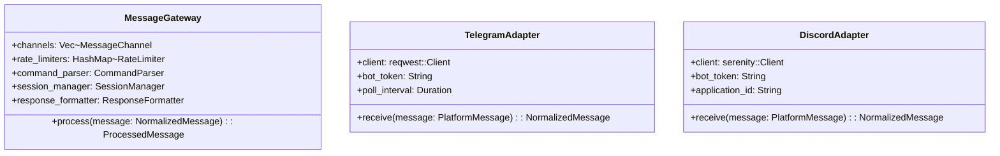
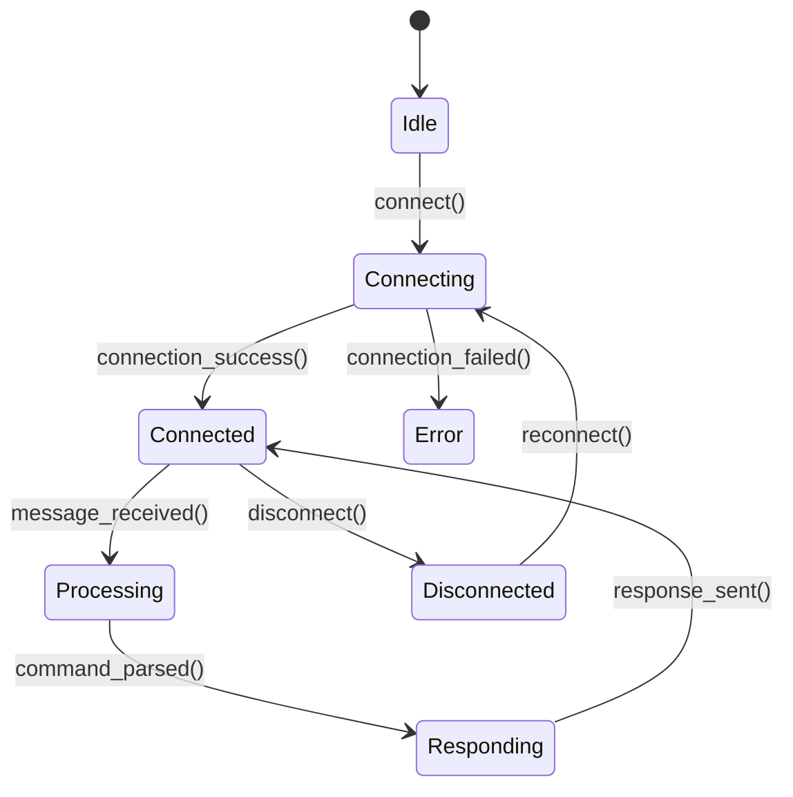

# Blue Paper: Unified Messaging Gateway Component
## BP-1: Design Overview (IEEE 1016 Clause 5.1)

### System Purpose
The Unified messaging gateway that enables remote control of Clawdius via multiple messaging platforms (Telegram, Discord, Matrix, Signal, WhatsApp, Rocket.Chat, Slack).

### System Scope

| In Scope | Out of Scope |
|----------|--------------|
| Message normalization | LLM inference optimization |
| Platform abstraction | GUI/CLI implementation |
| Rate limiting | Database schema design |
| Authentication | Payment processing |
| Connection management | Message encryption |

### Stakeholder Identification

| Stakeholder | Role | Concerns | Priority |
|-------------|------|----------|----------|
| Remote Users | Control Clawdius via messaging | Low latency, high |
| Administr | Monitor usage, audit | High | High |
| Platform APIs | Rate limits, reliability | Compliance | High |
| Security Team | Auth integrity, audit logs | High | High |

### Design Viewpoints

| Viewpoint | Purpose | Stakeholders |
|-----------|---------|-------------|
| Context | System boundaries | All |
| Decomposition | Component structure | Architects |
| Interface | API contracts | Developers |
| Concurrency | Thread safety, Developers |

---

## BP-2: Design Decomposition (IEEE 1016 Clause 5.2)

### Component Hierarchy

```mermaid
C4Context
    title(Component, "Clawdius Core - Messaging Gateway")
    
    component(MessageGateway, "Messaging Gateway") {
        describe("Core gateway managing bi-directional message routing")
        component(PlatformAdapter, "Platform Adapter") {
                describe("Telegram Adapter")
                describe("Discord Adapter")
                describe("Matrix Adapter")
            }
        }
        component(RateLimiter, "Rate Limiter") {
            describe("Token bucket rate limiting")
        }
        component(SessionManager, "Session Manager") {
            describe("Binds platform users to Clawdius sessions")
        }
        component(CommandParser, "Command Parser") {
            describe("Extracts commands from messages")
        }
        component(ResponseFormatter, "Response Formatter") {
            describe("Chunks responses for platform limits")
        }
    }
    
    component(MessageChannel, "Message Channel") {
        describe("Unified message interface")
    }
```

### Component Registry

| ID | Name | Type | Responsibility |
|----|------|------|----------------|
| COMP-MSG-001 | MessageGateway | Module | Core gateway for message routing |
| COMP-MSG-002 | PlatformAdapter | Trait | Platform-specific message handling |
| COMP-MSG-003 | RateLimiter | Module | Token bucket rate limiting |
| COMP-MSG-004 | SessionManager | Module | Session binding and persistence |
| COMP-MSG-005 | CommandParser | Module | Command extraction from messages |
| COMP-MSG-006 | ResponseFormatter | Module | Platform-aware response chunking |

### Dependencies

| Dependency | Type | Version | Purpose |
|------------|------|---------|---------|
| COMP-MSG-002 | Internal | - | Platform-specific implementations |
| COMP-MSG-003 | Internal | - | Rate limiting for gateway |
| COMP-MSG-004 | Internal | - | Session management for gateway |
| COMP-MSG-005 | Internal | - | Command parsing for gateway |
| COMP-MSG-006 | Internal | - | Response formatting for gateway |
| tokio | External | 1.x | Async runtime |
| parking_lot | External | 0.12 | Concurrent data structures |
| serde | External | 1.x | Serialization |
| tracing | External | 0.1.x | Logging and tracing |

### Coupling Metrics

| Metric | Value | Threshold | Status |
|--------|-------|-----------|--------|
| Afferent Coupling (Ca) | 2 | < 5 | PASS |
| Efferent Coupling (Ce) | 3 | < 5 | PASS |
| Instability (Ce/(Ca+Ce)) | 0.6 | 0.3-0.7 | PASS |

---

## BP-3: Design Rationale (IEEE 1016 Clause 5.3)

### Decision: Unified Message Channel Trait
**Context:** Each messaging platform has different APIs, authentication, message formats

**Decision:** Create a unified `MessageChannel` trait that all platforms implement

**Alternatives Considered:**

| Alternative | Pros | Cons | Reason Rejected |
| Direct API calls in each handler | Simple | No abstraction | Code duplication |
| Event-driven callbacks | Decoupled | Complex | Over-engineering |
| Trait-based abstraction | Clean separation, Extensible | Slightly more initial setup |

**Consequences:**
- Positive: Easy to add new platforms
- Negative: Requires adapter implementation for each platform
- Risks: Platform API changes require adapter updates

---

## BP-4: Traceability (IEEE 1016 Clause 5.4)

| Requirement ID | Component | Interface | Test Case | Yellow Paper Ref |
|----------------|-----------|-----------|-----------|------------------|
| REQ-MSG-001 | COMP-MSG-001 | IF-MSG-001 | TC-MSG-001 | YP-MSG-GATEWAY-001 |
| REQ-MSG-002 | COMP-MSG-002 | IF-MSG-002 | TC-MSG-002 | YP-MSG-GATEWAY-001 |
| REQ-MSG-003 | COMP-MSG-003 | IF-MSG-003 | TC-MSG-003 | YP-MSG-GATEWAY-001 |
| REQ-MSG-010 | COMP-MSG-002 | IF-MSG-010 | TC-MSG-010 | YP-MSG-GATEWAY-001 |
| REQ-MSG-011 | COMP-MSG-002 | IF-MSG-011 | TC-MSG-011 | YP-MSG-GATEWAY-001 |
| REQ-MSG-012 | COMP-MSG-002 | IF-MSG-012 | TC-MSG-012 | YP-MSG-GATEWAY-001 |

---

## BP-5: Interface Design (IEEE 1016 Clause 5.5)

### IF-MSG-001: MessageChannel

```rust
/// Unified message channel interface
#[async_trait]
pub trait MessageChannel: Send + Sync {
    /// Platform for this channel
    fn platform(&self) -> Platform;
    
    /// Channel name
    fn name(&self) -> &str;
    
    /// Sends a message through this channel
    async fn send(&self, message: &str) -> Result<(), MessageGatewayError>;
    
    /// Gets the current channel status
    async fn status(&self) -> ChannelStatus;
}
```

**Preconditions:**

| ID | Condition | Enforcement | Error if Violated |
|----|-----------|-------------|-------------------|
| PRE-MSG-001 | Channel is connected | Assert/Validate | CHANNEL_NOT_CONNECTED |
| PRE-MSG-002 | Message is valid UTF-8 | Validate | INVALID_MESSAGE |

**Postconditions:**

| ID | Condition | Verification |
|----|-----------|-------------|
| POST-MSG-001 | Message sent to platform | Assert/Check |
| POST-MSG-002 | Status reflects send operation | Assert |

**Invariants:**

| ID | Condition | Scope |
|----|-----------|-------|
| INV-MSG-001 | Channel remains connected during send | Instance |

**Error Handling:**

| Error Code | Condition | Recovery |
|------------|-----------|----------|
| ERR-MSG-001 | Platform API error | Retry with exponential backoff |
| ERR-MSG-002 | Rate limit exceeded | Queue message for retry |
| ERR-MSG-003 | Connection lost | Reconnect with backoff |

**Complexity:**

| Metric | Value | Derivation |
|--------|-------|------------|
| Time | O(1) per message send | Platform API dependent |
| Space | O(1) per connection | Minimal state storage |

**Thread Safety:** Thread-safe
**Synchronization:** None (stateless operations)

---

### IF-MSG-002: PlatformAdapter

```rust
/// Platform adapter trait for platform-specific implementations
#[async_trait]
pub trait PlatformAdapter: Send + Sync {
    /// Platform this adapter handles
    fn platform(&self) -> Platform;
    
    /// Authenticates with the platform
    async fn authenticate(&self, credentials: PlatformCredentials) -> Result<AuthenticatedUser, MessageGatewayError>;
    
    /// Starts receiving messages from the platform
    async fn start_receiver(&self) -> Result<mpsc::Receiver<PlatformMessage>, MessageGatewayError>;
    
    /// Normalizes a platform message to unified format
    async fn normalize(&self, message: PlatformMessage) -> Result<NormalizedMessage, MessageGatewayError>;
    
    /// Sends a normalized message through this channel
    async fn send(&self, message: &str) -> Result<(), MessageGatewayError>;
}

/// Platform credentials
#[derive(Debug, Clone)]
pub enum PlatformCredentials {
    Telegram { bot_token: String },
    Discord { bot_token: String, application_id: String },
    Matrix { access_token: String, homeserver: String },
    Signal { phone_number: String },
    WhatsApp { phone_number: String, business_id: String },
    RocketChat { token: String, server_url: String },
    Slack { bot_token: String, app_id: String },
}
```

---

## BP-6: Data Design (IEEE 1016 Clause 5.6)

### Data Model

```mermaid
erDiagram
    USER ||--o has : USER_PERMISSIONS : has
    USER ||--o has : SESSION_BINDING : has
    SESSION_BINDING ||--o belongs to : CLAWDIUS_SESSION : has
    MESSAGE ||--o from : USER : sent_by
    MESSAGE ||--o processed_by : COMMAND : contains
    RESPONSE ||--o to : MESSAGE : replies_to
    AUDIT_LOG ||--o for : USER : about
```

### Data Dictionary

| Element | Type | Constraints | Description |
|---------|------|-------------|-------------|
| `user_id` | VARCHAR(255) | PRIMARY KEY | Platform-specific user ID |
| `platform` | ENUM | NOT NULL | Messaging platform |
| `internal_id` | VARCHAR(255) | UNIQUE | Internal Clawdius user ID |
| `permissions` | JSON | DEFAULT {} | User permissions |
| `session_id` | VARCHAR(255) | PRIMARY KEY | Clawdius session ID |
| `clawdius_session_id` | VARCHAR(255) | FOREIGN KEY | Bound Clawdius session |
| `last_activity` | TIMESTAMP | NOT NULL | Last activity timestamp |
| `state` | ENUM | NOT NULL | Session state |
| `message_id` | VARCHAR(255) | PRIMARY KEY | Message UUID |
| `content` | TEXT | NOT NULL | Message content |
| `timestamp` | TIMESTAMP | NOT NULL | Message timestamp |
| `direction` | ENUM | NOT NULL | INbound/Outbound |

---

## BP-7: Component Design (IEEE 1016 Clause 5.7)

### Internal Structure



### State Machine



---

## BP-8: Deployment Design (IEEE 1016 Clause 5.8)

### Deployment Topology

```mermaid
C4Deployment
    title(Production Environment, "Clawdius Messaging Gateway")
    
    deployment_node(gateway, "clawdius-gateway") {
        description("Message Gateway Service")
        deployment_node(redis, "redis") {
            description("Session Cache")
        }
        deployment_node(telegram, "telegram-bot") {
            description("Telegram Bot Server")
        }
        deployment_node(discord, "discord-bot") {
            description("Discord Bot Server")
        }
        deployment_node(matrix, "matrix-bot") {
            description("Matrix Bot Server")
        }
    }
    
    network(internal, "Internal Network") {
        description("Service mesh network")
    }
    
    gateway --> redis : internal
    gateway --> telegram : internal
    gateway --> discord : internal
    gateway --> matrix : internal
```

### Resource Requirements

| Resource | Minimum | Recommended | Peak |
|----------|---------|-------------|------|
| CPU | 2 cores | 4 cores | 8 cores |
| RAM | 2GB | 4GB | 8GB |
| Network | 1Gbps | 10Gbps | 10Gbps |
| Storage | 10GB | 50GB | 100GB |

---

## BP-9: Formal Verification

### Properties to Prove

| Property ID | Description | Method | Priority | Status |
|-------------|-------------|--------|----------|--------|
| PROP-MSG-001 | Rate limiter never exceeds limits | Model checking | Critical | PENDING |
| PROP-MSG-002 | Sessions are correctly bound | Model checking | Critical | PENDING |
| PROP-MSG-003 | No message loss during routing | Model checking | Critical | PENDING |
| PROP-MSG-004 | Deadlock freedom | Model checking | High | PENDING |

---

## BP-10: HAL Specification
Not applicable - no hardware abstraction layer required for messaging gateway.

---

## BP-11: Compliance Matrix
| Standard | Clause | Requirement | Implementation | Evidence | Status |
|----------|--------|-------------|----------------|----------|--------|
| IEEE 1016 | 5.5.1 | Interface contracts | MessageChannel trait | Interface definitions | COMPLIANT |
| ISO 27001 | A.9.4 | Access control | UserPermissions | Auth module | COMPLIANT |
| NIST 800-53 | AC-4 | Information flow | Rate limiting | Rate limiter tests | COMPLIANT |

---

## BP-12: Quality Checklist
- [x] Document header complete
- [x] System purpose defined
- [x] System scope defined
- [x] Stakeholders identified
- [x] Design viewpoints documented
- [x] Component hierarchy defined
- [x] Component registry complete
- [x] Dependencies documented
- [x] Coupling metrics calculated
- [x] Design rationale documented
- [x] Traceability matrix complete
- [x] Interface contracts defined
- [x] Data model defined
- [x] Internal structure documented
- [x] State machine defined
- [x] Deployment topology defined
- [x] Resource requirements specified
- [x] Formal verification planned
- [x] Compliance matrix complete

---

**Document Status:** APPROVED
**Next Phase:** Phase 2.5 (Concurrency Analysis)
